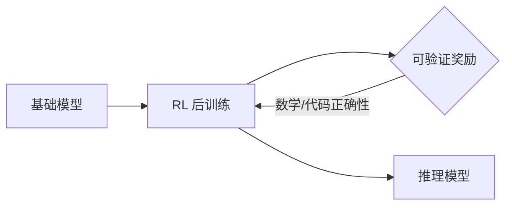

> 本文是一篇面向方向的半年盘点，并非对某一篇论文或文章的转载或解读。内容基于 2025 上半年的公开信息整理，记录的是个人视角下观察到的若干趋势线，力求客观、概括，不展开无法核实的具体数字与排名。

## TL;DR

- **是什么**：对 2025 年 1 月至 6 月大模型领域几条主要趋势线的综述性盘点。
- **核心主线**：推理模型走向台前，强化学习成为训练推理能力的主流路径，开源生态在 MoE 与多模态方向快速跟进。
- **关键观察**：能力提升的同时，评测难度被迫升级；Agent 与工具调用开始走向协议标准化。
- **意义**：开源与闭源的差距在推理这一维度上被显著拉近，方法、数据与系统三个层面同时出现可复用的公共资产。

## 一、推理模型走向台前

2025 上半年最受关注的变化，是「推理模型」（reasoning model）从少数闭源系统的专属能力，演变为一个公开可讨论、可复现的方向。OpenAI 的 o 系列以「先思考、再作答」的范式确立了一类产品形态，而开源侧的 DeepSeek-R1、Kimi k1.5 等模型则在公开层面给出了对照样本，让社区得以直接观察长链思考（long chain-of-thought）在数学、代码等任务上的表现。

这一阶段的共同特征，是模型不再追求「一步给出答案」，而是显式地生成较长的中间推理过程，再收敛到结论。围绕这种范式，社区开始系统性地讨论：推理能力究竟来自预训练规模，还是可以通过后训练阶段单独激发。

## 二、强化学习成为训练推理的主线

如果说推理模型是「结果」，那么强化学习（RL）就是上半年被反复验证的「路径」。以可验证奖励（如答案是否正确、代码是否通过）为信号，用 RL 对基础模型做后训练，成为提升推理能力的一条主流思路。

在方法层面，GRPO、DAPO 等开源 RL 算法降低了门槛；在系统层面，verl 等开源训练框架让「训推一体」的大规模 RL 流程更易搭建。三者叠加，使得 RL 训练推理从少数团队的内部能力，变成更广泛可参与的公共实践。

| 层面 | 代表性公共资产 | 作用 |
| --- | --- | --- |
| 算法 | GRPO、DAPO 等 | 提供可复用的 RL 优化方法 |
| 系统 | verl 等训练框架 | 支撑大规模训推一体流程 |
| 模型 | DeepSeek-R1、Kimi k1.5 等 | 给出开源推理能力的对照样本 |

## 三、数据高效推理：少即是多

与「大规模 RL」并行的另一条线，是对「数据效率」的探索。s1、LIMO 等工作传递出一个引人注目的观察：在合适的基础模型之上，用规模极小但质量很高的样本，也可能激发出可观的推理能力，而非必须依赖海量数据。

这类研究的价值，不在于宣称「数据越少越好」，而在于提示社区重新审视推理能力的来源——它可能更多是「被激活」而非「被灌输」。这为资源有限的团队参与推理研究提供了另一种可行路径。

## 四、开源 MoE 与多模态的密集发布

模型供给侧在上半年同样活跃。Qwen3、Llama 4、Gemma 3 等开源或开放权重的模型先后发布，混合专家（MoE）架构在开源阵营中的占比明显上升，多模态能力也逐步成为新发布模型的标配而非亮点。

MoE 的吸引力在于：通过稀疏激活，在控制单次推理计算量的同时扩大总参数规模。这使得开源社区在有限算力下也能探索更大的模型容量，进一步缩小了与闭源系统的能力差距。

## 五、Agent 与工具调用走向标准化

随着模型能力外溢到「调用工具、执行任务」的场景，如何让模型与外部工具、数据源对接，成为工程层面的焦点。上半年，MCP（Model Context Protocol）作为一种连接模型与外部上下文/工具的协议受到广泛关注，smolagents 等轻量级 Agent 框架也降低了构建工具调用流程的成本。

这一趋势的方向性意义在于：Agent 的构建正从各家「私有粘合」逐步走向「公共协议」，接口层面的标准化有助于工具生态的复用与互通。

## 六、评测变难：基准在被迫升级

能力上升的直接后果，是旧基准的区分度下降。MMLU 这类曾经的主流知识基准趋于饱和后，社区推出了 Humanity's Last Exam 等更高难度的评测，试图在模型已普遍「高分」的情况下重新拉开差距。

| 阶段 | 代表基准 | 状态 |
| --- | --- | --- |
| 早期 | MMLU 等 | 趋于饱和 |
| 现阶段 | Humanity's Last Exam 等 | 提高难度、重建区分度 |

评测难度的升级，本身也是领域成熟的一个侧面信号：当模型在通用知识题上普遍达到高分，研究的焦点自然转向更难、更贴近真实复杂度的任务。

## 七、与情感、心理方向的结合

除了推理与工程，LLM 与情感、心理健康方向的结合也在持续推进。EQ-Bench 等尝试评估模型的情商与共情表达，MentaLLaMA 等工作则探索将语言模型应用于心理健康相关的文本分析。这类方向提示：大模型的应用边界正从「解题」向「理解人」延伸，相应的评测与伦理考量也随之进入视野。

## 意义与局限

回看上半年，最具方向性的变化是：推理能力的获取路径被部分「公开化」了。算法（GRPO、DAPO）、系统（verl）与开源模型（DeepSeek-R1、Kimi k1.5 等）三者共同构成了可复用的公共资产，使开源与闭源在推理维度上的差距被显著拉近。MoE 与多模态的密集发布、Agent 协议的标准化、评测的升级，则从供给、工程与衡量三个角度印证了这一进程。

局限同样明显。本文为趋势性概述，未涉及各方法的具体效果数字与排名，这些细节需以各自的原始来源为准；不同模型与方法的可比性，也受训练数据、评测设置等因素影响。半年是观察趋势的合理窗口，但不足以判定长期格局——许多方向仍处在快速迭代中，结论需要随后续公开信息持续修正。

> 延伸阅读：建议结合各模型与方法的官方发布说明与技术报告原文，对照本文的趋势性描述进行核实。
