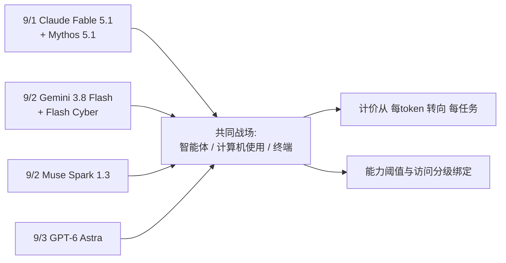

> 本文是一篇前沿观察笔记，梳理 2026 年 9 月 1 日至 3 日之间四家实验室的密集发布。需要特别说明的是：这些模型均为闭源产品，公开可核实的技术细节极其有限，本文只在可确认的范围内陈述，并明确区分「官方数字」与「第三方评测」。所有基准分数均为各来源报告值，不作独立验证。

## TL;DR

- 9 月 1 日至 3 日，Anthropic、Google DeepMind、Meta 与 OpenAI 接连发布新模型，构成今年最密集的一个发布窗口。
- 四场发布的共同战场高度一致：智能体任务、计算机与浏览器操作、终端与软件工程——传统的知识问答类基准几乎退出了叙事中心。
- 价格结构的变化与能力同样值得关注：缓存读取降价、token 效率成为卖点，「每 token 单价」正在让位于「每任务成本」。
- 另一条不容忽视的线索是网络安全能力：多家在本轮发布中触及或启用了与网络安全相关的能力阈值与访问分级机制。

## 一、四场发布：可确认的信息

按时间顺序梳理。以下内容依据各家官方发布与公开报道整理，具体数字请以原始来源为准。

**9 月 1 日，Anthropic：Claude Fable 5.1 与 Mythos 5.1。** 两者按报道是同一套权重，区别在访问方式——Mythos 5.1 面向受信任访问（trusted access）分级发放。一个值得记下的第三方观察是：该模型实测中每任务的输出 token 约为此前的 1.7 倍，折算下来单任务成本反而上升约 20%。

**9 月 2 日，Google DeepMind：Gemini 3.8 Flash（含 Flash Cyber 变体）。** Flash 系列在数周内的第三次迭代，HLE-Verified 54.9，保持 1M 上下文，速度约为前代 3 倍。最引人注意的是 Terminal-Bench 2.1 从 81.6% 提升到 90.8%——按模型卡的说法，增益来自「在长程智能体循环上训练，递归地评估与改进底层模型」，用平实的语言讲就是后训练阶段的规模化。

**9 月 2 日，Meta Superintelligence：Muse Spark 1.3。** 定位是高效率的前沿级模型，第三方评测认为能力与 GPT-5.6 Sol 一档相当。报道另提到一种颇具新意的机制：若用户允许其数据用于训练，成本可下降九成以上；官方亦承诺后续开放权重。

**9 月 3 日，OpenAI：GPT-6 Astra。** 官方报告的分数包括 ARC-AGI-3 达 99.9、FrontierMath Tier 4 达 97.6%–98%、OSWorld 2.0 达 72.6%、ScreenSpot Pro 达 92.7、Terminal-Bench Science 达 64.6%，知识截止为 2026 年 4 月。第三方 Artificial Analysis 给出的综合智能指数为 61，与 GPT-5.6 Sol 持平、位于 Claude Fable 5.1 的 66 之后，但称其 token 效率比 Sol 高出约 70%。

| 模型 | 发布日 | 输入 / 输出（美元 / 百万 token） | 公开强调的重点 |
| --- | --- | --- | --- |
| Claude Fable 5.1 / Mythos 5.1 | 9 月 1 日 | 10 / 50，缓存读取降价 75% | 编码与知识工作 |
| Gemini 3.8 Flash | 9 月 2 日 | 0.75 / 3.75 | 终端与编码智能体、1M 上下文 |
| Muse Spark 1.3 | 9 月 2 日 | 混合约 0.10 | 极致性价比，承诺开放权重 |
| GPT-6 Astra | 9 月 3 日 | 10 / 50（Fast 模式 2 倍） | 计算机使用、浏览、软件工程、科学 |

## 二、三条共同线索

把四场发布并排看，比逐个看更有信息量。

**其一，战场已经明确迁移到智能体。** 四家着力宣传的基准高度重叠：Terminal-Bench、OSWorld、ScreenSpot 与各类 SWE 类基准，全部是「让模型去操作一台电脑、完成一件多步骤的事」，而知识问答类基准在叙事里明显后移。这与本站在 DeepSeek-V4 那篇观察里记下的判断一致，只是如今转移已经完成：智能体不再是加分项，而是主战场。

**其二，成本的计价方式在变。** 这一轮最有意思的不是降价本身，而是降价的位置：缓存读取降价针对长会话，token 效率作为卖点指向完成同一任务所需的总量，数据换折扣则把商业模式当作变量。它们共同说明一件事——**「每百万 token 多少钱」正在失去比较意义，真正该算的是「完成一个任务多少钱」。** Fable 5.1 是最好的例子：单价没变、缓存大幅降价，但因输出变长，单任务成本反而上升。只看价目表，很容易得出相反的结论。

**其三，网络安全能力开始成为发布的一部分。** 本轮多家都在材料里触及了相关的能力评估与访问控制：有的报告模型首次触发内部设定的关键阈值，有的放出面向防御方的专门变体，有的以受信任访问的方式对同一权重分级发放。机制各异，信号却清楚——能力评估与发放策略正在被绑定，「同一权重、不同门槛」这种形态可能会更常见。

## 三、如何看待这批数字

对于闭源模型的密集发布，我一贯的态度是先把话说慢一点，有三个具体理由。

**厂商基准与独立评测存在系统性差距。** GPT-6 Astra 是本轮最直观的例子：官方数字中多项接近饱和（99.9、98%），而第三方综合指数将其与前代持平、且位列另一家之后。两组数字并不必然矛盾，它们衡量的东西与加权方式都不同，但只读其中一组，印象会相当不一样。

**harness 差异让跨模型比较变得脆弱。** 智能体类基准的分数高度依赖外层框架，同一个模型换一套 agent harness 就可能有显著变化。各家在自己的材料里通常用自家优化过的框架，表格里的并列数字往往并非同一条件的对照。这一点在上个月的 Kimi K3 笔记里讨论过，闭源这边同样成立，且更难核实。

**基准饱和本身是一个信号。** 分数逼近 100 的基准基本失去了区分能力，而今年主流基准的生命周期明显在缩短。这恰好解释了为什么 ACL 2026 的评测类获奖工作（如 CAR-bench）不再追求「更难的题」，转而去测一致性与限度自知——单一分数越高，越需要别的尺子。

所以稳妥的读法是：把这批数字当作方向性信息，它告诉你各家认为什么重要、在往哪里投入，而不是能力的精确刻度。真正的判断要等第三方评测铺开，以及在自己的任务集上实测之后。

## 意义与局限

意义层面，这个 72 小时窗口的价值更多在于它呈现出的结构，而非任何单一模型的能力。四家实验室在几乎同一时间、围绕几乎同一组能力发布产品，说明前沿方向已经收敛得相当厉害：智能体化、计算机操作、长程执行，以及支撑这些的成本效率。而价格机制的多样化与访问分级的普及，则提示行业正从「比谁的模型更聪明」转向「比谁能把智能以可接受的成本与可控的风险交付出去」。对使用者而言，这意味着选型的重心应从榜单排名移向自己任务上的单任务成本与稳定性。

局限层面必须坦诚。本文所依据的绝大部分是官方发布与二手报道，四款模型均未公开架构、规模与训练细节，任何关于内部实现的推测都应当避免；所引分数的测试条件与 harness 多不可核实，跨模型的并列比较仅供参考；发布窗口极近，独立评测尚未铺开，本文对相对强弱不作判断。这类笔记也有固有的时效性——价格、可用性与版本都在快速变动，几周后再读，具体数字很可能已经作废，唯有其中的结构性线索或许还剩一点参考价值。

> 延伸阅读：各家官方发布页面（OpenAI GPT-6 Astra、Anthropic Claude Fable 5.1、Google DeepMind Gemini 3.8 Flash、Meta Muse Spark 1.3）与第三方独立评测（Artificial Analysis 等）。相关前文可参考本站 GPT-5、Gemini 3 与 DeepSeek-V4 三篇观察笔记。
