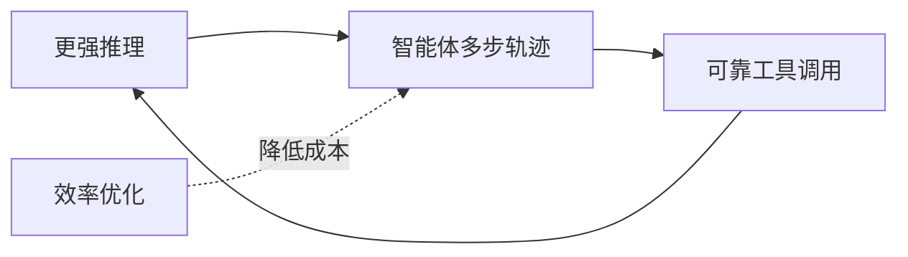

> 本文为方向性盘点与个人随笔，基于公开信息整理，并非对某一篇论文或某一份报告的转载。我尝试把 2026 上半年大模型领域几条值得关注的脉络梳理清楚，定性为主、克制对未完全公开的细节做猜测。文末附一小段读论文、写博客的个人感想。

## TL;DR

- 新一代基础模型继续高频迭代，开源与闭源沿各自路线推进，能力差距在收敛。
- 推理、智能体（agent）、工具使用是上半年最稠密的主线，正从「能用」走向「好用、可控」。
- 效率方向（稀疏注意力、投机解码、混合推理等）趋于成熟，开始作为默认工程实践被采纳。
- 情感计算与大模型的结合持续推进，情绪识别、情感支持、心理对话等场景受到稳定关注。

## 一、基础模型：迭代不停，路线分化

2026 上半年，基础模型的迭代节奏依旧很快。开源阵营里，以 DeepSeek、Qwen 为代表的系列继续向前推进，新一代版本（如 DeepSeek-V4、Qwen3.5 等）相继进入公众视野。对这些尚未完全公开技术细节的版本，这里只做概括陈述：总体方向延续了「更强的推理、更长的上下文、更低的单位算力成本」这条主轴，而非单纯堆参数。

一个可以定性观察到的趋势是，开源与闭源之间在通用能力上的差距正在收敛。开源模型凭借快速的社区迭代、可自由微调与部署的优势，在不少实际任务上已经足以满足生产需求；闭源模型则更多在前沿能力、产品化体验与安全对齐上保持身位。两条路线并非此消彼长，而是各自服务于不同的需求层次。

## 二、推理、智能体与工具使用：从「能用」到「可控」

如果说前两年的关键词是「会推理」，那么上半年的关键词更接近「把推理用好」。这一主线大致可以拆成三层：

- **推理本身的深化**：长链条推理、过程可验证、面向特定领域的推理仍是研究热点，模型在数学、代码、复杂规划类任务上的稳定性持续提升。
- **智能体（agent）化**：单次问答正在让位于多步、有状态、能调用外部能力的智能体范式。规划、记忆、反思、错误恢复等环节被反复打磨。
- **工具使用**：函数调用 / 工具调用从「能触发」走向「调得准、调得稳」，工具选择、参数填充与结果整合的可靠性成为评测重点。

这三层彼此咬合：更强的推理支撑更长的智能体轨迹，更可靠的工具使用又反过来约束推理不至于「自由发挥」。上半年的明显变化，是大家对**可控性与可观测性**的重视——不只看任务做没做成，也看过程是否可解释、失败是否可定位、行为是否可约束。

## 三、效率方向：从论文走向默认工程实践

效率不再只是论文里的加分项，而越来越像默认的工程基线。几条已被广泛讨论的路线在上半年趋于成熟：

| 方向 | 核心思想 | 现状（定性） |
| --- | --- | --- |
| 稀疏注意力 | 只在重要的 token 之间计算注意力，降低长上下文开销 | 在长文本与长上下文场景中被越来越多采用 |
| 投机解码 | 用小模型草拟、大模型校验，减少大模型前向次数 | 已成为推理加速的常见手段 |
| 混合推理 | 简单问题快答、复杂问题再深思，按需分配算力 | 在产品侧逐步落地，平衡延迟与质量 |
| 量化 / 蒸馏 | 压缩模型体积与算力需求 | 长期演进的成熟工程方法 |

这些技术的共同点，是在尽量不损失质量的前提下压低延迟与成本。它们的成熟意味着「同样的效果，更便宜地做出来」，这对应用落地的意义往往不亚于能力本身的提升。

## 四、情感计算与大模型：持续而克制的融合

另一条不那么喧闹、却一直在走的线，是情感计算与大模型的结合。围绕对话情绪识别（ERC）、情感支持对话、心理健康陪伴等场景的研究持续推进。大模型在共情表达、语境理解与多轮一致性上的能力，使它天然适配这类任务；但与此同时，安全边界、专业性与伦理约束也被反复强调。

这个方向的特点是「慢而稳」：它不像通用能力竞赛那样追求榜单数字，更看重对话质量、用户感受与潜在风险的权衡。把模型从「答得对」推向「答得让人舒服、且不越界」，本身就是一道难题。

## 意义与局限

把上半年连起来看，主旋律是「能力—智能体—效率」三者的协同推进：推理能力是地基，智能体是组织形式，效率优化决定它能否被规模化地用起来；情感计算等垂直方向则提示我们，模型最终要落到具体的人与具体的需求上。

局限同样需要清醒看待。一方面，许多新版本的细节尚未完全公开，公开评测与真实体验之间仍存在落差，盘点只能定性而非定量。另一方面，能力提升的同时，可控性、安全性、评测的可信度仍是没有解决的长期问题。智能体越自主，对「它到底做了什么」的可观测要求就越高。

## 一点碎碎念

写到这里，正好可以放下盘点的口吻。坚持读论文、记笔记这件事，做久了会有一种安静的踏实感——不是因为读懂了多少前沿，而是因为每读一篇、写一段，模糊的领域地图就清晰一点。很多当时觉得艰深的概念，过几个月回头看，已经变成了理所当然的常识，这种「自己确实在往前走」的反馈，是支撑我继续读下去的动力。

这个博客陪我走过的这段时间，更像一个对自己负责的记录本。把读到的东西用自己的话讲清楚，逼着我不能停在「好像懂了」。半年很快，技术更快，但慢慢读、认真写，大概是面对这种速度最稳妥的姿态。下半年继续。

> 延伸阅读：可关注各开源模型的官方技术报告与公开评测，结合自身场景做定性判断。
