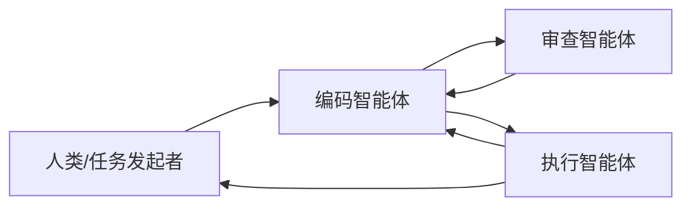

> 本文是对论文《AutoGen: Enabling Next-Gen LLM Applications via Multi-Agent Conversation》的阅读笔记。原文由 Wu 等人（Microsoft）于 2023 年发布，地址：[arXiv:2308.08155](https://arxiv.org/abs/2308.08155)。下文围绕已核实的核心思想做概括性梳理，不涉及对具体实验数字的复述。

## TL;DR

- AutoGen 把复杂任务拆给多个「可对话智能体（conversable agents）」，让它们通过对话彼此协作。
- 智能体高度可定制：角色、能力、是否能执行代码、是否引入人类介入，都可以按需配置。
- 智能体之间既能互相对话，也能调用工具、请人类参与，把"分工—协作"作为构建应用的基本范式。
- 它是多智能体编排框架的代表之一，尤其适合编码、审查、执行等需要分工的复杂工作流。

## 一、背景与动机

大语言模型在单轮问答、文本生成等任务上已经相当成熟，但当任务变得复杂、需要多步推理、需要调用外部工具、甚至需要人类在中途把关时，单个模型独立完成往往力不从心。一种自然的思路是：把一个大任务拆成若干子任务，交给不同的"角色"分别承担，再让这些角色协同推进。

AutoGen 正是沿着这条思路展开。它没有把"多智能体"理解为多个模型各自为政，而是把**对话**作为协作的统一接口：不同智能体之间通过消息往来推进任务，过程中可以穿插工具调用与人类反馈。这样一来，原本零散的提示工程、工具集成、流程控制，被收敛到一个更一致的框架里。

## 二、核心抽象：可对话智能体

AutoGen 的基础单元是"可对话智能体（conversable agent）"。所谓"可对话"，指的是智能体能够收发消息，并据此决定下一步动作。每个智能体都可以被赋予不同的设定：

- **角色与能力**：例如一个负责写代码，一个负责审查，一个负责执行。
- **后端来源**：智能体的行为可以由 LLM 驱动，也可以由代码工具驱动，或引入人类的输入。
- **是否能执行代码**：某些智能体被允许在受控环境中运行代码，从而把"生成"与"执行"分离开。

这种设计的关键在于：智能体的差异不靠"换一个模型"实现，而靠**配置**实现。同一套对话机制下，通过改变角色、可用工具与介入方式，就能拼装出形态各异的协作系统。

## 三、对话编排与协作模式

有了可对话智能体之后，应用的搭建就转化为"如何编排这些智能体之间的对话"。AutoGen 支持灵活的对话流程：可以是两个智能体一来一回，也可以是多个智能体在群聊式结构里轮流发言，还可以在流程中嵌入工具调用或人类确认环节。

一个常见的模式是"编码 + 审查 + 执行"的分工：一个智能体负责产出代码，另一个负责审查与提出修改意见，再由具备执行能力的智能体在受控环境里运行并把结果反馈回来。三者通过对话反复迭代，直到任务收敛。

下表概括了几种典型的智能体配置维度：

| 配置维度 | 含义 | 典型取值 |
| --- | --- | --- |
| 角色 | 智能体在协作中承担的职责 | 编码、审查、执行、协调 |
| 驱动来源 | 决定行为的后端 | LLM、工具/代码、人类 |
| 工具能力 | 可调用的外部能力 | 检索、计算、代码运行 |
| 人类介入 | 是否允许人类参与对话 | 始终、按需、从不 |

## 四、为何采用"对话"作为接口

把对话当作协作接口，带来几个直接的好处。其一是**统一性**：工具调用、人类反馈、智能体间的信息传递都被表达为消息，开发者面对的是一致的抽象。其二是**可组合性**：新增一个角色，往往只是再配置一个智能体并把它接入对话流程，而非重写整套逻辑。其三是**可观察性**：协作过程以对话记录的形式留存，便于理解、调试与复盘。

这也解释了为什么 AutoGen 更适合需要明确分工的复杂工作流。当任务本身可以被自然地切分为"生成—检查—执行"这类环节时，多智能体对话能让每个环节各司其职，而又通过对话保持整体协调。

## 意义与局限

从意义上看，AutoGen 提供了一套以对话为中心的多智能体编程范式，把"可定制的智能体"与"可编排的对话流程"组合起来，降低了构建复杂 LLM 应用的工程门槛。它是多智能体编排框架的代表之一，为后续相关工作提供了清晰的参照。

局限也同样存在。多智能体对话引入了额外的协调成本：对话轮次增多可能带来更高的开销，流程编排不当时也可能出现循环或低效。智能体之间的协作质量很大程度上依赖角色设计与提示设定，需要经验与调试。此外，是否引入多智能体应当视任务而定——当任务无需明显分工时，简单方案往往更稳妥。如何在协作收益与协调成本之间取得平衡，仍是落地时需要持续权衡的问题。

> 延伸阅读：AutoGen: Enabling Next-Gen LLM Applications via Multi-Agent Conversation（[arXiv:2308.08155](https://arxiv.org/abs/2308.08155)）
