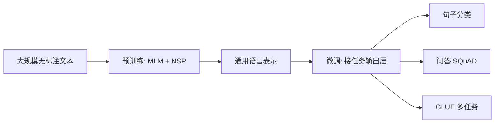

> 本文是对经典论文的回顾解读。原文：Devlin et al. (Google), 2018, *BERT: Pre-training of Deep Bidirectional Transformers for Language Understanding*, arXiv:1810.04805（https://arxiv.org/abs/1810.04805）。下文仅在论文公认事实范围内展开。

## TL;DR

- BERT 采用双向 Transformer 编码器，通过掩码语言模型（MLM）与下一句预测（NSP）两个任务完成预训练。
- 它确立了「大规模无监督预训练 + 下游任务微调」的范式，在 GLUE、SQuAD 等多项基准上大幅刷新当时的最优结果。
- 相对单向语言模型，双向上下文建模是其取得突破的关键。
- BERT 被视为 NLP 现代化的里程碑，深刻塑造了后续模型的研究路线。

## 一、背景与动机

在 BERT 之前，利用预训练语言表示提升下游任务已是一条被验证有效的路径，但主流做法在建模上存在结构性约束。标准的语言模型按从左到右（或从右到左）的方向逐词预测，这意味着每个词在编码时只能看到单侧上下文。即便通过把左向与右向两个独立模型的表示拼接来"近似"双向，这种浅层组合也无法在同一套深层网络中让每个词真正同时感知前后文。

对许多自然语言理解任务而言，词义往往依赖完整的句子语境。单向约束因此成为表示能力的瓶颈。BERT 的核心动机，就是打破这一限制，让深层网络在预训练阶段就学到真正双向的上下文表示。

## 二、核心思想：用两个预训练任务实现双向

BERT 的全称点明了它的本质——深度双向 Transformer 编码器。它只保留 Transformer 的编码器部分，并设计了两个互补的自监督任务，使双向建模成为可能。

**掩码语言模型（MLM）。** 直接做双向语言模型会带来"信息泄露"问题：在多层双向网络中，目标词可以间接看到自己。BERT 的解法是借鉴完形填空的思路，随机遮蔽输入中的部分词，让模型依据其余的左右上下文去还原被遮蔽的词。由于预测目标本身被掩盖，模型必须综合两侧语境才能作答，这就自然得到了深层双向表示。

**下一句预测（NSP）。** 许多下游任务（如问答、自然语言推断）关注的是句子对之间的关系，而词级别的语言建模并不直接覆盖这种句间信号。NSP 让模型判断两段文本是否构成连续的上下句，从而在预训练中显式学习句子级关系。

两个任务联合优化，使 BERT 同时具备词级与句级的理解能力。

## 三、预训练-微调范式

BERT 把使用流程清晰地拆为两段。预训练阶段在大规模无标注文本上完成，模型学到通用的语言表示，这一阶段成本高但只需进行一次。微调阶段则面向具体任务：在预训练好的模型之上接一个轻量的任务输出层，用任务自身的有标注数据端到端地小幅调整全部参数即可。

这种范式的价值在于解耦与复用——昂贵的通用表示学习与廉价的任务适配相分离，同一个预训练模型可迁移到多种下游任务。

## 四、关键设计对比

下表概括 BERT 在几个关键维度上与典型单向预训练思路的差异。

| 维度 | 单向语言模型 | BERT |
| --- | --- | --- |
| 上下文方向 | 仅左侧（或右侧）| 同时利用左右双向上下文 |
| 主预训练任务 | 顺序语言建模 | 掩码语言模型（MLM）|
| 句间关系建模 | 不直接覆盖 | 引入下一句预测（NSP）|
| 网络结构 | 多基于解码器式顺序生成 | Transformer 编码器 |
| 下游使用方式 | 预训练 + 适配 | 预训练 + 微调，接轻量输出层 |

正是双向上下文与编码器结构的结合，使 BERT 在自然语言理解类任务上展现出明显优势。

## 五、影响

BERT 公布后，在 GLUE、SQuAD 等多项广泛使用的基准上大幅刷新了当时的最优成绩，使「预训练-微调」迅速成为自然语言理解的主流做法。它降低了在具体任务上获得高水平表现的门槛：研究者与工程师不必从零训练，只需在公开预训练模型上微调，就能在众多任务上得到强劲基线。

更深远的影响在于研究范式的转变。BERT 之后，围绕预训练目标、数据规模、模型结构与训练方式的探索持续涌现，预训练表示成为现代 NLP 的基础设施。

## 意义与局限

BERT 的意义在于以双向编码器与自监督预训练，系统性地解决了通用语言表示的学习问题，并把「预训练-微调」确立为可复制、可迁移的工程范式，是 NLP 现代化进程中的里程碑。

其局限同样值得正视。MLM 在预训练时引入的掩码标记并不出现在微调阶段，造成预训练与下游使用之间的不一致。编码器式结构面向理解任务，对自然的文本生成并不直接适配。此外，大规模预训练对算力与数据的依赖较高。这些问题也成为后续工作改进与分化的起点。

> 延伸阅读：Devlin et al., *BERT: Pre-training of Deep Bidirectional Transformers for Language Understanding*（https://arxiv.org/abs/1810.04805）。
