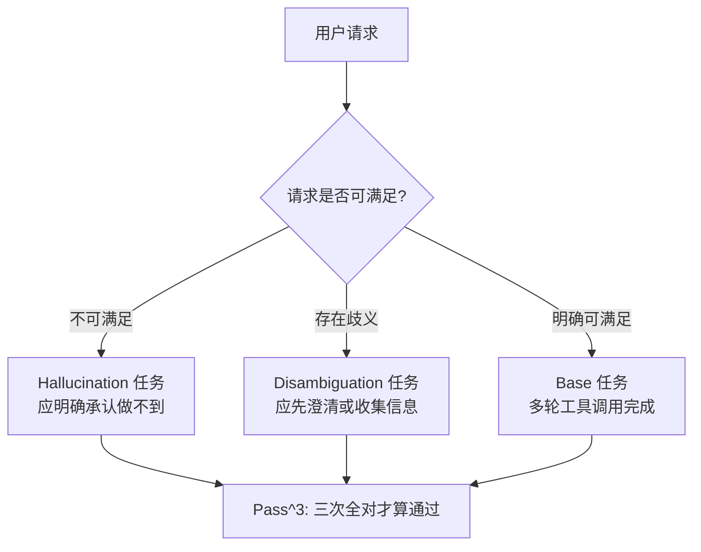

> 本文是对 Kirmayr, Stappen & André, 2026《CAR-bench: Evaluating the Consistency and Limit-Awareness of LLM Agents under Real-World Uncertainty》的阅读笔记，原文见 arXiv:2601.22027（https://arxiv.org/abs/2601.22027），该工作获 ACL 2026 Outstanding Paper。以下内容为个人整理与解读，具体数字请以原论文为准。

## TL;DR

- 现有智能体基准多在「信息完整、请求明确」的理想条件下测任务完成率，回避了真实用户场景里普遍存在的不完整与歧义。
- CAR-bench 以车载语音助手为载体，构建了含 58 个互联工具、19 条领域策略与 LLM 模拟用户的多轮交互环境。
- 除常规任务外，它引入两类新任务：Hallucination 任务考察「工具或信息缺失时是否承认做不到」，Disambiguation 任务考察「面对歧义是否先澄清再行动」。
- 评测指标从 Pass@k 转向 Pass^k（k 次全对才算通过），暴露出「偶尔能做对」与「稳定能做对」之间的巨大落差。

## 一、背景：智能体基准测漏了什么

过去两年，智能体评测的主线是任务完成率：给一组工具和一个明确目标，看模型能不能规划出正确的调用序列。SWE-bench、各类工具调用基准都属于这一类，它们回答的是「能不能做到」。

但把智能体放进面向终端用户的产品里，会遇到另一类问题。真实用户的请求经常是不完整的（「导航到最近的充电站」——哪种充电标准？）、有歧义的（「把会议改到下午」——哪个会议？），甚至是系统根本无法满足的（要求一个不存在的功能）。此时智能体需要的不是更强的执行力，而是一种「认识论上的自知」：知道自己什么时候可以动手，什么时候该去收集更多信息，什么时候应当明确说「我做不到」。

论文把这一维度概括为 **epistemic reliability**（认识论可靠性），并指出它在既有基准里几乎没有被测量。CAR-bench 就是为此设计的。

## 二、环境设计：为什么选车载场景

作者选择车载语音助手作为载体，理由是这个域天然具备几个苛刻特性：交互必须多轮且免手动、工具彼此耦合（导航状态会影响充电规划）、且存在大量硬性策略约束（行车安全相关的操作不能随意执行）。

环境的构成大致如下：

| 组件 | 内容 |
| --- | --- |
| 用户 | 由 LLM 模拟，按任务说明行事，对系统内部状态不可见 |
| 智能体 | 需遵守 19 条领域策略 |
| 工具集 | 58 个互联工具（27 个 set、29 个 get、2 个 no-op），覆盖导航、车辆控制、充电与日程 |
| 环境状态 | 可变状态、固定上下文变量与上下文数据库 |
| 规模 | 48 座城市、约 1.7k 兴趣点，以及日程、联系人等 |
| 任务复杂度 | 每任务 1–9 个动作 |

工具被划分为 get 与 set 两类是个细节但很重要的设计：前者只读取信息，后者会改变车辆或日程状态。一个把 set 类工具用错的智能体，其代价远高于读取失败。

## 三、三类任务与 Pass^k：把「稳定」当成一等指标

CAR-bench 的核心创新在任务类型与指标两处。

**任务类型。** 除了常规的 Base 任务（多轮工具使用与意图理解），论文构造了两类派生任务：

- **Hallucination 任务**：从 Base 任务出发，刻意移除一个必需组件——整个工具、工具的某个参数，或预期返回的数据。请求由此变为不可满足。智能体的正确行为是识别出这一缺失并明确承认无法完成，而不是编造工具结果或硬着头皮往下走。
- **Disambiguation 任务**：请求本身带有歧义，智能体必须通过向用户澄清、或从上下文中主动收集信息来消解不确定性，然后才能行动。

**评测指标。** 论文把重心从 Pass@k 移到 Pass^k：Pass@k 指 k 次尝试中至少一次成功，衡量的是「潜在能力」；Pass^k 要求 k 次全部成功，衡量的是「部署就绪度」。基准在排行榜上取 k=3。

这个区分看起来只是统计口径的差别，实际影响很大。一个偶尔能做对的智能体在产品里是不可用的——用户不会接受三次里两次翻车。Pass@k 会让这类模型看起来很不错，Pass^k 则把它按住。

## 四、结果：三处一致的失效模式

论文报告的基线结果里，有三个落差值得记下来。

**其一，能力与一致性之间的落差。** 最好的模型在 Base 任务上 Pass@3 达到 93%，说明它确实能解这些题；但 Pass^3 只有 80%。到了 Disambiguation 任务上，这个落差被进一步放大：70% 对 46%。

**其二，缺失能力时仍然倾向于编造。** 在 Hallucination 任务上，最好的模型 Pass^3 为 60%——也就是说，即便工具或数据明确缺失，它仍有约四成的时候选择编造工具结果或错误地继续，而不是说「我做不到」。论文把这一倾向解读为模型在「让用户满意」与「保持诚实」之间偏向了前者。

**其三，消歧是最难的一项。** Disambiguation 的最佳 Pass^3 仅 46%。失效的典型形态是「过早行动」：面对歧义，智能体不去核对用户偏好或请求澄清，而是选一个看起来合理的解释直接执行。这本质上和第二条是同一个问题的两面——都是把「完成任务」置于「做对任务」之上。

论文由此指出，即便是前沿推理模型，在这三类任务上都还远未达到可部署的可靠性水平。

## 意义与局限

意义层面，CAR-bench 的贡献主要在评测取向上。它把智能体评测的问题从「能力上限」转向「行为下限」：不再问模型最好能做到什么，而问它在最坏情况下会不会做出危险或不诚实的举动。Pass^k 这个指标虽然简单，却切中了从 demo 到产品之间那道最难跨的坎——一致性。此外，把「承认做不到」当作一项可量化的正确行为来测量，是近年围绕拒答、校准与幻觉的讨论的延伸，但它落在智能体的动作层面而非单轮文本层面，这对做产品的人尤其有参考价值。

局限层面需要客观看待。首先是域的单一性：车载场景虽然苛刻，但工具耦合方式与策略约束有相当的行业特殊性，结论能否迁移到编码、办公或客服场景需要独立验证。其次，用户由 LLM 模拟，这既是可复现性的来源也是偏差的来源——模拟用户的表达方式与真实用户必然存在分布差异，且模拟器本身的选择会影响评分。第三，任务的「不可满足」是人为移除组件构造的，这种方式是否覆盖了真实系统中能力缺失的主要形态，仍有讨论空间。最后，k=3 带有实践权衡意味：k 更大会更严格，但评测成本随之上升，这个门槛本身并无理论上的必然性。

> 延伸阅读：Kirmayr, Stappen & André, 2026，《CAR-bench: Evaluating the Consistency and Limit-Awareness of LLM Agents under Real-World Uncertainty》，arXiv:2601.22027（https://arxiv.org/abs/2601.22027）；代码与任务定义见 https://github.com/CAR-bench/car-bench 。
