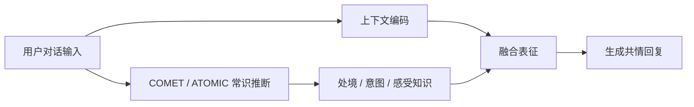

> 本文是对 Sabour et al., 2021（AAAI 2022）论文 *CEM: Commonsense-aware Empathetic Response Generation* 的阅读笔记与解读，原文见 arXiv:2109.05739（https://arxiv.org/abs/2109.05739）。文中观点与结论以原论文为准，本文仅做梳理。

## TL;DR

- 只识别对方的情绪标签，不足以生成真正共情的回复；还需理解「对方为什么会这样、可能需要什么」。
- CEM 引入常识知识（借助 COMET / ATOMIC 这类常识生成资源），推断用户的处境、意图与感受。
- 相比仅使用情绪标签的方法，融合常识让回复更具「认知共情」的成分。
- CEM 是在 EmpatheticDialogues 之后，把常识推理引入共情回复生成的代表性工作之一。

## 一、背景动机：共情不只是「读懂情绪」

共情回复生成（Empathetic Response Generation）关注的是：对话系统在感知到用户的情感状态后，应当给出体贴、恰当的回应。自 EmpatheticDialogues 数据集提出以来，主流做法多聚焦于「情绪识别」这一环——先判断用户处于何种情绪（如难过、焦虑、兴奋），再据此调整回复的语气与措辞。

然而，人类的共情往往超越了「贴一个情绪标签」的层次。心理学通常将共情区分为两个层面：一是**情感共情**（affective empathy），即感受到对方的情绪；二是**认知共情**（cognitive empathy），即理解对方处境背后的原因、意图与需求。仅停留在情绪标签上的模型，缺失了后一层——它知道用户「难过」，却不知道用户「为什么难过」「此刻可能想要什么」。CEM 正是针对这一缺口提出的。

## 二、核心思想：让常识补上「认知」这一环

CEM（Commonsense-aware Empathetic response generation Model）的关键假设是：要生成更贴心的回复，模型需要对用户当前处境做**常识层面的推断**，而不仅仅依赖对话文本表面的情绪信号。

为此，CEM 借助常识知识资源来「脑补」对话之外的隐含信息。这里用到的核心工具是 COMET——一个在 ATOMIC 常识知识库上训练的生成式模型，能够针对给定事件，生成诸如「事件之前需要什么」「事件会带来什么效果」「当事人有何感受」「当事人的意图为何」等多种常识推断。

将这些推断注入共情回复生成的流程后，模型对用户处境的理解就从「一个情绪词」扩展为「一组关于处境、意图与感受的推断」。据此生成的回复，不再是泛泛的安慰，而更可能触及用户真正关心的点，从而体现出认知共情的成分。

## 三、方法拆解：从对话到常识增强的回复

CEM 的处理思路大致可以分解为以下几个环节：

1. **理解对话上下文**：对用户的输入进行编码，获得其语义与情感表征。
2. **生成常识推断**：借助 COMET/ATOMIC，围绕用户所述事件生成多类常识知识，覆盖用户的处境、意图与可能的感受等维度。
3. **区分与融合两类信息**：将偏「情感」的推断与偏「认知/情境」的推断加以组织，并与对话上下文表征融合。
4. **生成共情回复**：在融合后的表征基础上解码，产出既回应情绪、又体现对处境理解的回复。

下表对「仅情绪标签」与「常识增强」两类思路做一个定性对比：

| 维度 | 仅使用情绪标签 | CEM（融合常识） |
| --- | --- | --- |
| 对用户的理解 | 停留在情绪类别 | 情绪 + 处境 / 意图 / 感受推断 |
| 共情层面 | 偏情感共情 | 兼顾认知共情 |
| 信息来源 | 对话文本本身 | 对话文本 + 外部常识知识 |
| 回复特征 | 易流于泛化安慰 | 更可能触及具体处境 |

其整体流程可以概括如下：

## 四、定位与关联工作

从研究脉络看，CEM 承接了 EmpatheticDialogues 所开辟的共情对话方向，并把「常识推理」这一要素明确地引入进来。此前的工作更多围绕情绪识别与情绪可控生成展开，而 CEM 强调：外部常识知识可以作为「认知共情」的支撑，帮助模型跳出对话文本的字面，去推断未被明说的处境与需求。这一思路也与近年来将结构化/生成式常识知识引入对话系统的整体趋势相呼应。

## 意义与局限

CEM 的价值在于，它把共情回复生成从「识别情绪」推进到「理解处境」，为后续把常识与外部知识引入情感对话提供了一条可借鉴的路径，凸显了认知共情在人机对话中的作用。

与此同时，这类方法也存在固有约束：其表现依赖所用常识资源（如 COMET/ATOMIC）的覆盖面与质量，当常识推断本身不准确或与语境不符时，可能反而引入噪声；常识生成也会带来额外的计算与流程复杂度；此外，共情回复的效果评估本身较为主观，如何稳定衡量「是否更懂你」仍是共情对话研究的共性难题。

> 延伸阅读：Sabour et al., *CEM: Commonsense-aware Empathetic Response Generation*, arXiv:2109.05739（https://arxiv.org/abs/2109.05739）。
