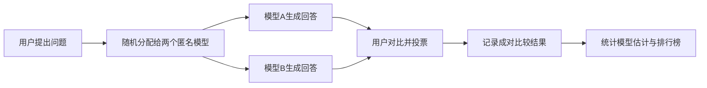

> 本文是对 Chiang et al. (LMSYS), 2024, *Chatbot Arena: An Open Platform for Evaluating LLMs by Human Preference*（arXiv:2403.04132，https://arxiv.org/abs/2403.04132）的阅读笔记与解读。文中观点与事实以原论文为准，本文仅做梳理。

## TL;DR

- **是什么**：Chatbot Arena 是 LMSYS 推出的开放式大模型评测平台，让真实用户在匿名对战中投票，把海量人类偏好汇聚成一份排行榜。
- **核心思想**：不预设固定题库，而是用真实用户提出的开放式问题，通过两两对比与投票来获取偏好信号。
- **关键方法**：基于成对比较，用 Bradley-Terry / Elo 类模型估计每个模型的相对强弱，并给出置信区间，同时讨论了抽样、异常投票检测与排名的统计有效性。
- **意义**：它已成为业界事实上的大模型排行榜之一，与同团队的 MT-Bench 一起构成了人类偏好评测与 LLM-as-a-Judge 的基础设施。

## 一、背景与动机

大语言模型能力快速增长，但「如何评价一个模型好不好」始终是个难题。传统的基准测试大多依赖固定题库和标准答案，擅长衡量知识问答、推理或代码等可自动判分的任务。然而开放式对话场景里，回答的质量往往取决于是否切题、是否符合用户意图、表达是否清晰自然，这些维度难以用单一指标量化。

固定题库还有两个结构性问题：一是题目可能与训练数据重叠或被针对性优化，导致刷分；二是静态题库难以反映真实用户不断变化的需求。Chatbot Arena 的出发点，正是用真实用户的开放式问题与主观偏好，来补足自动化基准难以覆盖的部分。

## 二、机制：匿名对战与投票

平台的交互流程很直观：用户输入一个问题，系统将同一问题分别发给两个匿名模型，用户在看到两份回答后投票选出更优者，或选择平局。投票完成前用户并不知道两个模型的身份，从而降低品牌偏好带来的干扰。每一次投票都是一条成对比较记录，海量记录持续累积，最终汇聚成排行榜。

这种设计的关键在于：题目来自真实需求、完全开放，且持续在线产生新数据，因此难以被针对性地刷分，也更贴近模型的实际使用情境。

## 三、统计方法：从成对比较到排名

平台收集到的是大量「A 胜 / B 胜 / 平局」的成对比较数据，如何把它们转换成一个可比较的分数，是论文的核心技术部分。其思路是把每个模型视为拥有一个潜在的强度参数，用 Bradley-Terry 模型这类成对比较模型来估计：两个模型对战时，胜负概率由两者强度之差决定。Elo 评分体系与此一脉相承，常被用来直观呈现排名。

论文不仅给出点估计，还强调了排名的统计有效性，包括：

| 关注点 | 论文讨论的内容 |
| --- | --- |
| 强度估计 | 基于 Bradley-Terry / Elo 从成对比较中估计相对强弱 |
| 不确定性 | 为分数给出置信区间，避免把微小差异当作显著差异 |
| 题目抽样 | 如何抽样与分配问题，使比较更具代表性 |
| 异常检测 | 识别异常投票，降低噪声与潜在操纵的影响 |

换言之，排行榜不只是把胜率排序，而是建立在一套有统计学依据的估计与校验流程之上，使「谁更强」这一判断带有可量化的可信度。

## 四、与自动化基准的对比

为了理解 Chatbot Arena 的定位，可以将其与传统自动化基准放在一起对照：

| 维度 | 传统自动化基准 | Chatbot Arena |
| --- | --- | --- |
| 题目来源 | 固定、预先编纂 | 真实用户、开放式 |
| 评判方式 | 标准答案 / 自动判分 | 人类主观偏好投票 |
| 抗刷分能力 | 易受针对性优化影响 | 题目开放，较难针对 |
| 数据更新 | 相对静态 | 持续在线累积 |
| 衡量维度 | 偏知识与推理 | 偏对话质量与用户满意度 |

两类方法并非互相替代，而是互补：自动化基准在可复现性与成本上占优，人类偏好评测则在开放对话与真实满意度上更有解释力。

## 五、影响与生态

Chatbot Arena 上线后逐步成为业界事实上的大模型排行榜之一，许多新模型发布时会参考其排名作为对话能力的横向参照。它与同一团队提出的 MT-Bench 共同构成了人类偏好评测的基础设施，也推动了 LLM-as-a-Judge（用强模型替代部分人工评判）这一研究方向的发展。其价值不仅在于一份榜单，更在于提供了一种「用真实人类偏好持续衡量模型」的范式。

## 意义与局限

Chatbot Arena 的意义在于，它把评测从封闭题库带向开放的真实交互，用持续累积的人类投票为模型提供了一个难以被针对性优化的参照系，并通过成对比较的统计建模让排名带上了可量化的不确定性。

与此同时，基于人类偏好的评测也有其固有边界：投票反映的是主观偏好，可能受表达风格、长度、措辞等因素影响，未必完全等同于事实正确性或专业性；用户群体与提问分布会影响结果的代表性；开放数据也对异常投票的检测与治理提出持续要求。这些方面在论文中均有相应讨论，也提示使用者应将榜单视为多维评测中的一个视角，而非唯一标准。

> 延伸阅读：Chatbot Arena 原论文 arXiv:2403.04132（https://arxiv.org/abs/2403.04132）。
