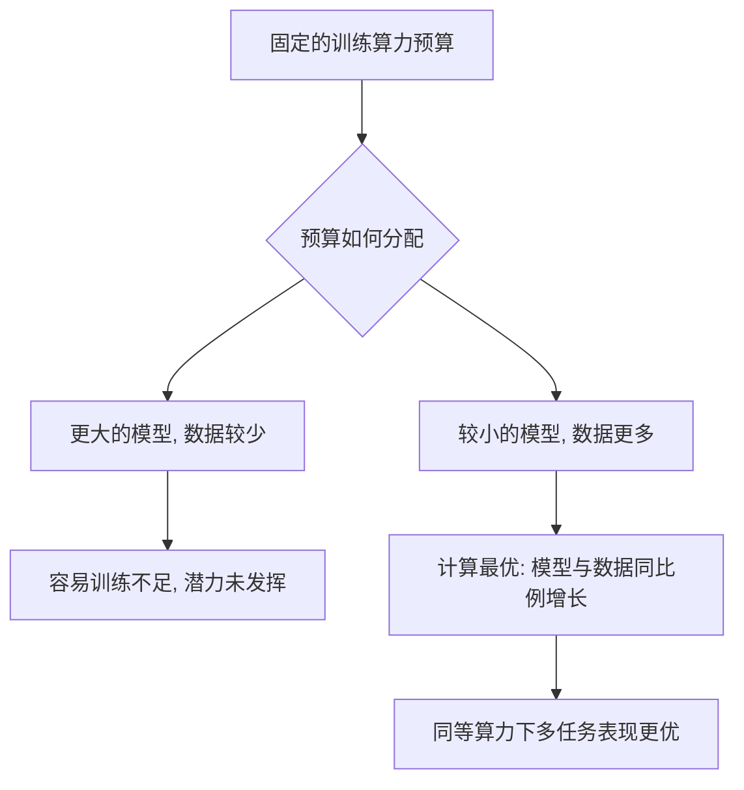

> 本文是对经典论文的解读与回顾。原文：Hoffmann et al. (DeepMind), 2022, *Training Compute-Optimal Large Language Models*，arXiv:2203.15556（<https://arxiv.org/abs/2203.15556>）。文中事实以原论文公开结论为准，定性概括，未引入无法核实的细节。

## TL;DR

- **是什么**：DeepMind 提出的一项关于大模型训练的缩放定律研究，回答"在算力预算固定时，参数量与训练数据该如何分配"这一核心问题。
- **核心思想**：在固定算力下，模型规模与训练 token 数应当大致**同比例**一起增长，而非一味把参数堆大。
- **关键结论**：此前许多大模型其实处于"训练不足"状态——参数很多但喂的数据太少；用同等算力训练一个更小、数据更多的模型反而更优。
- **意义**：这一发现重塑了"模型大小 vs 数据量"的权衡认知，直接影响了后续一批模型的训练配比选择。

## 一、背景与动机

在 Chinchilla 之前，大模型领域有一种朴素而流行的直觉：算力越多，就把模型做得越大。一批参数量动辄数百亿、上千亿的模型相继出现，竞赛的焦点几乎集中在"参数规模"这一个维度上。

但一个更基础的问题被忽略了：**给定固定的训练算力预算，到底应该把预算更多花在"更大的模型"上，还是花在"更多的数据"上？**

训练算力大体可以理解为"模型规模"与"训练所见 token 数"的乘积。预算一旦固定，二者就构成此消彼长的权衡：参数堆得越大，留给数据的算力就越少，模型见过的 token 也就越少；反之亦然。如何在这两者之间找到使最终效果最优的配比，正是这篇工作要回答的核心问题。

## 二、核心发现：很多大模型其实"训练不足"

论文最重要的洞察是：此前不少规模庞大的模型，实际上处于**训练不足（undertrained）**的状态——参数堆得很大，但训练所用的 token 数相对太少。

换句话说，这些模型把过多预算投在了"做大"上，却没有给它们喂足够多的数据。结果是同样的算力没有被用在刀刃上：模型容量没有被数据充分"填满"，潜力没有发挥出来。

由此得到的指导性结论是：**在计算最优（compute-optimal）的配置下，模型规模与训练 token 数应当大致同比例地一起增长。** 也就是说，当算力预算翻倍时，不应只把参数翻倍，而应让参数量和数据量都按相近的比例提升。这与"算力多就只把模型做大"的旧直觉形成了鲜明对比。

为了得到这一结论，论文系统地训练了大量不同规模、不同数据量的模型，并用多种方法去拟合"在固定算力下，参数与数据如何分配才能使损失最低"，多条路径给出了相互印证的结论。

## 三、实证验证：Chinchilla 对比 Gopher

理论结论需要实打实的对照实验来检验。论文据此设计了一个直接对比：

- 一边是此前的大模型 **Gopher（约 2800 亿参数）**；
- 另一边是按计算最优思路设计的 **Chinchilla（约 700 亿参数，约 1.4 万亿 tokens）**。

关键在于，**两者使用了大致相同的训练算力预算**。Chinchilla 参数量远小于 Gopher，但被喂了多得多的数据。

| 对比维度 | Gopher | Chinchilla |
| --- | --- | --- |
| 参数规模 | 约 2800 亿 | 约 700 亿（更小） |
| 训练数据量 | 相对较少 | 约 1.4 万亿 tokens（更多） |
| 训练算力 | 与对方大致相同 | 与对方大致相同 |
| 配比思路 | 偏向"做大模型" | 模型与数据同比例增长 |
| 多任务表现 | 基准 | 在众多任务上反超 |

结果是：在众多下游任务上，参数更小但数据更充分的 Chinchilla **反超了** 更大的 Gopher。这有力地说明，在算力固定的前提下，"把模型做小一点、把数据喂多一些"往往是更划算的选择。

下面用一张流程图概括这套推理逻辑：

## 四、对后续工作的影响

Chinchilla 的结论很快超越了单篇论文的范围，成为业界讨论"模型大小 vs 数据量"时的共同参照。它把人们的注意力从"单纯比拼参数规模"，引向"在固定算力下追求更优配比"。

这一思路直接影响了后续一批模型的训练配比选择——其中具有代表性的就是 LLaMA 系列：在相对可控的参数规模下，用更多的训练数据把模型"喂得更饱"，从而在有限算力下获得更强的实际表现。可以说，"Chinchilla 缩放定律"为之后大量预训练实践提供了重要的经验依据。

## 意义与局限

从意义上看，这项工作纠正了一个曾被广泛接受却并不准确的直觉，明确了"算力固定时模型与数据应同比例增长"的方向，让有限的算力被更有效地利用，也为预训练资源的分配提供了可操作的参考。

从局限上看，计算最优定律关注的是"在给定训练算力下如何取得最优"，但实际部署中还需要考虑推理成本——一个更小、数据更充分的模型在推理时通常更经济，这一点会进一步影响实践中的配比选择。此外，这类缩放规律是在特定数据与设定下拟合得到的经验性结论，外推到差异较大的数据分布、模型结构或训练条件时需要谨慎对待；随着训练范式与数据条件的演进，最优配比也可能随之变化。

> 延伸阅读：Hoffmann et al., *Training Compute-Optimal Large Language Models*，arXiv:2203.15556（<https://arxiv.org/abs/2203.15556>）
