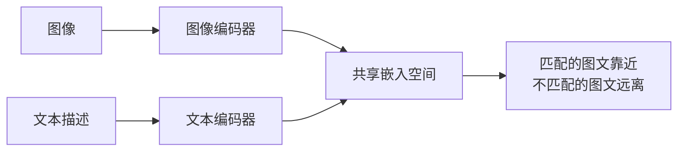

> 本文是对 CLIP 的经典回顾与阅读笔记。原文为 Radford 等人（OpenAI）于 2021 年发表的《Learning Transferable Visual Models From Natural Language Supervision》，arXiv:2103.00020（https://arxiv.org/abs/2103.00020）。下文内容只围绕原文已公开的核心思想展开。

## TL;DR

- CLIP 用约 4 亿图文对做对比学习，让匹配的图像与文本在共享嵌入空间里靠近、不匹配的远离。
- 训练目标不是预测固定类别，而是学习一种通用的视觉-语言表示。
- 借助文本提示（prompt），CLIP 可以直接对新任务做零样本图像分类，无需为每个任务重新训练。
- 这种图文对齐范式后来成为众多多模态大模型的基础组件之一。

## 一、背景与动机

传统的视觉模型大多依赖人工标注的固定类别标签来训练：先定义一套类别，再为每张图片打上其中一个标签。这种范式有两个长期存在的痛点。其一，标注成本高，类别一旦固定，模型能识别的概念就被框死；其二，迁移到新任务时往往需要重新收集数据、重新训练或微调，泛化能力受限。

与图像标签相比，互联网上天然存在海量"图像 + 自然语言描述"的配对数据。自然语言描述比单一类别标签包含的信息更丰富、更开放：它不只是"这是一只猫"，还可能描述场景、属性与关系。CLIP 的出发点正是要利用这种弱监督、规模庞大的图文对，把"用自然语言来监督视觉学习"这一思路真正做大、做通。

## 二、核心思想：对比式图文预训练

CLIP 的训练方式是对比学习（contrastive learning）。模型由两个编码器组成：一个图像编码器把图片映射成向量，一个文本编码器把对应的文字描述映射成向量。两者被投影到同一个共享的嵌入空间中。

训练时，模型看到一批图文对。它的目标是：让真实配对的（图像，文本）在嵌入空间里的相似度尽可能高，而让同一批次中不匹配的组合相似度尽可能低。换句话说，对每张图像，模型要在一批候选文本里"挑出"与之真正对应的那一条；对每段文本，同样要找回它对应的图像。这是一种双向的匹配目标。

这样训练带来的关键转变在于：模型学到的不是"把图片分到某个固定类别"，而是"判断任意一段文字与一张图片是否相配"。由此得到的视觉-语言表示是通用的、开放的，而非绑定在某套预设标签上。

## 三、零样本迁移：用文本提示当分类器

CLIP 最具代表性的能力是零样本分类。因为它学的是图文匹配，所以做分类时不需要再训练一个分类头，而是把"类别"改写成自然语言提示。

具体做法是：把每个候选类别填进一个文本模板（例如"一张关于某物的照片"），用文本编码器得到每个类别提示的向量；再把待分类图像用图像编码器编码成向量。然后比较图像向量与各个类别提示向量的相似度，相似度最高的提示对应的类别即为预测结果。

整个过程不需要见过该任务的训练样本，新增类别只需写出对应的文字描述即可。这就把传统"固定类别 + 重新训练"的流程，转化为"改写提示 + 直接比对"的灵活流程。

| 维度 | 传统监督式视觉模型 | CLIP |
| --- | --- | --- |
| 监督信号 | 人工标注的固定类别标签 | 自然语言图文配对 |
| 训练目标 | 预测预设类别 | 判断图文是否匹配 |
| 新任务适配 | 通常需重新训练或微调 | 改写文本提示即可 |
| 类别开放性 | 受限于预设标签集 | 可由自然语言灵活描述 |

## 四、为何成为多模态的基础组件

CLIP 的价值不止于一个分类器。它提供了一个把图像和文本统一进同一语义空间的通用表示，这一点对后续的多模态系统极为关键。

当图像与文本被对齐到可比较的向量空间后，"用文字检索图像""用文字描述引导图像生成""让模型理解图文混合输入"等任务都获得了一个共同的底座。也正因如此，图文对齐的预训练思路被后来的许多图文大模型与生成模型所借鉴和沿用，成为多模态领域的基础组件之一。

## 意义与局限

从意义上看，CLIP 把"自然语言监督 + 对比学习 + 大规模图文数据"组合成一套可规模化的范式，验证了不依赖固定标签也能学到强迁移性视觉表示的可行性，并让零样本迁移成为视觉模型的常规能力之一。

从局限上看，这一范式同样有其边界。模型表现高度依赖训练数据的规模与分布，互联网图文数据中潜在的偏差也可能被带入模型；零样本效果对文本提示的写法较为敏感，不同措辞会影响结果；此外，对比式匹配擅长整体语义对齐，但在需要细粒度理解或精确空间关系的任务上仍有不足。这些都是后续多模态研究持续改进的方向。

> 延伸阅读：Radford et al., Learning Transferable Visual Models From Natural Language Supervision, arXiv:2103.00020（https://arxiv.org/abs/2103.00020）
