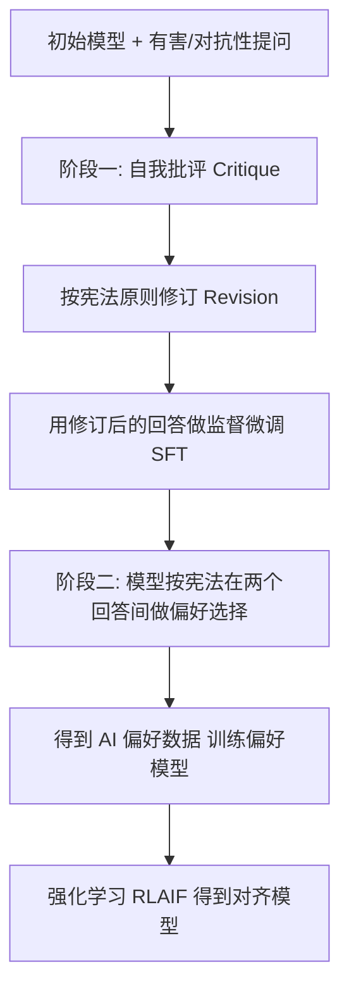

> 本文是对 Anthropic 论文 *Constitutional AI: Harmlessness from AI Feedback*（Bai et al., 2022）的阅读笔记与解读。原文出处：arXiv:2212.08073，链接：https://arxiv.org/abs/2212.08073 。文中观点以原论文为准，笔记仅作梳理。

## TL;DR

- **是什么**：Constitutional AI（CAI）是一套用"模型自己提供无害性反馈"来训练对齐模型的方法，核心是让一组显式书写的原则（constitution，宪法）来指导模型行为。
- **核心思想**：把对齐拆成两个阶段——先用"自我批评 + 修订"生成更无害的样本做监督微调，再用模型按宪法做偏好判断生成偏好数据，进行强化学习，即 RLAIF（Reinforcement Learning from AI Feedback）。
- **关键结论**：在无害性相关的反馈环节，AI 反馈可以在相当程度上替代人工标注，从而减少对人工标注有害内容的依赖。
- **意义**：提升了对齐流程的可扩展性与透明度——原则被显式写出来，而不是隐含在大量人工标注里。

## 一、背景与动机

主流的对齐范式 RLHF（Reinforcement Learning from Human Feedback）依赖大量人工标注：标注者在多个回答之间比较优劣，从而训练出偏好模型，再用强化学习把策略模型对齐到人类偏好。这套方法效果显著，但在"无害性"这一维度上有两个现实困难。

其一是**成本与可扩展性**。无害性偏好需要覆盖大量敏感、对抗性的提问场景，靠人工逐条标注代价高昂，且随着模型能力与覆盖面增长，标注需求会持续膨胀。

其二是**标注者负担**。要标注"有害/无害"，人就必须直接阅读甚至诱导出有害内容，这对标注者本身是一种心理负担。

由此产生一个自然的问题：能否让模型自己来提供无害性反馈？如果模型已经具备一定的判断能力，那么它或许可以在一组明确原则的约束下，对自己的输出做评价与改进，从而把"人类直接面对有害内容"这一环节大幅压缩。Constitutional AI 正是围绕这个问题展开。

## 二、核心方法：两个阶段

CAI 的训练流程由两个阶段组成，前者偏监督学习，后者偏强化学习。

### 阶段一：监督阶段（自我批评与修订）

这一阶段的目标是用低成本的方式生成一批"更无害"的训练样本。做法是：先用模型对带有诱导性或潜在有害的提问生成初始回答，然后让模型依据宪法中的某条原则对自己的回答进行**自我批评（critique）**，指出其中可能存在的问题；再据此对回答做**修订（revision）**，得到一个更符合原则的版本。这一"批评—修订"过程可以多次迭代。最后，用修订后的回答作为监督信号，对模型进行有监督微调（SFT），得到一个已经在无害性上有所改善的初始策略。

这里的关键在于：决定"什么算有害、应当如何改"的判断依据，来自显式写出的原则，而不是隐式的人工标注。

### 阶段二：强化学习阶段（RLAIF）

在监督阶段得到的模型基础上，进一步用强化学习提升对齐质量，但这一次的偏好信号由模型生成。具体做法是：对同一个提问采样出两个回答，让模型依据宪法中的相关原则去**判断哪个回答更符合原则**，由此得到一批 AI 生成的偏好数据。用这批数据训练一个偏好模型（preference / reward model），再以它为奖励信号对策略模型做强化学习。

由于这一阶段的偏好来自 AI 而非人类，整套流程被称为 **RLAIF**（Reinforcement Learning from AI Feedback），与传统 RLHF 形成对照。

## 三、RLHF 与 Constitutional AI 的对比

下表从几个维度梳理两者在无害性对齐上的差异（侧重定性比较）：

| 维度 | RLHF | Constitutional AI（含 RLAIF） |
| --- | --- | --- |
| 偏好信号来源 | 人工标注比较 | 模型按宪法原则自我判断 |
| 监督样本来源 | 人工撰写/筛选 | 模型自我批评 + 修订生成 |
| 对人工接触有害内容的依赖 | 较高 | 显著降低 |
| 行为依据的可见性 | 隐含在标注分布中 | 以显式原则形式写出 |
| 可扩展性 | 受人工标注产能限制 | 由模型生成，相对更易扩展 |

需要说明的是，CAI 并非完全不使用人类反馈——它通常仍会保留人类对"有用性（helpfulness）"等维度的反馈，而把无害性这部分较多地交给 AI 反馈。

## 四、为什么"显式原则"重要

CAI 中的"宪法"是一组用自然语言写出的原则，例如要求回答避免有害、尊重、不带误导等方向性约束。把这些原则显式化，带来两点直接影响。

一是**透明度**。模型行为所遵循的标准是可被人阅读、讨论与修改的文本，而不是分散在海量标注样本里的隐含偏好。当需要调整对齐目标时，原则上可以通过修改原则文本来体现。

二是**可控性与可审视性**。批评与修订、偏好判断都围绕这些原则展开，使得"模型为何这样回答"在一定程度上可以追溯到具体原则，而不是一个不可解释的黑箱偏好分布。

## 五、意义与局限（客观陈述）

**意义**方面，CAI 给出了一条用 AI 反馈部分替代人类反馈的可行路径：在无害性对齐上减少了对人工标注有害内容的依赖，提升了流程的可扩展性，并通过显式书写原则增强了透明度。RLAIF 这一思路此后也被更广泛地讨论与借鉴。

**局限**方面，需要客观看到：方法的效果依赖于初始模型本身具备一定的判断与遵循指令能力，能力不足的模型难以可靠地完成自我批评与偏好判断；宪法原则由人撰写，其覆盖面、措辞与潜在偏差会传导到最终模型的行为；用模型评价模型也可能引入与人类期望不一致的偏差。这些都属于该范式在实际应用中需要持续关注的方向。

> 延伸阅读：Bai et al., 2022, *Constitutional AI: Harmlessness from AI Feedback*, arXiv:2212.08073（https://arxiv.org/abs/2212.08073）。
