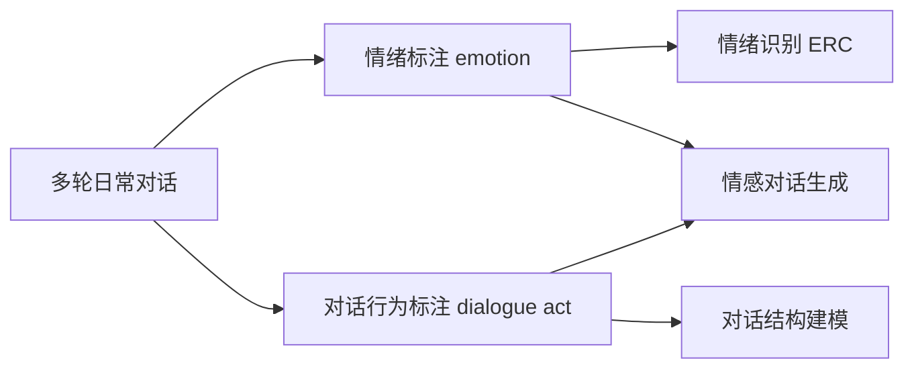

> 本文是对经典数据集论文的阅读笔记。原文：Li et al., 2017, *DailyDialog: A Manually Labelled Multi-turn Dialogue Dataset*, arXiv:1710.03957（https://arxiv.org/abs/1710.03957）。下文围绕该数据集的设计动机、标注方式与研究价值展开梳理。

## TL;DR

- DailyDialog 是一个高质量的多轮日常对话数据集，规模约 1.3 万段对话，话题贴近日常生活。
- 数据集同时提供了人工标注的情绪（emotion）与对话行为（dialogue act）标签，标注信息丰富。
- 由于双重标注的特性，它被广泛用于对话生成、情绪识别（ERC）等研究任务。
- 与 EmpatheticDialogues、MELD 等数据集同属情感对话方向的常用资源。

## 一、背景与动机

开放域对话系统的研究长期受限于数据质量。早期可用的大规模对话语料，很多来自社交媒体、电影字幕或论坛抓取，虽然规模可观，但噪声大、上下文残缺、话题分布失衡，且几乎没有可靠的细粒度标注。这类语料能支撑统计或检索式方法，却难以满足对“对话内在结构”进行建模的需求。

DailyDialog 的提出，正是为了填补“高质量、多轮、带细粒度标注”的日常对话语料这一空缺。它强调对话内容贴近真实生活场景——例如关于工作、旅行、情感、日常安排等主题，使得语料更接近人们实际交流的方式，而非碎片化的网络发言。

## 二、数据集构成与特点

DailyDialog 的核心定位是“手工标注的多轮对话数据集”。其几个突出特点可以概括如下：

- **多轮性**：对话由若干来回的话轮组成，保留了完整的上下文，便于研究上下文依赖的建模问题。
- **日常话题**：内容覆盖日常生活的常见场景，语言自然、表达规范。
- **人工标注**：在对话之外额外提供了情绪与对话行为两类标签，这是它区别于多数抓取语料的关键。
- **规模适中**：约 1.3 万段对话的体量，既保证了一定的覆盖面，又因人工标注而保持了较高质量。

下表对其关键维度做一概览：

| 维度 | 说明 |
| --- | --- |
| 对话规模 | 约 1.3 万段多轮对话 |
| 标注类型 | 情绪（emotion）、对话行为（dialogue act） |
| 话题取向 | 贴近日常生活的常见场景 |
| 标注方式 | 人工标注 |
| 典型用途 | 对话生成、情绪识别（ERC）等 |

## 三、两类标注的意义

DailyDialog 同时承载情绪与对话行为两套标签，这一“双重标注”是它被反复引用的根本原因。

情绪标注关注的是话语所传达的情感倾向。对话过程往往伴随情感的起伏变化，情绪标签使得研究者可以在话语层面追踪这种变化，从而支撑对话中的情绪识别（Emotion Recognition in Conversation, ERC）等任务。

对话行为标注则刻画了话语的功能意图，即一句话在交流中“在做什么”——是提问、回应、还是表达态度等。对话行为反映了对话的结构性与交互逻辑，对理解多轮对话的推进方式十分关键。

当情绪与对话行为被放在同一份多轮语料中时，研究者得以同时考察“说什么”“怎么说”以及“带着怎样的情感说”，这为对话建模提供了更立体的视角。

## 四、在研究生态中的位置

DailyDialog 常与其他情感对话资源一同出现。EmpatheticDialogues 更强调共情场景下的对话，MELD 则面向多模态的对话情绪识别。三者在侧重点上各有不同，但共同构成了情感对话方向的常用数据基础。

在实际研究中，DailyDialog 既可作为对话生成模型的训练与评测语料，也常被用作情绪识别任务的基准之一。其多轮结构与双重标注，使它在“语言生成”与“情感理解”两条研究脉络中都占有一席之地。

## 意义与局限

从意义上看，DailyDialog 通过人工标注与日常话题的结合，提供了一份兼具质量与信息密度的多轮对话语料，推动了对话生成与情绪识别等方向的研究。其“情绪 + 对话行为”的双重标注模式，也为后续数据集的设计提供了一种可参考的思路。

从局限上看，数据集的规模相对有限，话题集中于日常生活场景，难以覆盖更专业或更开放的对话情境；同时，它以文本为主，缺少语音、表情等多模态信息，这在一定程度上限制了对真实交流中情感线索的完整刻画。这些局限也正是 MELD 等后续多模态资源试图补充的方向。

> 延伸阅读：EmpatheticDialogues、MELD 等情感对话数据集。
