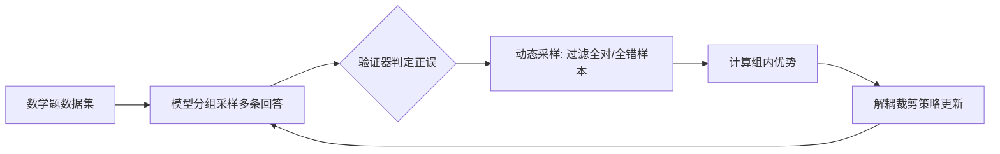

> 本文是对 ByteDance Seed 与清华大学合作论文《DAPO: An Open-Source LLM Reinforcement Learning System at Scale》的阅读笔记与解读。原文见 arXiv:2503.14476（<https://arxiv.org/abs/2503.14476>）。文中观点与数据均以原论文为准，本文仅做梳理与延伸。

## TL;DR

- **是什么**：DAPO（Decoupled Clip and Dynamic Sampling Policy Optimization）是一套面向大语言模型推理能力训练的、完全开源的大规模强化学习系统，由字节跳动 Seed 与清华合作提出。
- **核心思想**：在 GRPO/PPO 的策略优化框架上，引入「解耦裁剪」和「动态采样」等一系列工程与算法技巧，提升训练的稳定性与样本效率。
- **关键结论**：以 Qwen2.5-32B 为基座，DAPO 在 AIME 2024 数学竞赛题集上取得约 50 分。
- **意义**：DAPO 不仅公开了方法，还完整开源了算法、基于 verl 框架的训练代码以及整理后的数据集与验证器，降低了推理 RL 的复现门槛。

## 一、背景与动机

近一两年，强化学习被广泛用于提升大语言模型的复杂推理能力，尤其是在数学、竞赛题等需要长链条思考的任务上。然而，许多代表性工作虽然报告了亮眼的结果，却对训练过程中的关键细节语焉不详：奖励如何设计、采样如何组织、裁剪与正则化的超参数如何取值、数据如何清洗与验证，往往都没有完整披露。这导致社区在尝试复现时面临两难——能看到结论，却难以重走那条通往结论的路。

DAPO 的出发点正是「可复现」。它主张把一个能在规模上跑通的推理 RL 系统完整地交付出来：不只是论文里的方法描述，而是连同算法实现、训练代码（基于开源的 verl 框架）、整理好的数据集与对应的答案验证器一并开源，使得他人能够在相同的起点上重现并继续改进。这一定位使 DAPO 既是一个算法贡献，也是一套面向社区的基础设施。

## 二、方法：在 GRPO/PPO 之上的关键改进

DAPO 建立在以 PPO 为代表的策略梯度方法、以及在语言模型 RL 中广泛使用的 GRPO（基于分组采样估计优势、省去价值网络）思路之上，针对长链推理训练中容易出现的稳定性与效率问题，提出了若干改进。其中两项被写进了名字里。

**解耦裁剪（Decoupled Clip）。** 在 PPO 系列方法中，重要性采样比值会被裁剪到一个区间内，以防止单步更新过大。常规做法对正、负优势使用对称的裁剪边界。DAPO 将上下裁剪边界解耦，对正优势与负优势采用不同的裁剪上界，从而为「鼓励好的行为」与「抑制差的行为」留出不同的更新空间，缓解训练过程中策略熵塌缩、探索不足等问题。

**动态采样（Dynamic Sampling）。** 在分组采样的设定下，同一道题会被采样出多条回答并据此估计组内优势。如果某组内的所有回答全部正确或全部错误，组内优势差异为零，这批样本对梯度几乎没有贡献，却仍占用了昂贵的生成与训练算力。动态采样的思路是过滤掉这类「全对或全错」、不产生有效梯度信号的样本，把算力集中到真正有学习价值的数据上，从而提升训练效率。

除上述两点外，论文还讨论了与长序列推理训练相关的其他实践细节，整体构成了一个可在规模上稳定运行的训练配方。

## 三、要点对比

下表概括 DAPO 相对基础框架的若干关键点：

| 维度 | 常见做法 | DAPO 的处理 |
| --- | --- | --- |
| 裁剪边界 | 正负优势对称裁剪 | 解耦裁剪，正负优势使用不同上界 |
| 价值网络 | PPO 需训练独立 critic | 沿用分组优势估计，省去价值网络 |
| 采样利用 | 全部样本入训 | 动态采样，过滤全对/全错的无梯度样本 |
| 开放程度 | 方法描述为主，细节常缺失 | 开源算法、训练代码、数据集与验证器 |

整体而言，这些改进的共同主题是：让有限的算力尽量花在能产生有效学习信号的地方，同时让更新过程更可控。

## 四、训练流程概览

整个循环由「采样—验证—筛选—更新」构成。验证器负责对模型给出的答案做客观判定，为奖励提供可靠依据；动态采样在进入训练前剔除无信息量的样本；解耦裁剪则约束每一步更新的幅度。

## 五、结果

论文以 Qwen2.5-32B 作为基座模型，使用 DAPO 进行强化学习训练，在数学竞赛题集 AIME 2024 上取得约 50 分的成绩。这一结果是在完全开源的系统设定下得到的，意味着读者可以依据公开的代码与数据尝试重现该训练过程，而不必依赖未披露的内部细节。

## 意义与局限

DAPO 的价值，很大程度上来自它对「开放」的坚持。在推理 RL 普遍存在复现困难的背景下，把算法、训练代码、数据与验证器一并公开，使社区得以站在一个共同的、可检验的起点上推进研究，这本身是一项基础设施意义上的贡献。其在算法层面提出的解耦裁剪与动态采样，则给出了在长链推理训练中提升稳定性与效率的具体而可操作的思路。

需要客观看待的是，论文中的方法与结论是在特定基座模型、特定任务（以数学竞赛题为代表）和特定训练设定下得到的；其在其他模型规模、其他类型推理任务或更广泛对齐目标上的表现，仍需进一步验证。强化学习训练对超参数、数据质量与奖励设计较为敏感，迁移到新场景时往往需要重新调校。这些都属于该方向尚待持续探索的部分。

> 延伸阅读：arXiv:2503.14476《DAPO: An Open-Source LLM Reinforcement Learning System at Scale》（<https://arxiv.org/abs/2503.14476>）。
