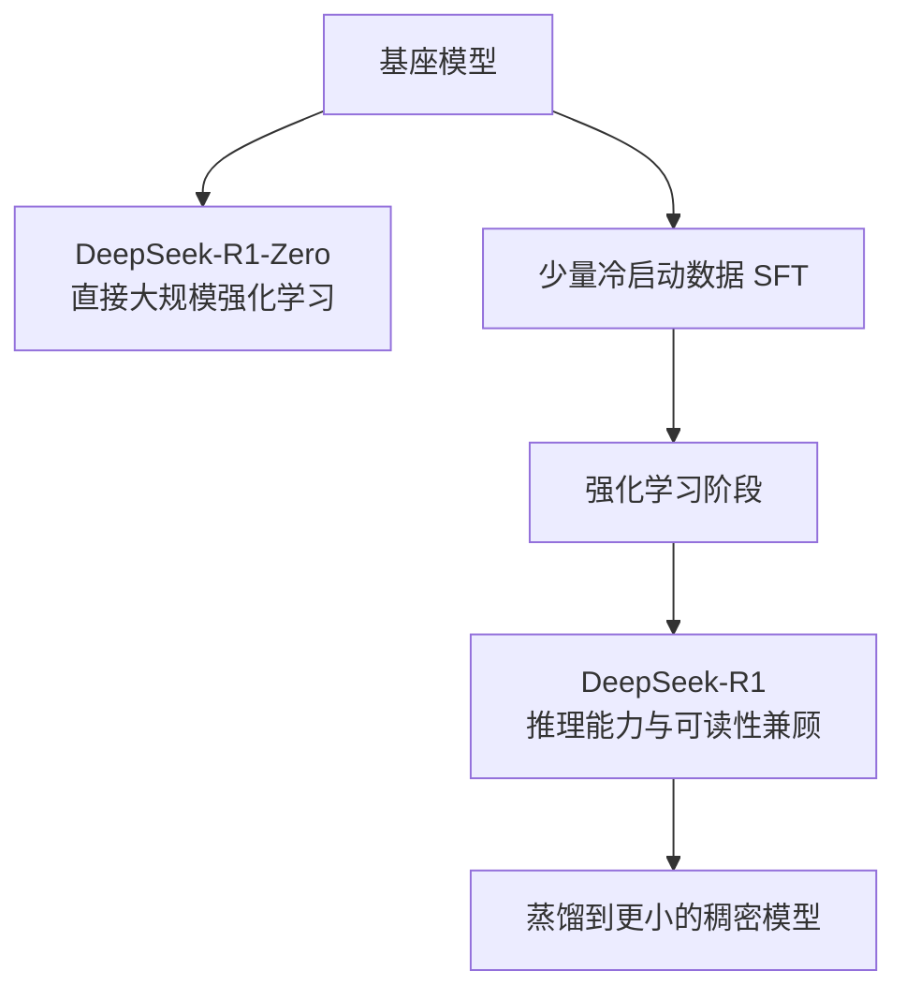

> 本文是对 DeepSeek-AI 技术报告《DeepSeek-R1: Incentivizing Reasoning Capability in LLMs via Reinforcement Learning》(2025, arXiv:2501.12948, https://arxiv.org/abs/2501.12948) 的阅读笔记与解读，仅作学习记录，具体细节请以原文为准。

## TL;DR

- **是什么**：一份关于如何通过强化学习提升大语言模型推理能力的技术报告，发布了 DeepSeek-R1-Zero 与 DeepSeek-R1 两个模型。
- **核心思想**：以「可验证正确性」为主要奖励信号，直接用大规模强化学习去激励模型生成长思维链，而非依赖独立训练的奖励模型。
- **关键结论**：纯强化学习路线下，长思维链、自我反思等推理行为可以自发涌现；再叠加少量冷启动数据后，可读性与综合表现得到改善。
- **意义**：作为 2025 年初备受关注的开源推理工作之一，它与 OpenAI o1 所代表的推理模型路线形成了公开可对照的参考。

## 一、背景与动机

近年来，提升大语言模型「推理能力」成为研究热点：让模型在回答前先进行一段较长的思考过程(长思维链，Chain-of-Thought)，往往能显著改善其在数学、代码等需要多步推理任务上的表现。OpenAI 的 o1 系列把这种「推理时投入更多计算」的思路推向台前，但其训练细节并未完全公开。

通常的对齐流程是「监督微调(SFT) + 基于人类反馈的强化学习(RLHF)」，其中强化学习阶段往往需要训练一个独立的奖励模型来打分。DeepSeek-R1 的工作提出了一个更直接的问题：能否绕开复杂的奖励模型，直接用强化学习把推理能力「逼」出来？围绕这个问题，报告给出了两条互补的路径。

## 二、DeepSeek-R1-Zero：纯强化学习的涌现

DeepSeek-R1-Zero 的特点是**不经过监督微调**，直接在基座模型上施加大规模强化学习。训练采用了 GRPO(Group Relative Policy Optimization)这类面向群组相对优势的策略优化方法，无需为价值函数单独维护一个同等规模的网络。

关键之处在于奖励的设计：它主要依赖**可验证的正确性**与**格式规范**，而不是训练一个独立的奖励模型。例如对于数学题或编程题，答案是否正确可以被自动判定；同时通过格式约束，引导模型把思考过程与最终答案分开呈现。

在这种设置下，报告观察到一些值得注意的现象：随着训练推进，模型会**自发地**生成更长的思维链，出现自我反思、回溯检查等行为，甚至出现了被形象地称为「aha moment」的转折点。这些推理行为并非由人工示范直接教会，而是在以正确性为导向的奖励驱动下涌现出来的。

不过，DeepSeek-R1-Zero 也暴露出明显短板：输出**可读性较差**，以及**语言混杂**(在同一段回答中夹杂多种语言)。这说明纯强化学习虽然能换来推理能力，却不一定带来良好的表达体验。

## 三、DeepSeek-R1：冷启动加强化学习

为弥补上述不足，DeepSeek-R1 在流程上做了调整：先用**少量高质量的「冷启动」数据**进行监督微调，给模型一个更规范的起点，再进入强化学习阶段。这样既保留了强化学习带来的推理能力，又改善了可读性与语言一致性，使输出更适合实际使用。

可以把两条路线的差异概括如下：

| 维度 | DeepSeek-R1-Zero | DeepSeek-R1 |
| --- | --- | --- |
| 是否使用 SFT | 否，直接强化学习 | 先少量冷启动 SFT，再强化学习 |
| 推理能力来源 | 强化学习中自发涌现 | 冷启动引导 + 强化学习 |
| 奖励信号 | 以可验证正确性与格式为主 | 同样以可验证正确性为核心 |
| 主要优点 | 验证了纯强化学习路线可行 | 兼顾推理能力与可读性 |
| 主要短板 | 可读性差、语言混杂 | 流程相对更复杂 |

整体训练思路可以用下图大致表示：

## 四、把推理能力蒸馏到小模型

除了两个主模型，报告还做了一件对社区颇有价值的事：把 DeepSeek-R1 的推理能力**蒸馏**到一系列更小的稠密模型上(基于 Qwen、Llama 等多种规模的基座)。其做法是让较小的模型去学习较强模型产出的推理数据，从而在参数量受限的情况下，也获得相对更强的推理表现。

这一思路的意义在于：强推理能力不必只停留在最大的模型上，经过蒸馏，部署成本更低的小模型也能受益，便于在更广泛的场景中落地。

## 意义与局限

DeepSeek-R1 的工作提供了一条相对清晰且公开的思路：以可验证正确性为核心奖励，用强化学习直接激励推理能力的形成，并通过冷启动数据兼顾表达质量。作为 2025 年初最受关注的开源推理工作之一，它与 OpenAI o1 所代表的推理模型路线形成了可对照的公开参考，对后续研究与复现具有借鉴价值。

需要客观看待的是几点局限与边界。其一，纯强化学习路线虽然能让推理行为涌现，但伴随可读性与语言混杂等问题，需要额外环节弥补。其二，「可验证正确性」奖励天然更适用于数学、代码等有明确判定标准的任务，对于难以自动验证答案的开放式问题，奖励设计仍是挑战。其三，蒸馏能让小模型获益，但小模型与大模型之间在能力上仍存在差距。这些边界既说明了方法的适用范围，也指向了后续值得继续探索的方向。

> 延伸阅读：DeepSeek-R1 技术报告原文 arXiv:2501.12948（https://arxiv.org/abs/2501.12948）
