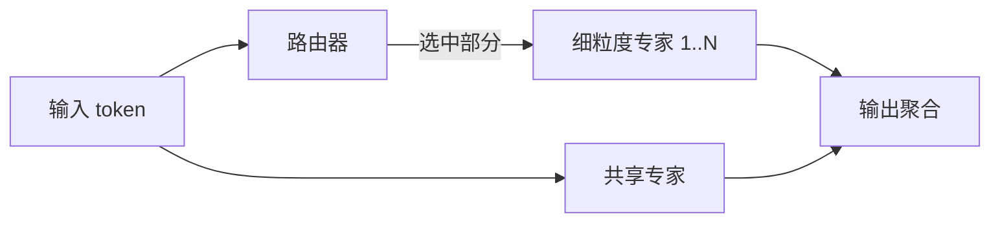

> 本文为经典回顾，解读 DeepSeek-AI 于 2024 年发布的技术报告《DeepSeek-V2: A Strong, Economical, and Efficient Mixture-of-Experts Language Model》（arXiv:2405.04434，链接：https://arxiv.org/abs/2405.04434）。这篇报告首次提出了后来被 DeepSeek-V3 沿用的两个关键组件——MLA 与 DeepSeekMoE，理解它有助于厘清 V3 中相关设计的来龙去脉。

## TL;DR

- DeepSeek-V2 把自己定位为「强、经济、高效」的混合专家（MoE）语言模型，核心是在不牺牲能力的前提下压低训练与推理成本。
- MLA（Multi-head Latent Attention）将 Key/Value 压缩成一个低秩潜在向量再缓存，大幅降低推理时的 KV Cache 显存占用，是高效推理的关键。
- DeepSeekMoE 采用细粒度专家与共享专家相结合的稀疏结构，以较低成本训练出强模型。
- 这两项设计在 DeepSeek-V3 中被继续沿用，V2 因此可被视为这条技术路线的起点。

## 一、背景与动机：为什么要同时追求「强」和「省」

大语言模型在规模扩张的过程中，逐渐被两类成本所约束。其一是训练成本：参数越多、数据越多，所需算力与时间越高。其二是推理成本：自回归生成时需要缓存历史 token 的 Key 与 Value（即 KV Cache），随着序列长度和并发请求增加，显存占用迅速膨胀，往往成为部署的瓶颈。

MoE（Mixture-of-Experts，混合专家）是缓解训练成本的一条主流路线：模型拥有大量参数，但每个 token 只激活其中一小部分专家，从而在「总参数量大」与「单次计算量小」之间取得平衡。然而 MoE 本身并不直接解决推理时的 KV Cache 显存问题，注意力机制的缓存开销依旧存在。

DeepSeek-V2 的动机正是同时正面回应这两类成本：用 DeepSeekMoE 控制训练侧的开销，用 MLA 控制推理侧的显存开销，并力求在能力上保持竞争力。这种「强、经济、高效」三者兼顾的定位，是理解整篇报告设计取舍的主线。

## 二、MLA：把 KV Cache 压成一个潜在向量

标准的多头注意力（Multi-Head Attention）在推理时，需要为每一层、每一个注意力头缓存完整的 Key 和 Value。这部分缓存与序列长度、头数、隐藏维度都成正比，是长上下文与高并发场景下显存压力的主要来源。围绕这一痛点，业界曾提出多查询注意力（MQA）、分组查询注意力（GQA）等方案，思路是让多个头共享 Key/Value 以减少缓存，但通常以一定的表达能力为代价。

MLA（Multi-head Latent Attention，多头潜在注意力）的核心思想是引入「低秩压缩」：不直接缓存高维的 Key 与 Value，而是先将其压缩为一个低秩的潜在向量（latent vector），在推理时只缓存这个更小的潜在表示，需要时再由它恢复出注意力计算所需的 Key/Value。

这样做带来的直接收益是 KV Cache 显存的显著下降——缓存的对象从完整的多头 Key/Value 变成了一个维度更小的潜在向量。与此同时，MLA 的设计目标是在压缩缓存的同时尽量保持注意力的建模能力，避免像简单共享方案那样明显损失质量。正是这一点，使 MLA 成为 DeepSeek-V2 实现高效推理的核心组件，也是它区别于此前 KV Cache 优化方案的关键。

下表对比几种降低 KV Cache 的思路（为定性说明，不含具体数值）：

| 方案 | 基本做法 | KV Cache 倾向 | 主要取舍 |
| --- | --- | --- | --- |
| 标准 MHA | 每个头各自缓存完整 K/V | 高 | 表达力强，但缓存最大 |
| MQA | 多头共享同一组 K/V | 低 | 缓存小，可能损失质量 |
| GQA | 头分组共享 K/V | 中 | 介于 MHA 与 MQA 之间 |
| MLA | 低秩压缩为潜在向量再缓存 | 低 | 兼顾缓存压缩与建模能力 |

## 三、DeepSeekMoE：细粒度专家加共享专家

在前馈层一侧，DeepSeek-V2 采用了 DeepSeekMoE 结构。它在传统 MoE「一组专家加路由」的基础上，做了两点设计上的细化。

其一是细粒度专家（fine-grained experts）。相比把前馈网络切成少数几个较大的专家，DeepSeekMoE 倾向于将其切分为数量更多、单个更小的专家。更细的粒度意味着不同专家可以承担更专门化的功能，路由也有更大的组合空间，有助于在相同激活成本下提升模型的有效容量。

其二是共享专家（shared experts）。除了由路由按 token 选择的专家之外，模型还保留一部分对所有 token 都生效的共享专家。其作用在于承载通用、共性的知识，让被路由选中的专家可以更专注于差异化的部分，从而减少不同专家之间重复学习相同基础能力的冗余。

细粒度与共享专家相结合，目标是在保持稀疏激活、控制单次计算量的前提下，提升参数利用效率，从而以较低成本训练出能力更强的模型。这与报告中「经济」的定位一脉相承。

## 四、组合起来：一条被 V3 继承的路线

把 MLA 与 DeepSeekMoE 放在一起看，DeepSeek-V2 实际上给出了一套在两个维度上分别发力的方案：注意力一侧用 MLA 压低推理时的 KV Cache 显存，前馈一侧用 DeepSeekMoE 提升训练时的参数利用效率。二者共同服务于「强、经济、高效」这一总目标。

| 组件 | 作用层 | 主要解决的成本 | 核心手段 |
| --- | --- | --- | --- |
| MLA | 注意力层 | 推理显存（KV Cache） | Key/Value 低秩潜在压缩 |
| DeepSeekMoE | 前馈层 | 训练成本与参数效率 | 细粒度专家 + 共享专家 |

这套设计的意义不止于 V2 本身。MLA 等组件在后续的 DeepSeek-V3 中被继续沿用，因此回头阅读 V2，能够帮助理解 V3 里相关设计为何如此选择、又是从何而来。

## 意义与局限

从意义上看，DeepSeek-V2 把「降低推理 KV Cache」与「降低训练成本」两个长期存在的工程难题，分别交给 MLA 与 DeepSeekMoE 处理，并将它们整合进一个统一的「强、经济、高效」框架中。这条路线被 DeepSeek-V3 继承，使 V2 成为理解这一系列模型设计取舍的合适起点。

就局限而言，低秩压缩本质上是在缓存大小与信息保留之间做权衡，潜在向量的维度与恢复方式会影响最终效果；细粒度专家与共享专家也涉及路由稳定性、负载均衡等工程问题。这些都需要结合具体实现与评测来理解，而非一概而论。要获得准确的结构细节与量化结论，建议回到原始报告对照阅读。

> 延伸阅读：DeepSeek-AI, 2024, "DeepSeek-V2: A Strong, Economical, and Efficient Mixture-of-Experts Language Model", arXiv:2405.04434（https://arxiv.org/abs/2405.04434）
