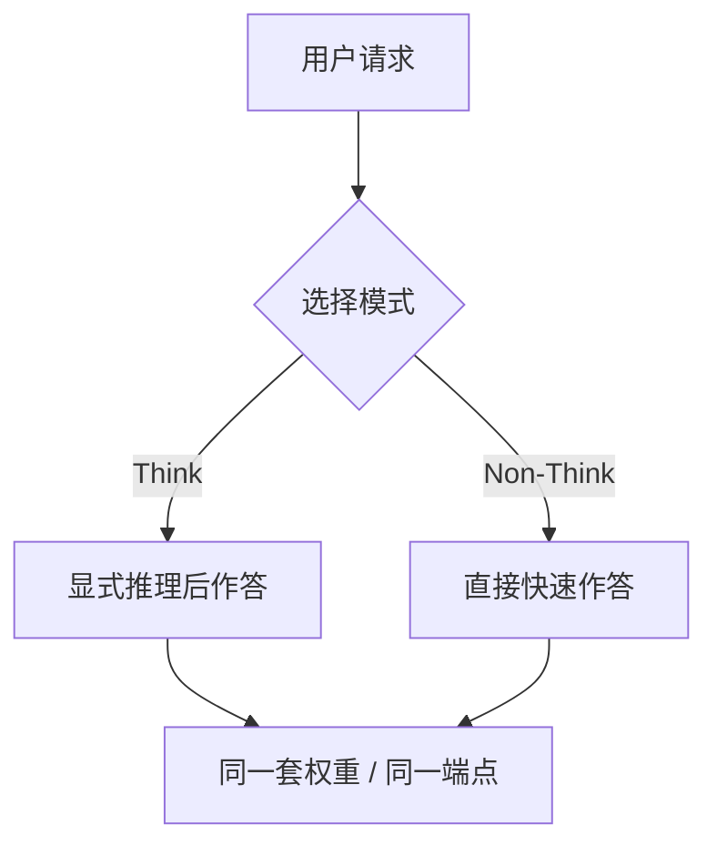

> 本文是对 DeepSeek-V3.1 发布的一篇阅读笔记与解读。模型由 DeepSeek 于 2025 年 8 月 21 日发布，相关说明可见官方 API 文档（[api-docs.deepseek.com](https://api-docs.deepseek.com)）与开源权重（Hugging Face：[deepseek-ai/DeepSeek-V3.1](https://huggingface.co/deepseek-ai/DeepSeek-V3.1)）。本文仅在公开信息范围内展开，不涉及未披露的精确指标。

## TL;DR

- **是什么**：DeepSeek 于 2025 年 8 月 21 日发布的新一代模型 DeepSeek-V3.1，最大亮点是「混合推理（hybrid inference）」。
- **核心思想**：同一个模型、同一个 API 端点，可在「Think（思考）」与「Non-Think（非思考）」两种模式间切换，把「会推理」和「答得快」合进一套权重。
- **关键结论**：Think 模式相比上一代 R1-0528 思考更快、同时保持推理质量；Non-Think 模式追求更直接快速的回答；同时升级了智能体与工具使用能力，支持 128K 上下文。
- **意义**：开源了 DeepSeek-V3.1 与 DeepSeek-V3.1-Base 权重，体现了「推理与非推理合一」的行业趋势。

## 一、背景与动机

过去一段时间，大模型领域出现了明显的「双轨」格局。一类是面向直接对话的通用模型，强调响应速度与流畅度；另一类是面向复杂任务的推理模型，会在回答前生成较长的「思维链」，以更多的中间步骤换取更高的解题正确率。DeepSeek 此前的 R1 系列即属于后者，而通用对话能力则由 V3 系列承担。

这种分工带来了一个工程上的现实问题：使用方往往需要在「快但浅」和「准但慢」之间二选一，甚至要为不同任务接入不同的模型与端点。对于需要同时处理简单问答和复杂推理的应用而言，这意味着更复杂的路由逻辑与更高的维护成本。

DeepSeek-V3.1 的出发点，正是把这两种能力收敛到同一个模型里：让「是否进行深度思考」成为一次调用时可以选择的开关，而不是模型选型阶段就要锁定的决策。

## 二、核心思想：混合推理的「快慢两挡」

混合推理（hybrid inference）是 V3.1 最核心的设计。它的关键在于「一个模型、一个端点、两种模式」：

- **Think 模式**：模型在作答前进行显式的推理过程，适合数学、代码、多步逻辑等需要拆解的任务。官方说明指出，相比上一代 R1-0528，V3.1 的 Think 模式思考得更快，同时保持了推理质量。
- **Non-Think 模式**：模型跳过冗长的思考过程，追求更直接、更快速的回答，适合日常问答、改写、信息抽取等对延迟敏感的场景。

二者共享同一套权重与同一个 API 端点，这意味着调用方无需切换模型，只需在请求中选择模式即可。这种设计把「推理深度」从一个静态的模型属性，转化为一个动态的、可按任务调节的运行时参数。

下面用一张图概括这一调用路径：

## 三、两种模式的定位对比

为便于理解，下表从几个维度对两种模式的定位做概括性梳理（仅为定性描述，不代表具体数值）：

| 维度 | Think 模式 | Non-Think 模式 |
| --- | --- | --- |
| 作答方式 | 先进行显式推理，再给出结论 | 跳过冗长思考，直接作答 |
| 适合任务 | 数学、代码、多步逻辑等复杂任务 | 日常问答、改写、抽取等轻量任务 |
| 相对侧重 | 推理质量与正确率 | 响应速度与直接性 |
| 与上一代关系 | 较 R1-0528 思考更快且保持质量 | 面向更快的直接回答 |
| 调用方式 | 同一模型、同一端点切换 | 同一模型、同一端点切换 |

需要强调的是，上表描述的是两种模式的「定位差异」，而非两者的绝对优劣——选择哪种模式取决于具体任务对延迟与推理深度的权衡。

## 四、智能体与工具使用能力的升级

除了混合推理，V3.1 在智能体（Agent）方向也做了升级，强化了工具使用（tool use）相关的能力。对于需要调用外部工具、检索信息、执行多步操作的智能体应用而言，模型能否稳定地理解工具接口、规划调用顺序并整合返回结果，是决定可用性的关键。

配合这一方向，V3.1 支持 128K 的上下文长度。较长的上下文窗口对智能体场景尤为重要：它使得多轮交互、较长的工具返回内容、以及任务过程中的中间状态能够更完整地保留在同一次会话里，减少因上下文截断带来的信息丢失。Think 模式与工具使用的结合，则为「先思考再行动」式的智能体流程提供了基础。

## 五、开源与生态

DeepSeek 开源了 DeepSeek-V3.1 与 DeepSeek-V3.1-Base 两套权重，并托管在 Hugging Face 上。其中 Base 版本面向需要在此基础上继续训练或定制的研究与工程场景，而对齐后的版本则可直接用于推理与应用集成。

开源权重的发布，使得社区可以在本地或自有基础设施上部署与评估该模型，也为后续的微调、蒸馏与二次开发留出了空间。结合可在同一端点切换的混合推理设计，这一发布在「能力」与「可获取性」两个层面都对使用方相对友好。

## 意义与局限

DeepSeek-V3.1 的核心价值，在于把「推理」与「非推理」两种长期分裂的能力收敛进同一个模型，并以运行时可切换的方式交给使用方。这呼应了当前业界「推理与非推理合一」的趋势：模型不再被静态地分为「思考型」与「对话型」，而是让深度思考成为一个可按需开启的能力。对应用方而言，这降低了模型选型与路由的复杂度。

局限方面也需保持客观。混合推理的实际收益依赖于任务类型与模式选择是否得当，模式切换本身并不能消除复杂任务固有的难度；同时，本文所依据的均为公开发布信息，具体的评测分数、不同任务下的精确表现等细节应以官方与第三方的后续公开数据为准，不宜在此范围之外做过度推断。总体而言，V3.1 提供的是一种更统一、更灵活的能力组织方式，其真实效果仍需在各自的场景中验证。

> 延伸阅读：DeepSeek 官方 API 文档（api-docs.deepseek.com）与 Hugging Face 上的 deepseek-ai/DeepSeek-V3.1 权重页面。
