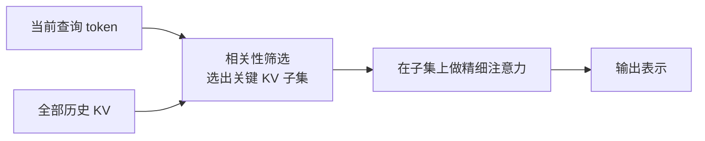

> 本文是对 DeepSeek 于 2025 年 9 月 29 日发布的实验版模型 DeepSeek-V3.2-Exp 的阅读笔记，重点解读其引入的稀疏注意力机制 DeepSeek Sparse Attention（DSA）。信息来自官方发布说明与开源仓库，供理解与讨论之用，具体数字请以官方为准。
> 出处：DeepSeek 官方发布说明（api-docs.deepseek.com/news/news250929）；开源仓库：GitHub deepseek-ai/DeepSeek-V3.2-Exp。

## TL;DR

- DeepSeek-V3.2-Exp 是在 V3.1-Terminus 基础上的实验版，核心变化是引入了 DeepSeek Sparse Attention（DSA），被官方描述为首次实现「细粒度稀疏注意力」。
- DSA 的目标是大幅降低长上下文场景下的训练与推理成本，同时把输出质量维持在与稠密注意力接近的水平。
- 在公开基准上，V3.2-Exp 的表现与 V3.1-Terminus 基本持平，即在提效的前提下没有明显的质量损失。
- 伴随发布，API 价格下调 50% 以上，模型权重在 Hugging Face 与 GitHub 开源。

## 一、背景动机：长上下文的成本瓶颈

标准 Transformer 的自注意力机制需要让序列中的每个 token 与其余所有 token 计算相关性，其计算与显存开销随序列长度呈平方级增长。当上下文从几千 token 扩展到几万甚至更长时，这种平方复杂度就成为训练与推理成本的主要来源之一，也直接影响到 API 的定价与响应速度。

围绕这一问题，业界长期探索各种「稀疏注意力」思路，其共同出发点是：并非每个 token 对当前 token 都同等重要，若能只让模型关注真正相关的一部分，就能在保住效果的同时节省大量算力。DeepSeek-V3.2-Exp 正是沿着这条路线，把稀疏注意力从早期较粗的分块、滑窗式做法，推进到官方所称的「细粒度」层面。

## 二、DSA 的核心思想

DeepSeek Sparse Attention 的基本立场是：在计算注意力时，为每个查询动态地筛选出一个较小的、真正相关的键值子集，只在这个子集上做完整的注意力运算，而不是对全序列一视同仁地展开。

可以把它拆成两个相互配合的环节来理解：

- 相关性筛选：先以较低的代价估计出哪些历史 token 与当前查询最相关，从而确定一个候选范围。这一步决定了「关注谁」，是稀疏化能否既省算力又不丢信息的关键。
- 精细注意力：在筛选出的子集上执行注意力计算并聚合结果。由于参与运算的 token 数量被显著压缩，长序列下的计算量和显存占用随之下降。

所谓「细粒度」，指的是筛选的粒度更接近单个 token 或很小的单元，而非早期方法中固定的大块区域或简单滑动窗口。粒度更细，意味着模型在省算力的同时更有机会保留那些分散在长文本中的关键信息。

需要说明的是，上图为帮助理解而作的示意，并非官方给出的精确结构图；DSA 的具体实现细节以官方仓库为准。

## 三、效率与质量的权衡

稀疏注意力最受关注的问题，始终是「省下来的算力会不会以牺牲质量为代价」。DeepSeek-V3.2-Exp 的做法是把 DSA 建立在已经较为成熟的 V3.1-Terminus 之上，以此为对照来验证稀疏化的影响。

根据官方发布信息，V3.2-Exp 在公开基准上的表现与 V3.1-Terminus 基本持平，也就是说，在把长上下文成本明显压下来的同时，输出质量没有出现可见的退化。下表对两者做一个定性的比较（仅为定性梳理，不代表精确数值）：

| 维度 | V3.1-Terminus | V3.2-Exp |
| --- | --- | --- |
| 注意力机制 | 稠密注意力 | DeepSeek Sparse Attention（DSA） |
| 长上下文成本 | 较高 | 明显降低 |
| 公开基准表现 | 基准参照 | 与前者基本持平 |
| 定位 | 稳定版本 | 实验版本 |

这种「效率提升、质量持平」的组合，也直接反映到了商业层面：官方在发布 V3.2-Exp 的同时将 API 价格下调 50% 以上，并将模型权重在 Hugging Face 与 GitHub 上开源，便于社区复现与进一步研究。

## 四、如何理解「实验版」

DeepSeek 明确将 V3.2-Exp 标注为实验版（Exp），这一命名本身传递了信息：它更像是一次在真实规模上验证 DSA 有效性的中间步骤，而非最终形态。以持平的基准表现证明稀疏化不损质量，同时以更低的成本和开源的方式邀请社区参与验证，是这类实验版发布的典型思路。

## 意义与局限

DSA 的意义在于，它把细粒度稀疏注意力放到了一个大规模、可公开使用、且有明确前代对照的模型上，用「基准持平 + 成本下降 + 价格下调」的组合，给出了稀疏注意力在生产环境可用的一个有说服力的例证。对长文档理解、长对话、代码库级任务等依赖长上下文的场景，这类降本方向具有现实价值。

局限同样需要客观看待。其一，「实验版」定位意味着仍在验证阶段，长期稳定性与在更多任务上的表现有待更广泛的检验。其二，公开基准持平不等于在所有细分任务、所有上下文长度下都无差异，稀疏化对极端长程依赖或特定分布任务的影响，仍需社区在实际使用中积累证据。其三，截至发布时，官方主要以发布说明和开源权重的形式提供信息，DSA 的完整实现与更系统的评测需结合仓库与后续材料理解，本文的定性解读不宜替代原始资料。

> 延伸阅读：DeepSeek 官方发布说明 api-docs.deepseek.com/news/news250929，以及开源仓库 GitHub deepseek-ai/DeepSeek-V3.2-Exp。
