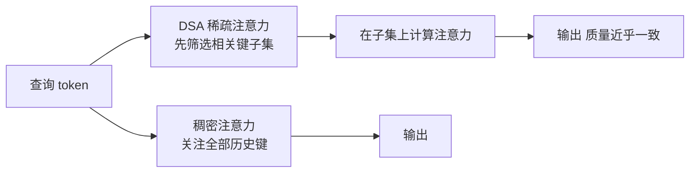

> 本文是对 DeepSeek 技术报告的阅读笔记与解读。DeepSeek 于 2025 年 9 月 29 日发布 DeepSeek-V3.2-Exp，引入 DeepSeek Sparse Attention（DSA）；相关技术报告见 arXiv:2512.02556（https://arxiv.org/abs/2512.02556）。本文仅在公开信息范围内做定性梳理，不展开未公开的精确数字。

## TL;DR

- **是什么**：DeepSeek-V3.2-Exp 是基于 V3.1-Terminus 的实验性版本，核心改动是把标准的稠密注意力替换为 DeepSeek Sparse Attention（DSA）。
- **核心思想**：用「细粒度稀疏注意力」减少长上下文场景下的注意力计算与显存开销，让每个查询只关注真正相关的一部分键值，而非全部历史 token。
- **关键结论**：在大幅提升长上下文训练与推理效率的同时，输出质量与稠密注意力近乎一致；在公开基准上与 V3.1-Terminus 基本持平。
- **意义**：伴随发布，API 价格下调 50% 以上，模型在 Hugging Face / GitHub 开源，长上下文的使用成本被显著拉低。

## 一、背景：长上下文为什么贵

Transformer 的自注意力机制让每个 token 都能与序列中其他 token 交互，这是其表达能力的来源，也是成本的来源。在标准（稠密）注意力下，序列长度增加时，注意力相关的计算与显存开销会随之快速增长。对于动辄数万乃至更长上下文的应用——长文档问答、代码仓库理解、多轮长对话、Agent 的长时记忆——这意味着推理延迟与服务成本都难以承受。

业界为此探索了多条路线：线性注意力、滑动窗口、分块与召回式注意力、KV 缓存压缩等。它们的共同目标是打破「每个 token 都必须看全部历史」的假设。DeepSeek-V3.2-Exp 中的 DSA 属于稀疏注意力一脉，强调的关键词是「细粒度」（fine-grained）：在更细的粒度上选择性地保留注意力连接，而不是简单地按固定窗口或固定分块来裁剪。

## 二、DSA 的核心思想：让注意力变得「挑剔」

稠密注意力的本质是：对每个查询（query），都要与序列中所有键（key）计算相关性，再对所有值（value）做加权聚合。DSA 的思路是让这个过程变得「挑剔」——对每个查询，只在一个被筛选出的、规模更小的相关子集上做注意力计算。

可以把核心动机拆成几个要点：

- **稀疏化是有依据的**：在长序列中，注意力分布往往高度不均，真正承载信息的连接只占少数。把贡献微弱的连接省去，对最终输出的影响有限。
- **细粒度选择**：相比按固定窗口或粗块裁剪，细粒度选择试图在更接近单个 token 的层面决定「关注谁」，从而在省算力的同时尽量不丢关键信息。
- **训练与推理同时受益**：稀疏化既减少了训练时的注意力计算量，也降低了推理时与 KV 缓存相关的访存与计算压力，长上下文场景收益尤为明显。
- **质量对齐为前提**：DSA 的设计目标不是单纯追求快，而是在效率提升的同时，保持与稠密注意力近乎一致的质量。

下图给出稠密与稀疏在「查询关注哪些键」上的直观差异：

## 三、与稠密注意力的对比

下表从几个维度对稠密注意力与 DSA 做定性对比（仅描述方向性差异，不涉及未公开的具体数值）：

| 维度 | 稠密注意力 | DeepSeek Sparse Attention（DSA） |
| --- | --- | --- |
| 关注范围 | 每个查询关注全部历史键 | 每个查询关注筛选出的相关子集 |
| 长上下文计算开销 | 随序列变长快速上升 | 通过稀疏化显著降低 |
| 推理访存压力 | 较高 | 较低 |
| 输出质量 | 基准参照 | 近乎一致 |
| 适用场景 | 通用，但长序列成本高 | 长文档、长对话、代码与 Agent 等长上下文 |

## 四、工程与生态：从模型到价格

DeepSeek-V3.2-Exp 以「实验性」（Exp）形态发布，建立在 V3.1-Terminus 之上，便于将 DSA 带来的变化与既有版本做对照——在公开基准上两者基本持平，说明效率提升并未以明显的质量损失为代价。

围绕这次发布，还有两点对使用者直接相关：

- **价格下调**：伴随发布，DeepSeek 将 API 价格下调 50% 以上。长上下文成本的下降，使得此前因价格而受限的长文档、长记忆类应用更具可行性。
- **开源可得**：模型在 Hugging Face 与 GitHub 开源，便于社区复现、评测与二次开发。其后，DeepSeek 进一步推出正式版 DeepSeek-V3.2 与配套技术报告。

把效率改进、价格下调与开源三者结合来看，DSA 不只是一个算法点，而是一次面向「长上下文规模化使用」的系统性下探。

## 意义与局限

从意义看，DSA 把「细粒度稀疏注意力」从研究概念推进到大规模可用的模型与服务，并通过价格与开源放大了影响：长上下文不再天然等同于高成本，这对长文档处理、代码理解和 Agent 类应用是实质性的松绑。它也验证了一个方向——在精心设计的稀疏化下，效率与质量未必是零和。

从局限看，稀疏注意力的收益与「相关子集」选择的质量强相关，不同任务、不同上下文长度下的表现仍需以公开评测为准；「Exp」命名本身也表明这是阶段性探索。对于具体收益的精确量化，应以 DeepSeek 公开的技术报告与基准结果为依据，避免以未经证实的数字下结论。

> 延伸阅读：DeepSeek-V3.2-Exp 技术报告 arXiv:2512.02556（https://arxiv.org/abs/2512.02556）。
