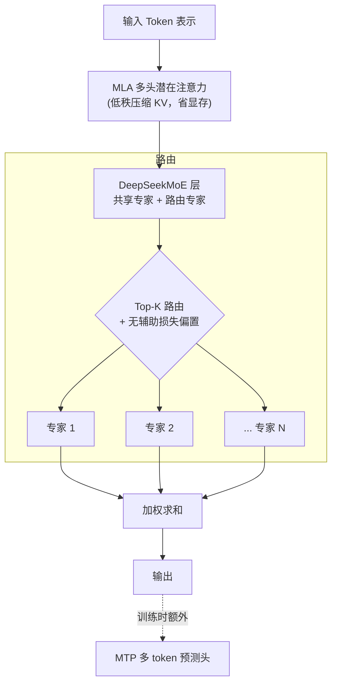

> 本文为技术报告深度解读笔记。原报告：*DeepSeek-V3 Technical Report*（DeepSeek-AI, 2024，arXiv:2412.19437，<https://arxiv.org/abs/2412.19437> ）。文中数据均引用自原报告，转载请注明出处。

## TL;DR

- **是什么**：一个总参数 **671B**、每 token 激活 **37B** 的开源 MoE 大模型，上下文长度 128K。
- **最反直觉的点**：完整训练只花了约 **2.788M H800 GPU 小时**（按 \$2/GPU·小时折算约 **557.6 万美元**），却在多数基准上逼近当时最强的闭源模型。
- **三个关键技术**：MLA 注意力（省 KV Cache）、auxiliary-loss-free 负载均衡（不靠辅助损失也能均衡专家）、FP8 混合精度训练（首批超大规模成功落地者之一）。
- **一句话**：它把"算力效率"做到了开源工作的新高度，证明了顶级模型不一定要靠堆算力堆出来。

---

## 一、背景：MoE 为什么重要，难点又在哪

稠密（dense）模型每个 token 都要激活全部参数，参数量一旦上到千亿级，训练和推理成本就会变得难以承受。**混合专家（Mixture-of-Experts, MoE）** 的思路是：把 FFN 层拆成很多个"专家"，每个 token 只路由到其中少数几个，从而做到"**总参数很大、单 token 计算量很小**"。

但 MoE 长期面临三个老大难问题：

1. **负载不均衡**：路由器容易把大量 token 挤到少数热门专家上，导致其余专家"饿死"，既浪费容量又拖慢训练。传统解法是加**辅助损失（auxiliary loss）** 惩罚不均衡，但这个损失会和主任务"打架"，损害模型质量。
2. **通信开销巨大**：专家分布在不同 GPU 上，token 路由意味着海量的跨卡 All-to-All 通信，常常成为训练瓶颈。
3. **训练稳定性**：参数规模越大、精度越低（如 FP8），越容易出现 loss 尖峰甚至发散。

DeepSeek-V3 的价值，正在于它对这三点都给出了工程上可复现的答案。

## 二、模型架构总览

整体仍是 Transformer，但在两个核心组件上做了替换：注意力用 **MLA**，FFN 用 **DeepSeekMoE**，并额外引入 **MTP** 训练目标。



### 关键超参数

| 项目 | 数值 |
| --- | --- |
| 总参数 | 671 B |
| 每 token 激活参数 | 37 B |
| 训练数据量 | 14.8 T tokens |
| 上下文长度 | 128 K |
| 路由专家数 / 每层 | 256 |
| 共享专家数 | 1 |
| 每 token 激活专家 | 8 |

## 三、三大核心技术拆解

### 3.1 MLA：把 KV Cache 压下来

推理时显存的大头是 **KV Cache**——每个历史 token 都要缓存 Key 和 Value。**Multi-head Latent Attention（MLA）** 的做法是：先把 Key/Value 联合压缩成一个**低秩潜在向量**，缓存这个小向量即可，用时再上投影还原。

直观地说，原来要缓存的是"完整的多头 K、V"，现在只缓存一个维度小得多的潜在表示 `c_KV`：

```
c_KV = W_DKV · h        # 下投影到低维潜在空间（被缓存的就是它）
k, v  = W_UK · c_KV, W_UV · c_KV   # 用时再上投影还原
```

效果：**KV Cache 显存大幅下降**，使得长上下文与大 batch 推理在工程上可行，同时性能几乎无损。

### 3.2 Auxiliary-Loss-Free 负载均衡

这是本报告最被称道的创新。传统辅助损失会引入与主目标冲突的梯度。DeepSeek-V3 改为给每个专家一个**可学习的偏置项 `b_i`**，只在**路由打分阶段**加上它来影响 Top-K 选择，而**不参与最终权重计算**：

- 某专家最近被选太多 → 训练中**动态调小**它的偏置 `b_i`；
- 某专家被冷落 → **调大** `b_i`，把更多 token 引过去。

由于偏置只影响"选谁"而不影响"算出来的值"，于是实现了**不牺牲性能的负载均衡**。报告还显示其专家呈现出明显的**领域专精**分化。

### 3.3 MTP：多 token 预测

标准语言模型一次只预测下一个 token。**Multi-Token Prediction（MTP）** 让模型在每个位置额外预测未来的多个 token：

- **训练时**：增加监督信号密度，让表示学得更充分；
- **推理时**：这些额外的预测头天然适合做**投机解码（speculative decoding）**，加速生成。

## 四、训练工程：FP8 + DualPipe

模型再好，训不动也是白搭。DeepSeek-V3 在工程上做了三件硬核的事：

| 维度 | 做法 | 收益 |
| --- | --- | --- |
| 数值精度 | **FP8** 混合精度训练，关键环节保留高精度 | 显存与算力开销大降，且训练稳定 |
| 流水线并行 | **DualPipe** 双向流水线 | 几乎消除流水线气泡（bubble） |
| 通信 | 定制化跨节点 All-to-All kernel | 通信与计算**几乎完全重叠** |

最终成本账（据报告）：

| 阶段 | H800 GPU 小时 |
| --- | --- |
| 预训练 | 2.664 M |
| 上下文扩展 | 0.119 M |
| 后训练 | 0.005 M |
| **合计** | **≈ 2.788 M** |

按 \$2/GPU·小时折算，总成本约 **557.6 万美元**——这正是它"以小博大"的底气。

## 五、后训练（Post-Training）

- **SFT**：在精心构造的指令数据上做监督微调。
- **知识蒸馏**：从 **DeepSeek-R1** 系列把**长链推理（CoT）** 能力蒸馏进来，显著提升数学与代码表现，同时通过控制输出长度避免"过度啰嗦"。
- **强化学习**：采用 **GRPO**（Group Relative Policy Optimization），用一组采样的相对优势替代独立的价值网络，做偏好对齐。

## 六、实验结果（节选）

下表为报告中 DeepSeek-V3 在若干基准上的表现（数值引自原报告）：

| 基准 | 类型 | DeepSeek-V3 |
| --- | --- | --- |
| MMLU (EM) | 综合知识 | 88.5 |
| MMLU-Pro (EM) | 综合知识(难) | 75.9 |
| GPQA-Diamond (Pass@1) | 研究生级科学 | 59.1 |
| MATH-500 (EM) | 数学 | 90.2 |
| AIME 2024 (Pass@1) | 竞赛数学 | 39.2 |
| Codeforces (百分位) | 竞赛编程 | 51.6 |

结论：DeepSeek-V3 是当时**最强的开源基座模型之一**，在数学、代码上尤为突出，与顶级闭源模型的差距被进一步缩小。

## 七、局限与意义

- **推理部署门槛仍高**：671B 的体量即便激活 37B，部署也需要相当规模的集群与工程优化。
- **FP8 训练的可复现性**：对数值范围和算子实现的要求很高，复现需要扎实的基础设施。
- **意义**：它把"算力效率"和"工程透明度"两件事一起推到了新高度——MLA、auxiliary-loss-free 负载均衡、FP8 训练这三点，已成为后续众多 MoE 工作的参考范式。

> 配套阅读：DeepSeek-R1 报告（用强化学习激发推理能力），后续单独整理。
