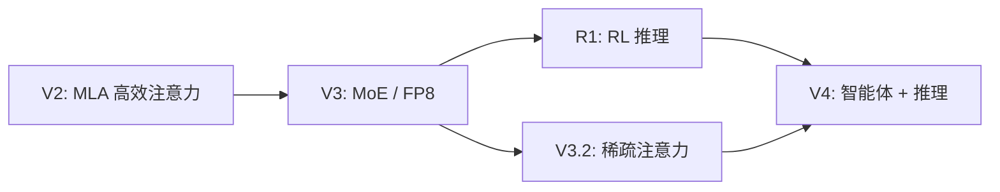

> 本文是一篇前沿观察笔记，记录与解读 DeepSeek 于 2026 年 4 月 24 日发布的新一代模型 DeepSeek-V4。需要特别说明的是，V4 刚刚发布，公开可核实的技术细节有限，本文只在可确认的范围内展开，并结合 DeepSeek 一路走来的技术脉络作背景梳理。出处：DeepSeek, 2026, DeepSeek-V4 发布（2026 年 4 月 24 日；[deepseek.com](https://deepseek.com) / [api-docs.deepseek.com](https://api-docs.deepseek.com)）。

## TL;DR

- DeepSeek 于 2026 年 4 月 24 日发布新一代模型 DeepSeek-V4，据报道包含 V4-Pro 与 V4-Flash 两个型号，并提供网页、App 与 API 三种入口。
- 官方强调本代的两个关键词：更强的智能体（agent）能力与顶尖的推理表现。
- 受发布时间影响，参数量、架构与具体评测分数等细节尚不充分公开，本文不做任何臆测，仅陈述可确认的概括信息。
- 把 V4 放回 DeepSeek 从 V2、V3、R1 到 V3.2 的技术脉络中，更能理解它所处的位置与可能的延续方向。

## 一、发布概览：可确认的信息

DeepSeek-V4 于 2026 年 4 月 24 日发布。根据公开报道，本次发布并非单一模型，而是包含两个面向不同场景的型号：定位更强能力的 V4-Pro，以及定位轻量、快速的 V4-Flash。这种「一强一快」的产品分层，便于在高难度任务与高吞吐、低时延场景之间做取舍。

在使用入口上，V4 延续了 DeepSeek 一贯的开放姿态，同时提供网页端、移动 App 与开放 API，方便个人用户直接体验，也方便开发者将其接入到自己的应用与工作流中。

官方在发布中突出的卖点集中在两点：一是更强的智能体（agent）能力，二是顶尖的推理表现。需要再次强调的是，截至撰写本文，关于模型规模、网络结构、训练数据与各项基准分数的可核实细节仍然有限，因此本文不展开具体数字，只对方向性信息作记录。

## 二、两个关键词：智能体与推理

把官方强调的两点拆开来看，可以理解为对当前大模型应用形态的回应。

- 智能体能力：所谓 agent，指模型不只是「一问一答」，而是能够进行多步规划、调用工具、与外部环境交互、并在长链条任务中保持目标一致性。强调 agent 能力，通常意味着模型在指令遵循、工具调用的稳定性、以及长程任务中的连贯性上有所侧重。
- 推理表现：推理（reasoning）指模型在数学、代码、逻辑与复杂问题求解上的能力。强调「顶尖推理」，是延续了自 R1 以来 DeepSeek 在推理方向上的投入。

这两个关键词其实互为支撑：可靠的智能体行为往往建立在扎实的推理与规划能力之上；而强推理模型要在真实任务中产生价值，又需要良好的工具使用与环境交互能力作为载体。

## 三、技术脉络：从 V2 到 V3.2 的延续

要理解 V4 所处的位置，最稳妥的方式是回顾 DeepSeek 一路走来公开过的核心技术思想。这些是已被广泛讨论、业界较为熟知的脉络，可作为理解 V4 的背景；但需要明确，下表所列特征属于既往各代，并不等同于对 V4 内部实现的断言。

| 版本 | 公开强调的核心思想 | 大致定位 |
| --- | --- | --- |
| V2 | MLA（多头潜在注意力），降低推理时的 KV 缓存开销 | 提升推理效率的注意力机制 |
| V3 | 大规模 MoE 架构与 FP8 训练实践 | 在可控成本下扩展能力 |
| R1 | 以强化学习（RL）激发与强化推理能力 | 推理专精方向的代表 |
| V3.2 | 稀疏注意力，进一步优化长上下文与效率 | 效率与长程能力的延续 |

从这条线索可以看出 DeepSeek 较为一致的取向：在「能力」与「效率」之间反复权衡，既追求更强的推理，又持续压低推理与训练的成本。V4 强调 agent 能力，可以看作在既有推理基础上，向「能在真实环境中自主完成任务」这一目标的进一步推进。

## 四、前沿观察：如何看待「细节有限」

对于一款刚发布的旗舰模型，公开细节有限是常态。发布初期，厂商往往先释出产品形态与方向性卖点，而完整的技术报告、评测细节与对比数据可能稍后才陆续公开。对读者而言，更稳妥的态度是：

- 区分「已确认信息」与「报道/传闻」，对未经核实的参数与分数保持谨慎。
- 关注可直接验证的部分，例如型号分层、可用入口与实际使用体验。
- 等待官方技术文档与第三方评测落地后，再对能力边界下更具体的判断。

## 意义与局限

意义层面，DeepSeek-V4 把「智能体能力」放到与「推理表现」并列的位置，反映出大模型竞争的重心正从单轮问答，向多步、可执行、可与环境交互的任务形态迁移；而 V4-Pro 与 V4-Flash 的分层，也顺应了不同场景对能力与成本的差异化需求。结合 DeepSeek 既往在效率与推理上的持续投入，V4 的方向具有较强的延续性。

局限层面，本文必须坦诚：由于发布时间很近，V4 的架构、规模、训练方法与具体评测结果等关键细节尚未充分公开，任何对其内部实现的描述都应避免臆断。本文所列既往版本的技术特征仅作背景参考，不应被理解为对 V4 的直接断言。真正的能力边界，仍有待官方完整文档与独立评测来回答。

> 延伸阅读：DeepSeek-V4 发布信息与 API 文档，见 [deepseek.com](https://deepseek.com) 与 [api-docs.deepseek.com](https://api-docs.deepseek.com)。
