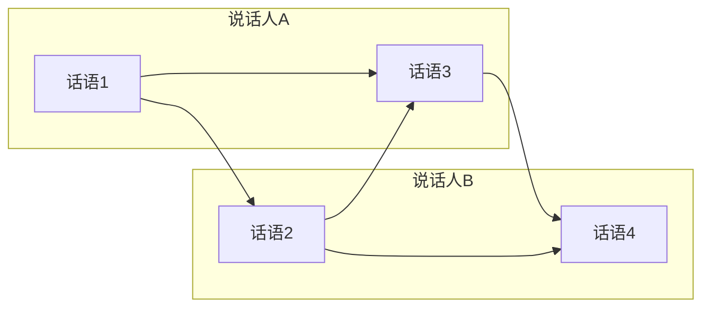

> 本文是对 Ghosal 等人发表于 EMNLP 2019 的论文《DialogueGCN: A Graph Convolutional Neural Network for Emotion Recognition in Conversation》的阅读笔记。原文见 arXiv:1908.11540（https://arxiv.org/abs/1908.11540）。下文尝试梳理这项工作把对话情绪识别从序列建模推进到图建模的核心思路与设计动机。

## TL;DR

- 对话情绪识别（ERC）的目标是判断对话中每一句话所表达的情绪。
- DialogueGCN 把一段对话建成图：节点是话语，边刻画说话人之间与上下文之间的依赖关系。
- 借助图卷积网络（GCN）聚合上下文与说话人信息，它能更好地捕捉"谁对谁说"以及相互影响。
- 在 IEMOCAP、MELD 等公开数据集上表现优秀，是 ERC 从序列模型走向图模型的代表作。

## 一、背景与动机

对话情绪识别（Emotion Recognition in Conversation, ERC）要解决的问题听上去朴素：给定一段多人或两人的对话，逐句判断说话者此刻表达的情绪。它在对话系统、社交媒体分析、共情式人机交互等场景里都有直接价值——一个能感知对方情绪的系统，才能给出更合适的回应。

难点在于，话语的情绪并不孤立。同一句"还好吧"，在被安慰的语境里和在争吵的语境里含义截然不同。也就是说，一句话的情绪取决于它所处的上下文，以及对话双方此前的状态。

在 DialogueGCN 之前，主流做法大多沿时间轴用循环网络（如 RNN/LSTM）顺序地编码对话，把"上下文"理解为前面若干句话的线性累积。这类序列建模有一个结构性的局限：它主要沿单一时间方向传递信息，难以显式表达"某句话是在回应更早的某句话""不同说话人之间彼此影响"这类非线性的依赖关系。DialogueGCN 的出发点，正是用图结构来弥补这种表达力上的缺口。

## 二、把对话建成一张图

DialogueGCN 的核心思想，是放弃"对话只是一串句子"的线性视角，转而把它看作一张图。

- **节点（node）**：每一句话语对应一个节点。每个节点先由一个序列编码器得到包含局部上下文的初始表示。
- **边（edge）**：边用来连接彼此存在依赖的话语。一个话语不仅与时间上相邻的话语相连，也会在一定的上下文窗口内与更早或之后的话语相连，从而把"远距离的相互影响"显式地表达出来。
- **边的类型（relation）**：这是该工作的关键设计之一。边并非千篇一律，而是根据"说话人是谁"以及"被连接的话语在当前话语之前还是之后"被赋予不同的关系类型。这样一来，"自己对自己的延续""他人对自己的影响"等不同性质的依赖，就被区分开来分别建模。

这种建图方式让模型能够同时感知两类信息：一类是说话人层面的依赖（speaker dependency），即对话参与者各自的情绪惯性与彼此影响；另一类是上下文层面的依赖（context dependency），即话语在语境中的位置关系。

## 三、图卷积如何聚合信息

建好图之后，DialogueGCN 用图卷积网络在图上传播与聚合信息。直观地说，每个话语节点会从与之相连的邻居节点收集信息，并按边的关系类型区别对待不同来源的信息，再融合进自身的表示。由于边携带了说话人与上下文方向的类型标签，这种聚合天然区分了"来自同一说话人"和"来自对话伙伴"的影响。

经过图卷积更新后的节点表示，已经融合了序列层面的局部上下文与图层面的说话人/上下文依赖。最终，模型在每个节点上做分类，输出该句话语的情绪标签。整体流程可以概括为下表：

| 阶段 | 处理对象 | 主要作用 |
| --- | --- | --- |
| 序列编码 | 单句话语 | 得到含局部上下文的初始节点表示 |
| 构图 | 整段对话 | 依说话人与上下文方向连边并标注关系类型 |
| 图卷积 | 话语图 | 按关系类型聚合邻居信息，注入说话人/上下文依赖 |
| 分类 | 各节点 | 为每句话语输出情绪标签 |

这样的设计把"序列"与"图"两种归纳偏置结合在一起：序列编码负责捕捉就近的语言连续性，图卷积负责捕捉跨越距离的、与说话人相关的相互作用。

## 四、效果与定位

作者在 IEMOCAP、MELD 等常用的对话情绪识别数据集上验证了方法。相比仅按时间顺序建模的基线，引入图结构后，模型在显式刻画"谁对谁说""相互影响"这类关系上更具优势，整体识别表现优秀。

从研究脉络上看，DialogueGCN 的意义不止于一组成绩。它示范了一种把对话的关系结构编码进模型的范式，让此后一批工作沿着"图视角"继续推进 ERC，逐渐形成与纯序列建模并行的技术路线。

## 意义与局限

DialogueGCN 的价值在于提供了一个清晰且可扩展的框架：用节点表示话语、用带类型的边表示说话人与上下文依赖、用图卷积完成信息聚合。它把"对话是一张关系网"这一直觉落到了具体的网络结构上，推动 ERC 从序列模型走向图模型，成为这一转向中的代表作。

与此同时，图方法也带来新的考量。建图依赖于上下文窗口与边类型等设计选择，这些选择会影响信息聚合的范围与方式；当对话很长或说话人很多时，图的规模与关系类型也会随之增长。如何在表达力与复杂度之间取得平衡，是图视角下持续被讨论的问题。总体而言，DialogueGCN 的贡献更多体现在建模范式层面：它说明了显式建模对话关系结构对情绪识别的帮助，并为后续研究提供了可借鉴的基础。

> 延伸阅读：Ghosal et al., 2019, DialogueGCN, arXiv:1908.11540（https://arxiv.org/abs/1908.11540）
