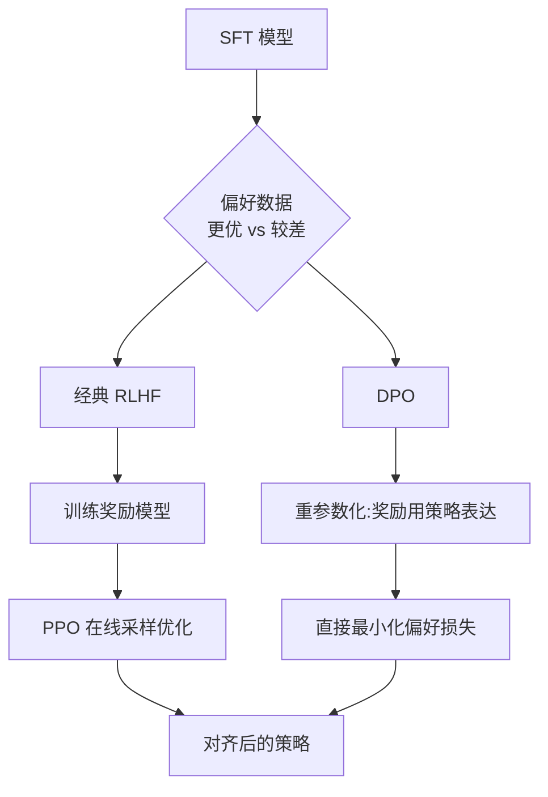

> 本文是对 Rafailov et al., 2023, *Direct Preference Optimization: Your Language Model is Secretly a Reward Model* 的阅读笔记与解读。原文：[arXiv:2305.18290](https://arxiv.org/abs/2305.18290)。文中观点以原论文为准，解读部分仅作梳理。

## TL;DR

- **是什么**：DPO（Direct Preference Optimization，直接偏好优化）是一种用偏好数据对齐语言模型的方法，目标与 RLHF 一致，但不再训练显式奖励模型、也不做强化学习采样。
- **核心思想**：RLHF 中"最优策略"与"奖励"之间存在闭式关系，可以把奖励用策略自身重参数化，于是偏好学习被改写成一个直接作用在策略上的损失。
- **关键结论**：最终得到的损失形式像一个二分类目标——在"更优回答 vs 较差回答"的偏好对上，提高更优回答相对参考模型的对数似然、压低较差回答。
- **意义**：训练更稳定、实现更简单、无需在线采样与独立奖励模型，是 RLHF 之后被广泛采用的对齐范式之一。

## 一、背景与动机

让语言模型"听话"、产出符合人类偏好的回答，主流路线是 RLHF（基于人类反馈的强化学习）。经典的 RLHF 流程通常分三步：先做有监督微调（SFT）得到一个基础策略；再用人类对一对回答的偏好标注训练一个奖励模型（Reward Model）；最后用 PPO 之类的强化学习算法，让策略在奖励模型的打分下最大化收益，同时用 KL 惩罚约束策略不要偏离参考模型太远。

这套流程效果显著，但工程上并不轻松：需要单独训练并维护一个奖励模型；强化学习阶段要在线采样、对超参数与实现细节敏感，训练过程容易不稳定。DPO 想回答的问题是：能不能在不显式建奖励模型、不跑强化学习的前提下，直接从偏好数据里学到对齐效果。

## 二、核心洞察：策略本身就是"隐藏的奖励模型"

DPO 的出发点是 RLHF 优化目标的一个已知性质。RLHF 通常优化"奖励减去与参考模型的 KL 散度"，在这种带 KL 约束的目标下，最优策略与奖励之间存在一个闭式关系：最优策略可以写成参考模型乘上一个与奖励指数相关的因子（再归一化）。

把这个关系反过来看，就能把"奖励"用"策略相对参考模型的对数比值"来表达。换句话说，奖励不必单独学习，它隐含在策略与参考模型的关系里——这正是论文标题"你的语言模型其实就是一个奖励模型"的含义。

偏好数据本身通常用一个偏好概率模型来刻画（即一对回答中哪个更优的概率由二者奖励之差决定）。把"奖励用策略重参数化"代入这个偏好模型，奖励项被消掉，只剩下策略与参考模型，于是偏好学习就变成一个可以直接对策略做梯度下降的目标。

## 三、损失长什么样：一个"像分类"的目标

经过上述代换，DPO 得到的损失可以直观理解为一个二分类风格的目标。对每一条偏好数据（同一个提示下的一个更优回答与一个较差回答），它比较两件事：

- 更优回答在当前策略下相对参考模型的对数似然变化；
- 较差回答在当前策略下相对参考模型的对数似然变化。

训练的方向是：**提高更优回答的相对对数似然、压低较差回答的相对对数似然**。其中温度系数 **beta** 控制策略可以偏离参考模型的程度——beta 越大，约束越强，策略越贴近参考模型。参考模型通常取 SFT 后的模型，在训练中保持冻结，作为对比基准。

下表对比经典 RLHF 与 DPO 的关键差异：

| 维度 | 经典 RLHF（奖励模型 + PPO） | DPO |
| --- | --- | --- |
| 奖励模型 | 需要单独训练 | 不需要，隐含在策略中 |
| 优化方式 | 强化学习（在线采样） | 直接监督式损失，离线训练 |
| 参考模型 | 用于 KL 约束 | 用于重参数化，冻结 |
| 关键超参 | 奖励权重、KL 系数等 | 温度系数 beta |
| 训练稳定性 | 相对敏感 | 相对稳定、实现简单 |

下面用流程图概括两者从偏好数据到对齐模型的路径差异：

## 四、为什么它更易用

DPO 的吸引力主要来自工程与训练层面的简化：

- **无需独立奖励模型**：省去一整套奖励模型的训练与维护，减少了误差累积与额外算力。
- **无需在线强化学习**：训练退化为在固定偏好数据集上的监督式优化，不必在训练中反复采样生成。
- **实现简单、依赖少**：损失形式接近标准分类损失，易于集成进常规训练框架。
- **训练相对稳定**：避免了 PPO 等在线 RL 算法对超参数和实现细节的高度敏感性。

这些性质让 DPO 在偏好对齐任务上很快被广泛尝试，并衍生出一系列变体方法，成为 RLHF 之后讨论度很高的对齐路线之一。

## 五、意义与局限（客观陈述）

DPO 的意义在于，它把"用人类偏好对齐模型"从一个需要奖励模型加强化学习的多阶段流程，简化为一个可以直接在偏好对上做梯度下降的目标，降低了对齐的实现门槛与训练不稳定性。

同时，它也并非没有适用前提与讨论空间：

- **依赖偏好数据质量与覆盖面**：作为离线方法，DPO 的效果与所用偏好数据的质量、分布密切相关，难以像在线方法那样在训练中探索新样本。
- **对参考模型与 beta 的依赖**：参考模型的选择与温度系数 beta 会影响优化行为，需要结合任务调节。
- **与显式奖励建模的取舍**：在某些需要可复用奖励信号、或需要在线优化的场景中，显式奖励模型仍有其价值。围绕离线偏好优化的边界与改进，后续也出现了不少讨论与变体。

总体而言，DPO 提供了一条更简洁的偏好对齐路径，其适用性需结合具体数据与任务来评估。

> 延伸阅读：Rafailov et al., *Direct Preference Optimization: Your Language Model is Secretly a Reward Model*，arXiv:2305.18290。
