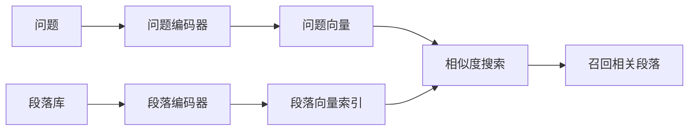

> 这是一篇经典论文的阅读笔记，对象是 Karpukhin 等人（FAIR）于 2020 年发表的《Dense Passage Retrieval for Open-Domain Question Answering》（arXiv:2004.04906，https://arxiv.org/abs/2004.04906）。本文尝试梳理 DPR 的核心思想，以及它为何成为后续向量检索与 RAG 体系的重要起点。

## TL;DR

- DPR 用双编码器分别把问题和段落映射为稠密向量，通过向量相似度而非词面匹配来检索相关段落。
- 在开放域问答的检索环节，DPR 明显优于以词匹配为代表的 BM25，关键在于它能捕捉语义而非字面重合。
- 这种"先检索、后阅读"的两阶段范式，把检索本身变成了一个可学习的表示问题。
- DPR 是当下 RAG 与向量数据库检索的技术基石之一。

## 一、背景与动机

开放域问答（Open-Domain QA）要求系统在一个庞大的文本库（如整个维基百科）中，先找到与问题相关的段落，再从中抽取或生成答案。它通常被拆成两个阶段：检索器负责从海量文本中召回少量候选段落，阅读器再在候选上定位答案。

长期以来，检索环节由稀疏的词匹配方法主导，BM25 是其中的代表。这类方法依赖词项的重合与统计权重，工程上成熟、可解释、无需训练，但有一个结构性短板：当问题与答案段落使用了不同的措辞表达同一含义时，字面重合度低，相关段落就可能被漏掉。换句话说，词匹配难以跨越"同义不同词"的鸿沟。

DPR 想回答的问题是：能否让检索器学会理解语义，从而把"意思相近但用词不同"的段落也召回出来。

## 二、核心思想：双编码器与稠密表示

DPR 的核心是一个双编码器（dual-encoder）结构：用一个编码器把问题编码成稠密向量，用另一个编码器把段落编码成稠密向量，二者落在同一个向量空间中。检索时，计算问题向量与段落向量的相似度，相似度高的段落被认为更相关。

这样设计带来两个直接好处：

- 语义匹配：相关性由向量空间中的接近程度决定，而非词面是否重合，因此能匹配语义层面的对应关系。
- 离线可索引：段落向量可以预先计算并建好索引，在线检索时只需对问题编码一次，再做向量相似度搜索，工程上可扩展到大规模语料。

## 三、训练方式：把检索当作表示学习

DPR 把检索建模成一个表示学习问题：让相关的"问题—段落"对在向量空间中靠近，让不相关的对彼此远离。训练时，每个问题会配上一个正例段落（确实相关）和若干负例段落（不相关），通过对比式的目标函数拉近正例、推远负例。

负例的选取对效果影响显著。除了随机抽取的负例，DPR 还利用了更有难度的负例——例如与问题词面相近却并不真正包含答案的段落，迫使模型学会区分"看起来相关"和"真正相关"。这种思路也成为后续稠密检索工作中反复出现的关键技巧。

## 四、与 BM25 的对比

下面从几个维度概括 DPR 与传统词匹配方法的差异：

| 维度 | BM25（稀疏词匹配） | DPR（稠密检索） |
| --- | --- | --- |
| 匹配依据 | 词项重合与统计权重 | 向量空间中的语义相似度 |
| 是否需要训练 | 不需要 | 需要在问答数据上训练 |
| 处理"同义不同词" | 较弱 | 较强 |
| 索引形式 | 倒排索引 | 稠密向量索引 |
| 可解释性 | 较高（命中词可见） | 相对较低 |

需要强调的是，这并不意味着词匹配方法被完全取代。稀疏与稠密各有所长，实践中两者常被结合使用，以兼顾字面精确匹配与语义召回。

## 五、对后续技术的影响

DPR 验证了一个重要判断：检索不必停留在词面层面，而可以作为一个端到端可学习的表示问题来处理。这一思路直接支撑了此后大量工作的展开。

今天广泛使用的 RAG（检索增强生成）流程，其检索环节大多沿用了"将文本编码为向量、按相似度召回"的范式；各类向量数据库的兴起，本质上也是为这种稠密检索提供高效的存储与近邻搜索基础设施。可以说，DPR 是把"语义检索"从研究概念推向工程实践的重要一环。

## 意义与局限

DPR 的意义在于，它清晰地展示了稠密向量检索在开放域问答上的优势，并把检索器从一个固定的统计模块，转变为可以随任务一起训练优化的组件。这为后来的语义检索、向量数据库与 RAG 体系打下了基础。

其局限同样值得正视。稠密检索依赖训练数据，在与训练分布差异较大的领域上，泛化能力可能受限；纯语义匹配对需要精确字面命中的场景（如专有名词、编号）不一定占优；此外，稠密向量索引的构建与维护，也带来了与稀疏方法不同的工程成本。正因如此，稀疏与稠密的结合，以及更强负例、更好编码器的探索，构成了这一方向上持续演进的主线。

> 延伸阅读：Karpukhin et al., Dense Passage Retrieval for Open-Domain Question Answering, arXiv:2004.04906（https://arxiv.org/abs/2004.04906）
