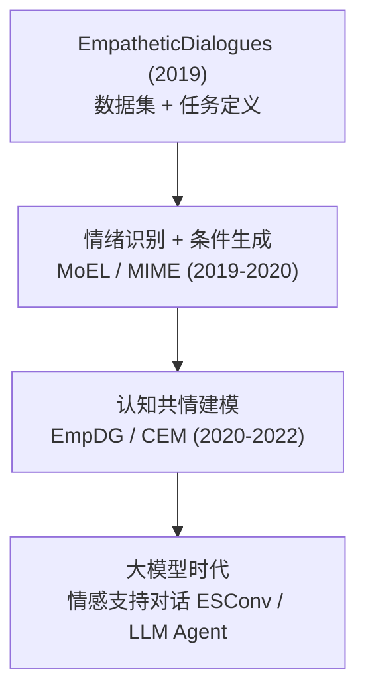

> 本文为方向综述性深度笔记，串联共情回复生成（Empathetic Response Generation）领域的若干代表性工作。核心论文：*Towards Empathetic Open-domain Conversation Models: a New Benchmark and Dataset*（Rashkin et al., ACL 2019，arXiv:1811.00207，<https://arxiv.org/abs/1811.00207> ）；并涉及 MoEL、MIME、EmpDG、CEM、ESConv 等后续工作。文中数据引自各原论文。

## TL;DR

- **任务**：共情回复生成，指对话系统能**识别对方情绪并给出恰当的情感回应**——不只是"答得对"，更要"答得暖"。
- **基石**：Facebook AI 的 **EmpatheticDialogues（ED）** 数据集，约 **24,850** 段对话、**32** 种情绪标签，奠定了这一方向的评测基础。
- **技术脉络**：从"情绪识别 + 条件生成"（MoEL、MIME），到引入认知共情（EmpDG、CEM），再到大模型时代转向**情感支持对话（ESC）** 与策略建模（ESConv）。
- **难点**：共情质量很难用 BLEU 衡量，评测高度依赖情绪准确率 + 人工/LLM 评分。

---

## 一、为什么要专门研究"共情"

一个好的对话系统不仅要把事情说对，还要在对方情绪低落、焦虑、兴奋时给出**情感上恰当**的回应。这种能力被称为**共情（empathy）**，在心理陪伴、情感支持、客服、教育等场景中价值极高。

心理学上通常把共情拆成两个层面，这也直接影响了后续的建模思路：

| 层面 | 含义 | 对应的建模重点 |
| --- | --- | --- |
| **情感共情** Affective | 感受到对方的情绪 | 情绪识别、情绪对齐 |
| **认知共情** Cognitive | 理解对方处境与想法 | 情境推理、意图理解 |

## 二、奠基性工作：EmpatheticDialogues

Rashkin 等人在 ACL 2019 提出的 **EmpatheticDialogues（ED）** 数据集，是这一方向的基石。它的构造方式很巧妙：

- 规模：约 **24,850** 段对话，由众包工人两两配对完成。
- 情绪：覆盖 **32 类**细粒度情绪标签，远超传统的"正/负/中性"三分。

部分情绪标签示例：

| 正向 | 负向 | 复杂 |
| --- | --- | --- |
| joyful, proud, excited, grateful | afraid, angry, sad, lonely | guilty, nostalgic, anxious, jealous |

论文证明：在 ED 上微调的对话模型，其回复的**共情程度与人类评分显著提升**，且该数据集随后成为几乎所有共情对话工作的标准评测集。

## 三、技术演进脉络

### 3.1 情绪识别 + 条件生成

- **MoEL**（Mixture of Empathetic Listeners）：为不同情绪各设一个"倾听者解码器"，再根据识别到的情绪**软组合**它们的输出。
- **MIME**：引入**情绪分组**与**模仿（mimicry）** 机制——人在共情时往往会"镜像"对方的情绪强度，MIME 显式建模了这一点。

### 3.2 引入认知共情

- **EmpDG**：用**多分辨率情绪感知** + 对抗式判别器，让生成回复既贴合情绪又自然。
- **CEM**（Commonsense-aware Empathetic）：引入**常识知识**（如 ATOMIC），让模型不仅感知情绪，还能推断"对方为什么会有这种情绪、接下来可能需要什么"，迈向认知共情。

### 3.3 大模型时代：从"共情回复"到"情感支持"

LLM 本身已具备很强的共情表达能力，研究重心随之上移到**完整的情感支持过程**：

- **ESConv**（*Towards Emotional Support Conversation*，Liu et al., ACL 2021）：把心理咨询里的**支持策略**显式建模，标注了一整套策略标签（如提问 Question、自我表露 Self-disclosure、肯定与安慰 Affirmation、提供建议 Suggestion 等），并遵循"探索→安慰→行动"的支持阶段。
- 研究焦点也从"单轮共情回复"转向**长期一致性、安全性、策略选择**等更贴近落地的问题。

## 四、评测的难点

共情质量很难用 BLEU、ROUGE 这类**词重叠**指标衡量——一个用词完全不同的回复可能同样共情甚至更好。常用评测方式：

| 维度 | 方法 |
| --- | --- |
| 情绪准确率 | 回复/识别的情绪是否匹配目标情绪 |
| 自动指标 | Perplexity、Distinct-n（多样性），仅作参考 |
| 人工评分 | 共情度 Empathy、相关性 Relevance、流畅度 Fluency 三维度 |
| LLM 裁判 | 用强模型打分，提效明显 |

> ⚠️ 用 LLM 当裁判时要特别小心它对"长而煽情"回复的偏好（参见我之前关于 [MT-Bench 的笔记](/2024/10/20/llm-as-a-judge-mtbench/)），建议控制长度并辅以人工抽检。

## 五、意义与展望

- **意义**：共情回复生成把"情感"正式纳入了对话系统的评价维度，ED 数据集与一系列方法为情感计算与对话生成的交叉研究铺好了路。
- **趋势**：方向正从"标签驱动的小模型"过渡到"策略驱动的大模型"。对落地而言，**情感支持对话（ESC）** 比单纯的共情回复更有价值——它强调一个**完整的支持过程**，而非单轮的暖心回应。
- **待解问题**：长程一致性、安全边界（避免有害建议）、个性化、以及如何客观评测"是否真的帮到了用户"。

> 后续计划：单独整理 ESConv 数据集与基于 LLM 的情感支持智能体（ESC Agent）相关工作。
