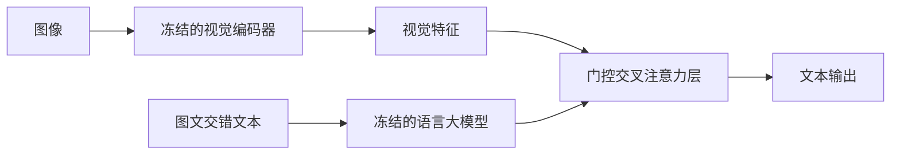

> 本文是对经典论文的阅读笔记。出处：Alayrac et al. (DeepMind), 2022, *Flamingo: a Visual Language Model for Few-Shot Learning*, arXiv:2204.14198（https://arxiv.org/abs/2204.14198）。作为多模态少样本学习的代表性早期工作，它的设计思路对后续大量图文模型产生了深远影响，值得回看。

## TL;DR

- Flamingo 把一个**冻结的视觉编码器**与一个**冻结的语言大模型**通过新增的**门控交叉注意力（gated cross-attention）**层连接起来。
- 它能够处理**图文交错（interleaved）**的输入序列，因而天然支持以"几个图文示例 + 新问题"的形式提问。
- 主打**少样本学习**：给定少量示例就能完成看图问答、图像描述等新任务，无需为每个任务单独微调。
- 它是多模态少样本学习的代表性早期工作，影响了后续众多视觉语言模型的架构选择。

## 一、背景与动机

在 Flamingo 出现之前，纯文本的大语言模型已经展示出强大的**上下文学习（in-context learning）**能力：只要在提示里给出几个示例，模型不更新权重就能完成新任务。与之相对，视觉语言领域的主流做法仍然偏向"为每个下游任务收集标注数据、再做一次专门微调"，迁移成本高、灵活性低。

一个自然的问题随之产生：能否把语言模型那种"看几个例子就会做"的少样本范式，迁移到需要同时理解图像和文本的多模态场景？要做到这一点，模型需要既保留语言大模型已有的强大文本与推理能力，又能把视觉信息有效地注入到这套能力之中。Flamingo 正是围绕这一目标设计的。

## 二、核心思想：连接两个冻结的强模型

Flamingo 的设计哲学可以概括为"**不重新训练巨人，而是在巨人之间架桥**"。它复用两个已经训练好的强大模块，并把它们**冻结**：

- **视觉编码器**：负责把图像编码成视觉特征，参数在训练中保持不变。
- **语言大模型**：提供文本理解与生成能力，参数同样保持冻结。

模型真正训练的，是连接两者的**新增桥接组件**。这样做的好处是显而易见的：语言模型在海量文本上学到的知识与推理能力被原样保留，不会因为多模态训练而被破坏；同时只需训练相对较少的新参数，就能让语言模型"看见"图像。

下面用一张简图勾勒整体的信息流。

## 三、方法拆解

Flamingo 的关键设计可以拆成几点来看：

1. **门控交叉注意力（gated cross-attention）**。在语言模型的若干层之间插入新的交叉注意力层，让文本表示去"查询"视觉特征，从而把图像信息引入语言流。这里的"门控"机制让新增模块在训练初期对原模型输出的影响很小，随后逐步放大，保证了在不破坏预训练语言能力的前提下平稳地融合视觉信号。

2. **处理图文交错的输入**。Flamingo 不要求输入是"一张图配一句话"的固定格式，而是能够消化图像与文本任意交错排列的序列。这一点至关重要——它正是少样本提示得以成立的基础：把若干"图 + 答案"示例和最终待回答的图像拼成一个序列，模型就能照着示例的模式作答。

3. **以少样本方式适配新任务**。得益于上述两点，Flamingo 在面对一个新的视觉任务时，不需要梯度更新，只需在提示中给出少量图文示例，即可完成看图问答、图像描述等任务。这把语言模型的上下文学习范式成功延伸到了多模态。

下面把它与"传统按任务微调"的范式做一个定性对比：

| 维度 | 传统按任务微调 | Flamingo 少样本范式 |
| --- | --- | --- |
| 适配新任务方式 | 收集标注数据后微调权重 | 提示中给出少量图文示例，无需更新权重 |
| 主干模型 | 通常整体或大部分参与训练 | 视觉编码器与语言模型均冻结 |
| 输入形式 | 多为固定的图文配对 | 支持图文交错序列 |
| 新任务迁移成本 | 较高 | 较低 |

## 四、意义与局限

从意义上看，Flamingo 验证了一条颇具吸引力的技术路线：**通过冻结并复用已有的强视觉与强语言模型、只训练轻量桥接层，就能获得具备少样本能力的视觉语言模型**。它把上下文学习从纯文本推广到图文交错场景，为"通用、低适配成本的多模态助手"提供了早期范本，也使得"冻结主干 + 交叉注意力桥接"成为后续许多图文模型反复借鉴的设计模式。

局限同样值得客观看待。其一，少样本提示虽然灵活，但表现会受到示例选择与排布方式的影响，稳定性不及为单一任务精心微调的专用模型；其二，模型继承了所复用视觉与语言主干的能力边界与固有偏差，桥接层难以凭空补足主干本身缺失的知识；其三，处理图文交错长序列以及在推理时携带多个示例，都会带来额外的计算与上下文长度开销。这些方面也成为后续多模态研究持续改进的方向。

总体而言，Flamingo 的价值不只在于某一项具体指标，更在于它确立的一种范式：用尽量少的新增训练，把现成的强模型"拼接"成会看图、能对话、且能从少量示例中快速学会新任务的系统。

> 延伸阅读：Alayrac et al., *Flamingo: a Visual Language Model for Few-Shot Learning*, arXiv:2204.14198（https://arxiv.org/abs/2204.14198）。
