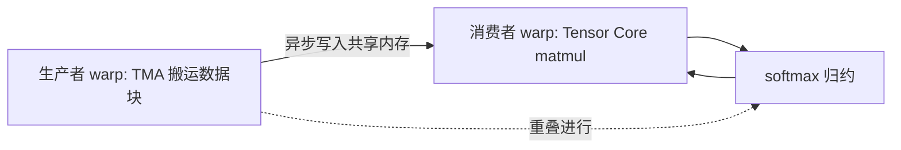

> 本文是对 Shah et al., 2024（NeurIPS 2024）论文《FlashAttention-3: Fast and Accurate Attention with Asynchrony and Low-precision》的阅读笔记，原文见 arXiv:2407.08608（https://arxiv.org/abs/2407.08608）。文中观点与数据均以原论文为准。

## TL;DR

- FlashAttention-3 面向 NVIDIA Hopper（H100）架构，是 FlashAttention 系列针对新硬件的延续。
- 核心是三件事：warp 专门化把计算与数据搬运异步重叠、交错 matmul 与 softmax 隐藏延迟、FP8 低精度进一步提速。
- 相比 FlashAttention-2，提速约 1.5–2×；FP16 下达到约 740 TFLOPs/s，约为硬件峰值的 75%。
- FP8 通过块量化与 incoherent processing 在追求速度的同时控制精度损失。

## 一、背景与动机

注意力是 Transformer 的核心算子，其计算量随序列长度平方增长，长期是长上下文训练与推理的瓶颈。FlashAttention 系列的思路是把注意力做成 IO 感知的融合算子：通过分块（tiling）与在线 softmax，避免把巨大的注意力矩阵写回显存，从而在减少显存访问的同时降低峰值内存占用。

FlashAttention-2 在此基础上优化了并行度与工作划分，但它主要面向上一代 GPU。到了 Hopper（H100）这一代，硬件引入了新的能力：更强的 Tensor Core、用于异步数据搬运的 TMA（Tensor Memory Accelerator），以及对 FP8 低精度的支持。已有实现并未充分利用这些特性，注意力算子的实际硬件利用率仍有较大提升空间。FlashAttention-3 的动机，正是围绕 Hopper 的异步与低精度能力重新设计注意力内核。

## 二、三大核心技术

论文把提速拆解为三个相互配合的方向，可逐点理解：

**其一，warp 专门化的异步重叠。** Hopper 上的 Tensor Core（负责矩阵乘）与 TMA（负责在显存与共享内存之间搬运数据）都是异步单元。FlashAttention-3 让不同的 warp 承担不同角色，一部分负责数据搬运（生产者），一部分负责计算（消费者），使得下一块数据的加载与当前块的计算能够重叠进行，从而把访存延迟藏在计算之后。

**其二，交错 matmul 与 softmax。** 注意力的一轮计算包含矩阵乘（QK、以及与 V 的乘）和其间的 softmax（含指数、归约等非矩阵乘操作）。矩阵乘走 Tensor Core，softmax 则主要走相对较慢的其他单元，若串行执行会互相等待。FlashAttention-3 通过流水化地交错这两类操作，让 softmax 的延迟被相邻块的 matmul 掩盖，提高整体吞吐。

**其三，FP8 低精度。** Hopper 支持 FP8，可显著提升矩阵乘吞吐，但低精度直接用于注意力会带来精度问题。FlashAttention-3 采用块量化（block quantization）配合 incoherent processing 的处理方式，在保持较高速度的同时把量化带来的误差控制在可接受范围。

下面用一张示意图概括异步重叠的关系：

## 三、技术要点对照

| 维度 | FlashAttention-2 | FlashAttention-3 |
| --- | --- | --- |
| 主要目标硬件 | 上一代 GPU | Hopper（H100） |
| 异步机制 | 利用有限 | warp 专门化，Tensor Core 与 TMA 异步重叠 |
| 计算调度 | matmul 与 softmax 结合较紧 | 交错 matmul 与 softmax 隐藏延迟 |
| 低精度支持 | 以 FP16/BF16 为主 | 增加 FP8（块量化 + incoherent processing） |

需要说明的是，上表中 FlashAttention-2 一侧的描述是相对定性的对比，用以突出 FlashAttention-3 面向新硬件的改动方向，而非逐项的功能规格清单。

## 四、结果概览

论文报告，得益于上述设计，FlashAttention-3 相比 FlashAttention-2 提速约 1.5–2×。在 FP16 下，注意力内核达到约 740 TFLOPs/s，约相当于 H100 硬件峰值的 75%。FP8 路径则在此之上进一步追求更高的吞吐，同时通过块量化与 incoherent processing 兼顾精度。整体来看，这些数字体现的是把 Hopper 的异步执行与低精度能力较充分调动后的效果。

## 意义与局限

从意义上看，FlashAttention-3 延续了整个系列 IO 感知、算子融合的思路，并把优化重点转向与具体硬件深度耦合的方向：它示范了如何针对 Hopper 的 TMA、Tensor Core 与 FP8 重新组织注意力内核，让长期存在的注意力瓶颈在新硬件上得到进一步缓解，对长上下文训练与推理有实际价值。

局限方面，这些优化与 Hopper 架构强绑定，其收益依赖 TMA、异步 Tensor Core 与 FP8 等特性，在其他架构上不一定能直接复现同等提升；FP8 低精度虽有块量化与 incoherent processing 加持，其精度表现仍需结合具体任务与数值范围审慎评估；此外，warp 专门化与交错调度带来的实现复杂度，也对内核工程提出了更高要求。

> 延伸阅读：FlashAttention 与 FlashAttention-2 原始论文，以及 NVIDIA Hopper 架构中关于 TMA 与 FP8 的技术文档。
