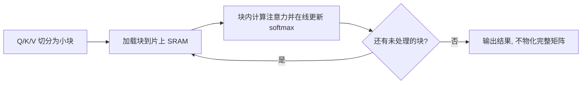

> 本文是对 Dao et al., 2022（NeurIPS 2022）"FlashAttention: Fast and Memory-Efficient Exact Attention with IO-Awareness" 的经典回顾，arXiv:2205.14135（<https://arxiv.org/abs/2205.14135>）。原文从 GPU 显存层级出发，重新审视注意力计算的瓶颈所在。

## TL;DR

- 是什么：FlashAttention 是一种重新组织注意力计算的算法，目标是在不改变结果的前提下让注意力更快、更省显存。
- 核心思想：以「IO 感知（IO-aware）」为出发点，通过分块计算与反向重计算，避免把完整的 N×N 注意力矩阵写回显存。
- 关键结论：它是「精确（exact）」注意力，输出与标准实现一致，并非近似；收益来自减少显存读写，而非牺牲精度。
- 意义：它已成为现代 Transformer 训练与推理的标配，并衍生出 FlashAttention-2、3 等后续迭代。

## 一、背景与动机：瓶颈不在算力，而在搬运

标准的自注意力需要为长度为 N 的序列计算一个 N×N 的注意力分数矩阵，经过 softmax 后再与 value 相乘。问题在于，这个中间矩阵通常会被完整地物化到 GPU 的高带宽显存（HBM）里。序列越长，这个矩阵的规模就以平方级增长，带来两方面压力：一是显存占用迅速膨胀，限制了可处理的最大序列长度；二是大量数据需要在显存与计算单元之间反复读写。

值得注意的是，在现代 GPU 上，许多注意力操作的真正瓶颈并不是浮点运算本身，而是显存的读写带宽。换言之，硬件的算力往往是充裕的，但数据在不同存储层级之间「搬运」的开销成为实际的限制因素。标准实现没有充分考虑这一点，于是把宝贵的带宽消耗在了反复读写巨大的中间矩阵上。

## 二、IO 感知：从显存层级重新设计算法

FlashAttention 的核心洞见是「IO 感知」，即在设计算法时显式地考虑 GPU 的存储层级结构。GPU 的存储大致可以分为容量大但带宽相对较低的 HBM，以及容量很小但速度极快的片上 SRAM。标准注意力的开销大量来自在 HBM 上反复读写中间结果，而 FlashAttention 的思路是：尽可能把计算留在快速的 SRAM 中完成，减少与 HBM 之间的往返。

围绕这一目标，论文采用了两项关键技术：

- 分块（tiling）：将 query、key、value 切分成可以放入 SRAM 的小块，逐块地把注意力计算累积起来，从而无需一次性在 HBM 中物化完整的注意力矩阵。其中 softmax 通过在线增量的方式逐块更新，保证分块计算的结果与一次性计算完全一致。
- 重计算（recomputation）：在反向传播阶段，不保存前向过程中的完整注意力矩阵，而是在需要时利用已保存的少量统计量重新计算。这用少量额外计算换取了显存读写的大幅下降。

这两点结合起来，使得前向与反向都能避免把 N×N 矩阵写回 HBM，从根本上削减了显存读写量。

## 三、为什么仍是「精确」的注意力

很多用于降低注意力开销的方法走的是近似路线，例如稀疏化或低秩逼近，它们会在一定程度上改变计算结果。FlashAttention 的不同之处在于它是「精确」注意力：它只是改变了计算的组织方式和数据的搬运路径，而没有改变所要计算的数学对象。因此，它的输出与标准注意力在数值上是一致的，使用者无需担心模型质量因此发生偏移。

这一点在工程实践中很重要：它意味着可以把已有模型的注意力实现直接替换为 FlashAttention，在获得速度与显存收益的同时，不引入精度上的不确定性。

下面用一张表概括标准实现与 FlashAttention 在几个关键维度上的差异：

| 维度 | 标准注意力 | FlashAttention |
| --- | --- | --- |
| 中间矩阵 | 在 HBM 中物化完整 N×N 矩阵 | 分块计算，不物化完整矩阵 |
| 主要瓶颈 | 显存读写带宽 | 显著降低显存读写 |
| 反向传播 | 依赖保存的注意力矩阵 | 通过重计算换取省显存 |
| 结果性质 | 精确 | 精确（与标准一致） |
| 长序列支持 | 受显存平方增长限制 | 更容易扩展到更长序列 |

## 四、意义与局限

FlashAttention 的价值在于，它没有把注意力当作一个纯粹的数学问题，而是当作一个运行在真实硬件上的系统问题来看待。通过「IO 感知」的视角，它把优化的重心从减少计算量转移到减少数据搬运，这一思路对后续大量系统层面的工作产生了影响。在实践中，它降低了长序列训练与推理的显存门槛，使得更长上下文的模型训练变得更可行，如今已被广泛集成进主流的 Transformer 训练与推理栈中。其后续的 FlashAttention-2、FlashAttention-3 等迭代，进一步在并行划分和新一代硬件特性上做了优化。

局限方面，FlashAttention 的实现与具体的硬件存储层级和并行结构紧密相关，因此往往需要针对不同硬件进行适配与调优，这也是后续版本不断迭代的原因之一。同时，它解决的是「精确注意力如何算得更省更快」，对于注意力本身随序列长度增长的计算复杂度，它通过减少 IO 与显存占用来缓解压力，而非改变其根本的复杂度量级。

> 延伸阅读：FlashAttention 原文 arXiv:2205.14135（<https://arxiv.org/abs/2205.14135>），以及后续的 FlashAttention-2、FlashAttention-3。
