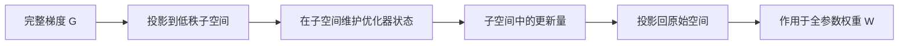

> 本文是对 Zhao et al., 2024（ICML 2024 Oral）论文《GaLore: Memory-Efficient LLM Training by Gradient Low-Rank Projection》的阅读笔记，原文见 arXiv:2403.03507（https://arxiv.org/abs/2403.03507）。以下内容为笔者的梳理与解读，具体结论请以原论文为准。

## TL;DR

- GaLore 把**梯度**投影到低秩子空间来优化，从而在**保持全参数训练**的同时显著降低显存占用，这与只近似权重更新的 LoRA 有本质区别。
- 显存收益主要来自优化器状态：论文报告优化器状态显存最多可省约 65.5%，8-bit GaLore 变体最多可省约 82.5%。
- 借助这一节省，可在单张 24GB 显卡（如 RTX 4090）上预训练 7B 规模模型，无需模型并行、重计算或 offload。
- 方法与优化器无关、易于集成，是降低大模型训练显存门槛的代表性工作。

## 一、背景与动机

大语言模型训练的显存开销不只来自模型权重本身。以常用的 Adam 类优化器为例，除了参数与梯度，还要为每个参数额外维护一阶、二阶动量估计，这部分优化器状态往往数倍于参数规模，成为显存的主要负担之一。对预训练场景来说，这意味着即便是中等规模的模型，也要依赖多卡并行、梯度重计算或参数 offload 等工程手段才能跑起来，抬高了研究与实验的门槛。

参数高效微调（PEFT）方法，尤其是 LoRA，提供了一条节省显存的思路：冻结原始权重，只训练注入的低秩适配矩阵，从而减少可训练参数与相应的优化器状态。但 LoRA 的低秩假设作用在**权重（或权重更新）**上，其表达能力受限于低秩结构，在从零预训练这类需要充分更新全部参数的场景下，未必能达到全参数训练的效果。GaLore 想要回答的问题是：能否既保留全参数训练的能力，又拿到接近 PEFT 的显存收益。

## 二、核心思想：把低秩用在梯度上

GaLore 的关键转变，是把低秩结构从权重转移到**梯度**。它的出发点是：训练过程中，权重矩阵的梯度往往在结构上呈现低秩特性。既然梯度本身近似低秩，那么就可以用一个投影矩阵把高维梯度映射到一个低维子空间，在这个子空间里维护优化器状态并完成更新，再投影回原始空间作用到全参数上。

这样带来的直接好处是：需要在优化器中存储动量等状态的对象，从"完整梯度"变成了"低秩子空间中的梯度"，其体积随秩的降低而大幅缩小；而权重矩阵本身仍然是被完整更新的，训练保持全参数的形态。可以把它与 LoRA 做一个对照：

| 维度 | LoRA | GaLore |
| --- | --- | --- |
| 低秩作用对象 | 权重更新（注入的适配矩阵） | 梯度 |
| 原始权重是否更新 | 冻结，仅训练适配器 | 全参数更新 |
| 主要节省来源 | 可训练参数与其优化器状态 | 优化器状态（低秩子空间） |
| 适用侧重 | 微调 | 预训练与微调均可 |

整体的数据流可以概括如下：

## 三、显存收益与集成方式

GaLore 的显存节省集中体现在优化器状态上。论文报告，相比标准做法，优化器状态显存最多可省约 65.5%；进一步结合 8-bit 量化的 8-bit GaLore 变体，最多可省约 82.5%。得益于此，论文展示了在单张 24GB 显存的消费级显卡（如 RTX 4090）上预训练 7B 规模模型，而无需借助模型并行、梯度重计算或 offload 等额外的系统级手段。

在工程层面，GaLore 的一个重要特点是**与优化器无关**：它对梯度做投影这一步，与具体使用哪种优化器解耦，因此可以叠加在常见优化器之上，集成成本较低。这种"可插拔"的性质，使其更容易被纳入既有训练流程。

需要说明的是，投影所依赖的低秩子空间不是一成不变的——为覆盖训练中梯度结构的变化，方法会周期性地更新子空间，而非固定单一投影方向。这一设计是让低秩投影在长训练过程中保持有效的关键之一，具体机制与更新策略请参见原论文。

## 意义与局限

从意义上看，GaLore 提供了一个与 LoRA 不同的显存优化视角：不牺牲全参数训练能力，而是从梯度的低秩结构中挖掘节省空间。它把预训练所需的显存门槛拉低到单张消费级显卡可及的范围，对算力受限的研究者和小团队具有现实价值；与优化器无关、易于集成的特性也降低了落地成本。作为 ICML 2024 Oral 工作，它是当前降低大模型训练显存门槛这一方向上的代表性成果。

局限方面，低秩投影本质上是对完整梯度的一种近似，其效果依赖梯度确实近似低秩这一前提；秩的选择、子空间更新的频率等超参数会影响最终表现，需要结合具体任务权衡。此外，显存收益主要作用于优化器状态，对权重、激活等其他显存组成部分的帮助有限。这些取舍的定量细节，建议以原论文的实验与讨论为准。

> 延伸阅读：GaLore: Memory-Efficient LLM Training by Gradient Low-Rank Projection, arXiv:2403.03507（https://arxiv.org/abs/2403.03507）
