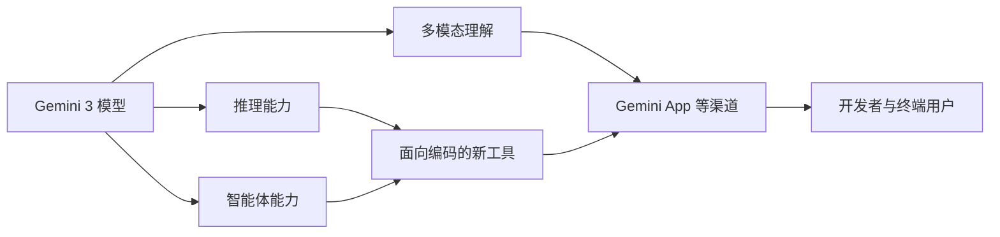

> 本文是一篇前沿观察笔记，基于 Google 于 2025 年 11 月 18 日发布的官方信息整理与解读。出处：Google, 2025, "Gemini 3"，发布于官方博客 blog.google。需要强调的是，Gemini 3 目前并未公开完整的技术报告，本文只在官方公开、业界广为知晓的范围内展开，对未披露的架构与具体数字不做任何推测。

## TL;DR

- 是什么：Gemini 3 是谷歌于 2025 年 11 月 18 日发布的新一代多模态旗舰模型。
- 核心思想：在统一的多模态能力基础上，进一步强化推理与智能体（agent）能力。
- 关键结论：官方称其在多项公开基准上刷新纪录，并同期推出面向编码的新工具与应用。
- 意义：被广泛视为前沿大模型竞争中的又一轮升级，但完整技术细节公开程度有限。

## 一、背景与动机

自多模态大模型成为前沿竞争焦点以来，谷歌的 Gemini 系列便承担着对标其他头部实验室旗舰模型的角色。每一代 Gemini 的发布，既是模型能力的迭代，也是产品形态的更新——模型不再只是「会聊天的接口」，而是逐步演化为能够理解图像、文本等多种模态，并能执行多步任务的系统。

Gemini 3 正是在这一脉络下推出的。谷歌将其定位为「新一代多模态旗舰」，意图在通用理解、复杂推理以及面向真实工作流的智能体场景中，确立新的能力上限。从公开口径看，这一代的重心明显从「更强的对话」转向「更强的推理与行动」。

## 二、官方公开的核心要点

由于 Gemini 3 尚未发布完整技术报告，可确认的信息主要来自官方发布内容。以下要点逐一拆解：

- 发布时间与定位：谷歌于 2025 年 11 月 18 日发布 Gemini 3，明确将其定位为新一代多模态旗舰。官方称该模型在多项基准测试上刷新了纪录。这里需要保持审慎——官方所述的「刷新纪录」是公开宣传口径，具体涉及哪些基准、提升幅度多大，并未配套完整、可复核的技术报告。

- 推理与智能体能力：本次发布特别强调推理（reasoning）与智能体（agent）能力。这意味着模型不仅要给出答案，还要在多步骤、需要规划与工具调用的任务中表现稳定。这一方向与近年前沿模型「从生成到执行」的整体趋势一致。

- 面向编码的新工具：谷歌同期推出了面向编码的新应用/工具，将模型的推理与智能体能力落地到开发场景。编码任务天然适合检验模型的多步推理与自我修正能力，因此常被作为新一代模型的重要展示窗口。

- 渠道与生态：Gemini 3 通过 Gemini App 等渠道上线，使新能力能较快触达终端用户与开发者。

## 三、能力维度与公开程度

下表对本次发布中可确认的几个维度做归纳，并标注其公开程度，避免将宣传口径误读为已验证的硬指标。

| 维度 | 官方公开信息 | 公开程度 |
| --- | --- | --- |
| 定位 | 新一代多模态旗舰 | 明确 |
| 基准表现 | 称在多项基准上刷新纪录 | 仅有口径，缺完整报告 |
| 重点能力 | 推理与智能体 | 方向明确，细节有限 |
| 配套产品 | 面向编码的新工具/应用 | 明确 |
| 上线渠道 | Gemini App 等 | 明确 |
| 架构/参数 | 未披露 | 不公开 |

可以看到，真正「明确」的多是定位、方向与产品形态，而模型内部的架构、参数规模、训练细节以及具体分数，目前并不在公开范围内。对于技术读者而言，这一区分尤为重要。

## 四、放在竞争格局中观察

Gemini 3 的发布被媒体普遍解读为前沿大模型竞争中的又一轮升级，常与其他头部实验室（如 OpenAI）的旗舰模型相提并论。这种对比的背后，是各家在「多模态 + 推理 + 智能体」这一共同方向上的持续投入。

下面用一张流程图概括本次发布的对外呈现逻辑——从模型能力，到产品落地，再到用户触达。

需要说明的是，这张图刻画的是公开信息所呈现的产品与能力关系，而非内部技术架构。

## 意义与局限

从意义上看，Gemini 3 延续并强化了前沿模型「从对话走向行动」的趋势：多模态是底座，推理与智能体是重心，编码工具是落地抓手。它再次表明，头部实验室的竞争焦点已不只是单点能力，而是「能力—产品—生态」的整体节奏。

局限同样清晰。其一，缺乏完整技术报告，外界难以独立复核「刷新纪录」的具体含义；其二，架构、参数与训练细节均未公开，使得深入的技术分析无从展开；其三，宣传口径与可验证指标之间存在天然落差，需要后续更多公开评测来填补。在这些信息补足之前，对 Gemini 3 的判断宜保持定性、谨慎的态度。

> 延伸阅读：Google, 2025, "Gemini 3"（blog.google 官方发布）。
