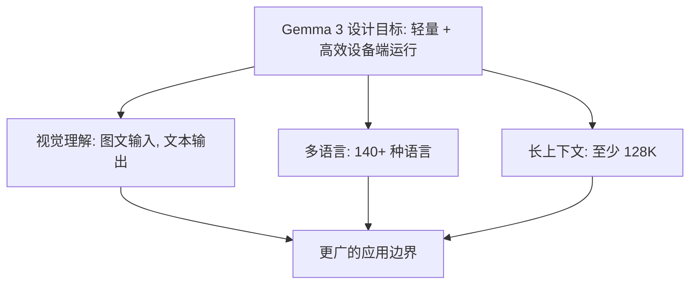

> 本文是对谷歌 DeepMind 团队技术报告的阅读笔记与解读。原文出处：Gemma Team, Google DeepMind, 2025, 「Gemma 3 Technical Report」, arXiv:2503.19786（<https://arxiv.org/abs/2503.19786>）。文中观点与事实均以原报告为准。

## TL;DR

- **是什么**：Gemma 3 是谷歌 Gemma 轻量级开源模型家族的多模态新版本，参数规模覆盖 1B 到 27B，同时开放预训练与指令微调两套权重。
- **核心思想**：在保持「可在设备上高效运行」的前提下，为开源轻量模型补齐视觉理解能力，并大幅扩展多语言与长上下文支持。
- **关键能力**：新增图文输入、文本输出的视觉理解；多语言支持扩展到 140+ 种语言；上下文长度至少达到 128K。
- **意义**：它把此前主要存在于大型闭源模型的多模态、长上下文等特性，下沉到面向终端与本地部署的轻量开源模型中。

## 一、背景与动机

Gemma 系列是谷歌推出的轻量级开源模型家族，定位与体量庞大的旗舰模型不同：它强调较小的参数规模、对算力与显存更友好的部署形态，以及开放的权重许可。这一定位的现实背景在于，越来越多的应用场景需要模型能够在受限的硬件环境中运行——无论是个人开发者的工作站，还是更贴近用户的终端设备。

然而，过去一段时间里轻量开源模型与前沿闭源模型之间存在明显的能力差距，尤其体现在多模态理解、跨语言覆盖以及长上下文处理这几个维度上。Gemma 3 的动机正是在不牺牲「轻量」这一根本属性的前提下，尽量缩小这些差距，让本地化、低成本的部署也能用上这些能力。

报告指出，Gemma 3 借鉴了支撑 Gemini 2.0 的相关研究与技术。换言之，它并非孤立的工程产物，而是把大型模型研发中沉淀的方法迁移、压缩到轻量级形态上的一次尝试。

## 二、模型家族与开放形态

Gemma 3 以「家族」而非单一模型的方式发布，参数规模从 1B 跨越到 27B。这种分档设计的好处在于覆盖不同的算力预算：较小的档位适合资源极为受限的环境，较大的档位则在能力上更接近通用助手的需求，使用者可以按部署条件自行取舍。

在权重开放方面，Gemma 3 同时提供两类权重：

| 维度 | 预训练权重 | 指令微调权重 |
| --- | --- | --- |
| 主要用途 | 作为基座继续训练或微调 | 直接用于对话与指令任务 |
| 适合人群 | 需要二次开发的研究者/工程师 | 希望开箱即用的使用者 |
| 灵活性 | 高，可定制下游行为 | 行为已对齐到指令场景 |

这种「基座 + 指令版」的双轨开放，是开源模型生态中较为常见且实用的做法：前者保留了最大的可塑性，后者降低了直接使用的门槛。

## 三、核心能力的三条主线

Gemma 3 相较前代最值得关注的变化，可以归纳为三条主线。

**视觉理解。** Gemma 3 新增了多模态能力，支持图文混合输入并输出文本。这意味着模型不再局限于纯文本任务，而是可以面向图像内容进行理解与描述类的工作。对于一个定位轻量、面向设备端的模型家族而言，把视觉能力纳入进来是一次明显的能力边界扩展。

**多语言覆盖。** 报告称 Gemma 3 的多语言支持扩展到 140+ 种语言。更广的语言覆盖直接关系到模型在非英语场景下的可用性，对于面向全球用户的应用尤为重要。

**长上下文。** Gemma 3 的上下文长度至少达到 128K。更长的上下文窗口让模型能够一次性处理更长的文档、对话历史或多段材料，从而支撑更复杂的输入场景。

下面用一张图概括这三条主线如何共同服务于「在设备上高效运行」这一总目标。

## 四、面向设备端的取向

贯穿 Gemma 3 设计的一条隐线，是「在设备上高效运行」的工程取向。轻量级模型家族的价值，很大程度上取决于它能否在算力、内存、能耗都受限的环境中保持可用。多档参数规模的设置、对部署友好的形态，以及把大型模型的研究成果迁移到小模型上的思路，都服务于这一取向。

需要强调的是，能力扩展与部署效率之间往往存在张力：视觉理解、长上下文这些特性通常会带来额外的计算与内存开销。Gemma 3 的做法是在轻量定位的约束下引入这些能力，而具体的权衡细节与量化指标，应以技术报告原文为准，本文不作超出报告范围的数字推断。

## 意义与局限

从生态角度看，Gemma 3 的意义在于把多模态、广多语言、长上下文这些此前更多见于大型闭源模型的特性，下沉到了一个开放权重、面向轻量与设备端部署的模型家族中。预训练与指令微调权重的同时开放，也为研究者的二次开发和使用者的直接调用提供了便利。

局限方面，轻量级定位本身意味着在绝对能力上与体量更大的前沿模型仍可能存在差距；多模态目前是「图文输入、文本输出」的形态，而非任意模态间的双向生成。此外，模型在不同语言、不同任务上的实际表现，需要结合具体评测来判断，本文不对未公开的精确分数作出断言。总体而言，Gemma 3 体现的是在「轻量可部署」这一约束下，尽可能补齐前沿能力的工程路线。

> 延伸阅读：Gemma 3 Technical Report, arXiv:2503.19786（<https://arxiv.org/abs/2503.19786>）
