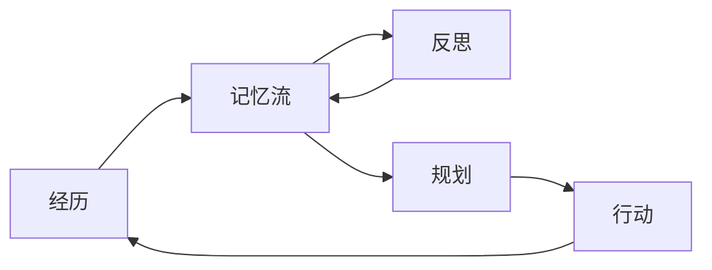

> 本文是对经典论文的回顾与解读。原文为 Park et al. 在 UIST 2023 发表的 “Generative Agents: Interactive Simulacra of Human Behavior”，arXiv 链接见此：[arXiv:2304.03442](https://arxiv.org/abs/2304.03442)。下文围绕其核心机制与设计动机展开，事实以原文为准。

## TL;DR

- 在一个类《模拟人生》的沙盒小镇里放入 25 个由大语言模型驱动的智能体，它们能自主作息、社交、协作。
- 智能体的拟人行为由三大机制支撑：记忆流（memory stream）、反思（reflection）与规划（planning）。
- 实验中观察到「涌现的社会行为」——例如信息在居民之间自然传播。
- 这是 LLM 智能体长期记忆与拟人行为研究中的标志性工作。

## 一、背景与动机

让计算机模拟可信的人类行为，是交互系统与社会仿真长期追求的目标。早期的智能体往往依赖手工编写的规则或有限状态机，行为模式封闭、缺乏长期一致性，也难以应对开放情境中的新事件。

大语言模型的出现改变了这一格局：模型在海量文本上习得了关于人类行为、社会常识与语言表达的丰富先验。然而，仅凭一次性的提示词调用，LLM 难以维持跨越数天的连贯人格与记忆——它会「忘记」此前发生的事，也无法把零散经历整合为对世界的理解。Generative Agents 要解决的正是这个问题：如何让 LLM 驱动的智能体在较长时间尺度上表现得既连贯又可信。

为此，作者搭建了一个名为 Smallville 的沙盒小镇，其交互形式让人联想到《模拟人生》。研究者在其中放入 25 个智能体，每个智能体拥有自然语言描述的身份、关系与日常。它们会起床、用餐、上班、闲聊，也会根据环境与他人的行为做出反应。

## 二、核心机制逐点拆解

论文的核心贡献，是提出了一套支撑拟人行为的智能体架构。它把「经历—理解—行动」串成一条闭环，由三个相互衔接的机制构成。

- **记忆流（memory stream）**：以自然语言记录智能体的全部经历，构成一份按时间排列的长期记忆。当需要决策时，智能体并非检索全部记忆，而是依据相关性、时近性与重要性等因素，提取出最相关的片段送入上下文。这缓解了 LLM 上下文窗口有限、无法承载全部历史的根本约束。
- **反思（reflection）**：随着经历不断累积，智能体会周期性地从底层记忆中归纳出更高层、更抽象的认识。反思的结果同样写回记忆流，并可被进一步反思引用，从而形成层层抽象的理解结构。这让智能体不止「记得发生了什么」，还能「总结出关于人和世界的看法」。
- **规划（planning）**：智能体把对自身与环境的理解转化为具体行动计划，并自上而下地细化——从一天的大致安排，逐步落到具体时段的动作。计划并非一成不变，当遇到新情况时，智能体会据此调整后续安排，使行为既有方向性又能随机应变。

下表概括这三大机制的分工：

| 机制 | 作用 | 在闭环中的位置 |
| --- | --- | --- |
| 记忆流 | 以自然语言记录经历，并按相关性等因素检索 | 经历的留存与召回 |
| 反思 | 将零散经历提炼为更高层的抽象认识 | 经历到理解 |
| 规划 | 将认识转化为分层、可调整的行动 | 理解到行动 |

三者通过一个统一的检索机制衔接：行动产生新的经历，经历沉淀进记忆流，反思从中抽象出认识，规划再据此驱动新的行动。

## 三、涌现的社会行为

当多个具备上述能力的智能体被放在同一个小镇里互动时，研究者观察到了并未被显式编程的「涌现」现象。一个被反复提及的例子是信息的自然传播：某个智能体产生的想法或安排，会在日常对话中被传递给其他智能体，进而扩散到更大范围的居民之中。类似地，智能体之间能够形成新的关系，并围绕共同事务展开协调与协作，例如自发地筹备一场聚会。

这些行为之所以值得关注，是因为它们并非来自针对「传播」或「协作」编写的专门规则，而是记忆、反思与规划机制在多智能体互动中自然组合的结果。它表明：当个体层面的认知机制足够完备时，群体层面的社会动态有可能从底层交互中浮现出来。

## 意义与局限

Generative Agents 的意义，在于给出了一套让 LLM 智能体维持长期连贯、拟人行为的可复用架构。记忆流、反思与规划的三段式设计，把「如何让模型记住并整合长期经历」这一难题拆解为可工程化的模块，对后续的智能体记忆系统、检索增强与多智能体仿真研究产生了广泛影响，使其成为该方向的标志性工作。

与此同时，这类系统也存在固有局限。其行为质量高度依赖底层语言模型的能力与提示设计，长期运行中仍可能出现记忆检索不当、行为不一致或偏离常理的情况；将一切经历都转写为自然语言并反复调用模型，也带来不可忽视的计算与成本开销。此外，「可信」更多是对外部观察者而言的表象一致，并不等同于真正的理解或意图。如何在更大规模、更长时间尺度上保持稳定与可控，仍是值得持续探索的问题。

> 延伸阅读：Park et al., “Generative Agents: Interactive Simulacra of Human Behavior”, arXiv:2304.03442。
