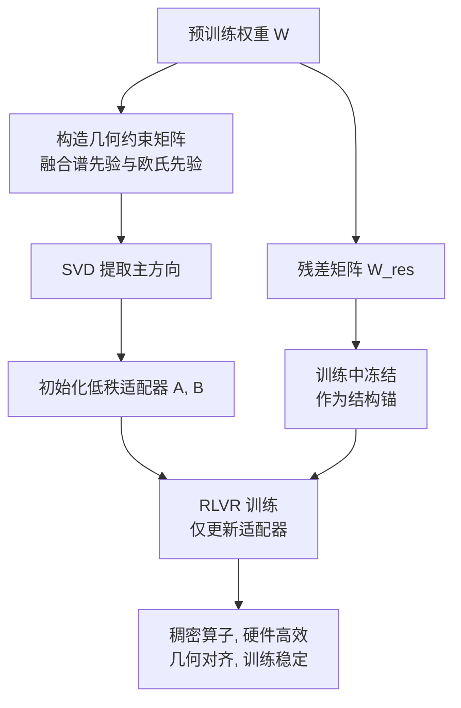

> 本文是对 Zhang et al., 2026《GeoRA: Geometry-Aware Low-Rank Adaptation for RLVR》的阅读笔记，原文见 arXiv:2601.09361（https://arxiv.org/abs/2601.09361），该工作获 ACL 2026 Outstanding Paper（ACL Anthology: 2026.acl-long.1110）。以下内容为个人整理与解读，具体结论请以原论文为准。

## TL;DR

- LoRA、PiSSA、MiLoRA 等低秩适配方法都是围绕监督微调（SFT）设计的，而 RLVR 的优化动态与 SFT 差别很大，直接套用会出现谱坍缩与优化不稳定。
- 另一条路——直接在 RLVR 偏好的非结构化稀疏参数子空间上微调——在现代硬件上遭遇效率瓶颈。
- 论文的关键观察是：RLVR 的有效更新子空间既是各向异性的，也是可压缩的，具有明确的低秩结构。
- GeoRA 在一个几何约束矩阵内用 SVD 提取主方向来初始化适配器，同时冻结残差分量作为「结构锚」。在 1.5B–32B 的 Qwen/Llama 上，数学、医疗与代码 RLVR 设置下均优于强低秩基线，且域外泛化更好、遗忘更少。

## 一、背景：把 SFT 的工具搬到 RL 上会出什么问题

LoRA 是本站写过的老朋友：冻结主干权重，只训练两个低秩矩阵的乘积，把微调成本压到极低。围绕它衍生出的一批改进——PiSSA 用主奇异分量初始化适配器，MiLoRA 反过来用次要分量——思路都是「怎么挑选适配器的初始子空间」。

但这些方法有一个共同前提：它们的设计与验证都在 SFT 场景下完成。SFT 的优化目标是拟合给定的目标序列，梯度稠密、方向相对稳定。RLVR 则不同：奖励稀疏且只在轨迹末端可得，优势有正有负，更新方向随采样波动，整体上是一种更「躁动」的优化过程。

论文指出，把 SFT 导向的低秩方法直接用于 RLVR，会遇到两类具体问题：

- **谱坍缩（spectral collapse）**：适配器的奇异值谱在训练中退化，有效秩下降，表达能力被浪费。
- **优化不稳定**：RLVR 本身的方差叠加上初始化与优化路径的错配，训练容易发散或原地震荡。

而如果放弃低秩、转去直接微调 RLVR 实际偏好的那部分参数——研究发现这部分是稀疏的——则会撞上另一堵墙：非结构化稀疏在 GPU 上跑不快，算力利用率低。这是一个典型的两难：结构化但错配，或者匹配但低效。

## 二、核心观察：RL 更新子空间的几何形状

GeoRA 的破局点在于对这个稀疏子空间的重新审视。作者的分析结论是：RLVR 的有效更新子空间并非各向同性的随机稀疏，而是**各向异性且可压缩的**——它有明确的方向偏好，因而本身就带有低秩结构。

这个观察把两难化解掉了。既然稀疏子空间可压缩，那就不必在非结构化稀疏上硬碰硬，而可以提取它的主方向，用一个稠密的低秩参数化来近似它。这样既对齐了 RLVR 的更新几何，又保留了稠密算子的硬件效率。

## 三、GeoRA 的两个设计要点

**1）在几何约束子空间内做 SVD 初始化。** GeoRA 并不直接对原权重矩阵做 SVD（那是 PiSSA 的做法），而是先构造一个「几何约束矩阵」——按公开材料的描述，它融合了谱先验与欧氏先验两类信息，用于刻画 RLVR 更新实际会走的方向。然后在这个矩阵上做奇异值分解，取其主方向来初始化低秩适配器。区别在于：PiSSA 问的是「原权重里哪些方向最重要」，GeoRA 问的是「RL 更新会往哪些方向走」。

**2）冻结残差分量作为结构锚。** 初始化之后，权重被拆成两部分：被提取进适配器的主方向，以及剩下的残差矩阵。GeoRA 在训练中冻结残差，只更新适配器。论文把这个冻结的残差称为「结构锚」（structural anchor），也用「residual leash」（残差牵引绳）来形容它的作用——它把训练限制在几何对齐的子空间内，防止 RLVR 的激进更新破坏预训练的几何结构。

这一点回应了 RL 后训练里一个已被观察到的现象：过于激进的更新会导致行为坍缩或能力退化。冻结残差相当于给优化过程加了一条明确的约束。

## 四、与既有低秩方法的对比

| 维度 | LoRA | PiSSA / MiLoRA | 稀疏子空间微调 | GeoRA |
| --- | --- | --- | --- | --- |
| 设计目标场景 | SFT | SFT | RLVR | RLVR |
| 初始化依据 | 随机（B 置零） | 原权重的主 / 次奇异分量 | 更新稀疏模式 | 几何约束子空间的主方向 |
| 计算形态 | 稠密 | 稠密 | 非结构化稀疏 | 稠密 |
| 硬件效率 | 高 | 高 | 低 | 高 |
| 对预训练结构的保护 | 无显式机制 | 部分 | 无显式机制 | 冻结残差作为结构锚 |

实验部分覆盖 Qwen 与 Llama 系列 1.5B 到 32B 的模型，在数学、医疗与代码三类 RLVR 设置下，GeoRA 一致优于强低秩基线；论文另外强调它在域外任务上泛化更强、灾难性遗忘更少——这与「冻结残差保护预训练结构」的设计意图是吻合的。

## 意义与局限

意义层面，GeoRA 提出的问题比它给出的方法更值得记住：**参数高效微调的既有工具箱，几乎全部是在 SFT 语境下打磨出来的，而后训练的重心已经大幅转向 RL。** 当优化范式换了，初始化策略、秩的选择、乃至「该冻结什么」这些问题都值得重问一遍。论文用「谱坍缩」把这种错配落到了可观测的现象上，并给出一个自洽的解法：先刻画 RL 更新的几何，再据此构造低秩参数化。就工程价值而言，能用 LoRA 级别的成本做 RLVR 且不牺牲稳定性，对算力受限的团队意义直接。

局限层面需要客观看待。首先，几何约束矩阵的构造引入了新的设计选择——谱先验与欧氏先验如何融合、相关超参如何设定，这些都会影响效果，其鲁棒性需要看原文的消融实验。其次，SVD 初始化在大矩阵上有一次性开销，对 32B 以上或 MoE 结构的模型，这项成本与实现复杂度都会上升，论文的规模上限也停在 32B。第三，「域外泛化更好、遗忘更少」是一组相对结论，其成立范围取决于所选的域外任务集合。最后，与全参数 RLVR 相比，低秩适配终究是一种受限的假设——它在多大程度上能逼近全参数训练的上限，仍是一个开放问题。

> 延伸阅读：Zhang et al., 2026，《GeoRA: Geometry-Aware Low-Rank Adaptation for RLVR》，arXiv:2601.09361（https://arxiv.org/abs/2601.09361）。相关背景可参考本站 LoRA 与 QLoRA 两篇笔记。
