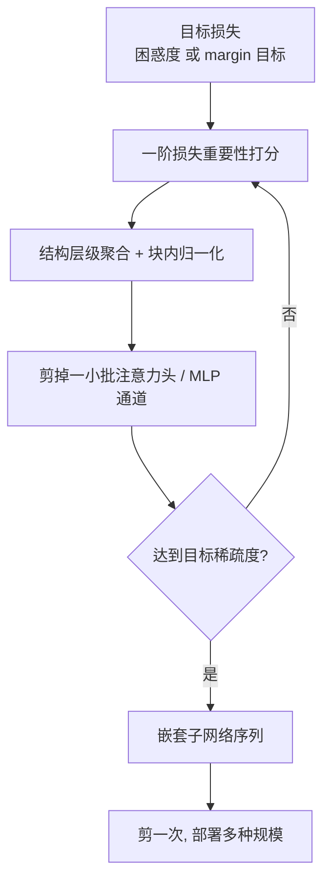

> 本文是对 Wang et al., 2026《From Local to Global: Revisiting Structured Pruning Paradigms for Large Language Models》的阅读笔记，原文见 arXiv:2510.18030（https://arxiv.org/abs/2510.18030），该工作获 ACL 2026 Outstanding Paper（ACL Anthology: 2026.acl-long.1653）。以下内容为个人整理与解读，具体数字请以原论文为准。

## TL;DR

- 结构化剪枝的主流做法是「局部范式」：逐层做重建，让剪枝后每一层的输出尽量接近剪枝前。这种做法与任务目标无关。
- 后果是它能守住困惑度和泛化的零样本行为，却无法利用少量任务相关的校准信号，下游收益因此有限。
- GISP 回到全局范式：用一阶的、基于损失的重要性打分，在结构层级上聚合并做块内归一化，从而直接对齐模型级损失。
- 采用迭代而非一次性剪枝，在高稀疏度下稳住精度、避免困惑度崩塌，且不需要中间微调；迭代轨迹天然形成嵌套子网络，支持「剪一次、部署多种规模」。

## 一、背景：局部剪枝守住了什么，又漏掉了什么

要把大模型部署得更省，量化和剪枝是两条主线。本站写过 GPTQ，走的是量化；这篇则是结构化剪枝——直接删掉整个注意力头或 MLP 通道，得到一个更小、且对硬件友好的紧凑架构。相比非结构化稀疏，结构化剪枝的好处是删完就能直接加速，不依赖特殊的稀疏算子。

问题在于「删哪些」。近年占主导地位的是局部（layer-wise）范式：一层一层地看，选择一组要保留的结构，使该层剪枝后的输出与剪枝前尽量接近。这个思路的吸引力在于它把一个全局的组合优化问题分解成一系列小问题，每个都可以高效求解，甚至有闭式解。

但论文指出局部范式有一个内在的错配：**它优化的是逐层重建误差，而不是任务目标。** 这带来两个后果。其一，它是任务无关的——逐层重建只关心「这一层的输出别变太多」，因此天然倾向于保住通用行为，困惑度与一般的零样本表现确实能守住；但如果手上有一小批任务相关的校准数据（比如就想让剪枝后的模型继续能做数学题），局部范式没有机制去利用它。其二，逐层最优不等于整体最优：每层都尽力保住自己的输出，误差却会跨层累积，而各层对最终损失的敏感度并不相同，均匀对待每一层本身就是一种浪费。

## 二、GISP：把重要性定义在模型级损失上

GISP（Global Iterative Structured Pruning）是一个后训练方法，其核心是把重要性的定义从「层输出的变化」改成「模型级损失的变化」。

**重要性打分。** 对每个候选结构（一个注意力头、一个 MLP 通道），用一阶的、基于损失的重要性分数来衡量删掉它会让目标损失上升多少。这些分数在结构层级上聚合，并做块内归一化（block-wise normalization）。归一化这一步是必要的：不同层的梯度尺度差异很大，不做归一化会导致剪枝集中在少数几层，而不是按真实重要性分布。

由于重要性直接锚定在损失上，非均匀的稀疏分配就自然出现了——敏感的层保留更多结构，不敏感的层删得更狠，而这不需要额外的启发式规则来指定各层的稀疏率。

**迭代而非一次性。** 全局剪枝如果一次性把目标稀疏度全部剪掉，在高稀疏度下容易不稳定，甚至困惑度崩塌。GISP 改为分若干轮：每轮剪掉一小部分，重新估计重要性，再剪下一部分。论文强调这个过程**不需要中间微调**——稳定性来自迭代本身，而非靠微调把损伤补回来。

## 三、两个额外的好处

迭代式的全局剪枝顺带带来两个不在原始动机里、但很实用的性质。

**1）嵌套子网络与「剪一次、部署多种规模」。** 因为剪枝是逐轮累加的，每一轮结束时的模型都是下一轮模型的超集。于是一次剪枝流程会自然产出一整条从大到小的模型序列，且彼此嵌套。相比为每个目标规模独立跑一次剪枝，这是一个显著的成本节省，也便于按不同部署环境挑选合适的档位。

**2）任务对齐的校准。** 既然重要性由目标损失定义，只要换掉这个损失，剪枝就会朝不同方向倾斜。论文实例化了两种：语言建模用困惑度；决策式任务（如多选问答）用一个基于 margin 的目标——按公开材料的描述，它取正确标签与错误标签上损失梯度之差，从而直接保住区分正确与错误答案的决策边界。这一点是局部范式做不到的。

## 四、与局部范式的对比与实验

| 维度 | 局部（逐层重建） | GISP（全局迭代） |
| --- | --- | --- |
| 优化对象 | 各层输出的重建误差 | 模型级目标损失 |
| 任务相关性 | 任务无关 | 可换损失以对齐任务 |
| 各层稀疏率 | 通常均匀或需人工指定 | 由重要性自然导出，非均匀 |
| 剪枝方式 | 多为一次性 | 迭代，无需中间微调 |
| 产物 | 单一规模 | 嵌套子网络序列 |
| 主要成本 | 低 | 较高（需梯度） |

实验覆盖 Llama2-7B/13B、Llama3-8B 与 Mistral-0.3-7B：GISP 一致地降低 WikiText-2 困惑度并提升下游精度，在 40%–50% 稀疏度区间的增益尤为明显。这个区间的意义在于，它正是局部方法开始明显退化的地方——低稀疏度下各种方法差别不大，压力测试要看高稀疏。另外，在 DeepSeek-R1-Distill-Llama-3-8B 与 Qwen3-8B 上用 GSM8K 做任务对齐校准时，精确匹配精度有相当幅度的提升，这直接验证了「任务对齐」这一卖点。

## 意义与局限

意义层面，这篇论文的价值在于它把一个被普遍接受的工程默认设置重新推上了辩论席。局部逐层重建之所以流行，很大程度上是因为它便宜且好实现，久而久之「结构化剪枝就该这么做」几乎成了共识。GISP 说明，一旦愿意付出梯度的代价，回到全局目标不仅可行，还能顺带拿到非均匀稀疏、任务对齐与嵌套子网络这三样好处。其中「剪一次、部署多种规模」在工程上尤其实惠——很多团队真正的需求不是一个最优尺寸，而是一条可选的规模曲线。

局限层面，论文自己点明了主要一条：基于梯度的重要性估计带来较高的显存与计算开销，这是全局范式的固有代价，作者提到未来可结合参数高效微调来缓解。其次，评估未覆盖 MoE 模型（因规模差距过大），而 MoE 恰是当下旗舰模型的主流形态——剪枝在专家维度上如何定义结构、如何避免破坏路由均衡，都还没有答案。第三，任务对齐是双刃剑：用 GSM8K 校准出的子网络在数学上更强，却很可能在别处更弱，通用性的保持程度需要看原文完整表格。最后，一阶近似在高稀疏度下的可靠性与迭代轮数的敏感性，都值得在具体模型上实测确认。

> 延伸阅读：Wang et al., 2026，《From Local to Global: Revisiting Structured Pruning Paradigms for Large Language Models》，arXiv:2510.18030（https://arxiv.org/abs/2510.18030）。压缩方向的另一条主线可参考本站 GPTQ 笔记。
