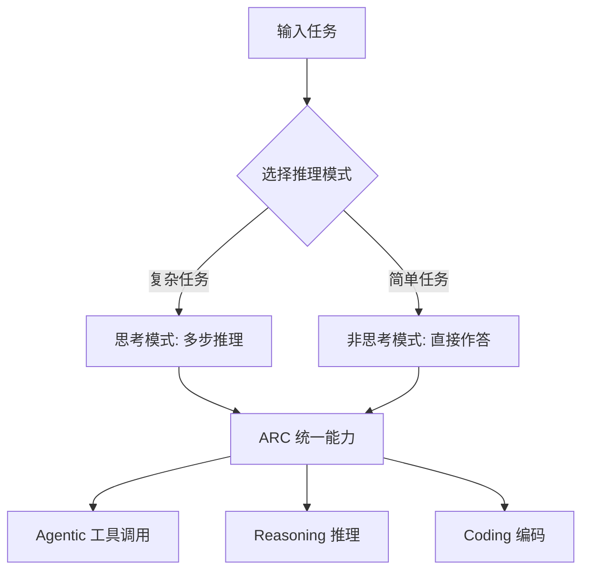

> 本文是对智谱 AI（Z.ai）技术报告《GLM-4.5: Agentic, Reasoning, and Coding (ARC) Foundation Models》（Zhipu AI / Z.ai, 2025, arXiv:2508.06471，[<https://arxiv.org/abs/2508.06471>](https://arxiv.org/abs/2508.06471)）的阅读笔记与解读，旨在梳理其设计定位与核心思路，引用的数据均来自原报告。

## TL;DR

- **是什么**：GLM-4.5 是智谱 2025 年 8 月发布的开源混合专家（MoE）大模型，总参数约 355B、激活约 32B，并提供更紧凑的 GLM-4.5-Air（总参数约 106B、激活约 12B）。
- **核心思想**：以「ARC」为定位，把 Agentic（智能体/工具使用）、Reasoning（推理）、Coding（编码）三类能力统一进同一个基础模型，而非分散到多个专用模型。
- **关键结论**：报告给出 TAU-Bench 约 70.1、AIME 24 约 91.0、SWE-bench Verified 约 64.2，覆盖工具调用、数学推理与真实代码修复三个维度。
- **意义**：作为 2025 年国产开源模型在「智能体+推理+编码」综合能力上的代表之一，它体现了从「单点能力」走向「统一基础能力」的趋势。

## 一、背景与动机：为什么要做「统一」

近年的大模型能力评测逐渐分化为几个相对独立的赛道：以数学竞赛题为代表的推理、以真实仓库缺陷修复为代表的编码，以及以工具调用、多步交互为代表的智能体任务。不同赛道往往催生不同的专用模型或微调版本，导致一套系统里需要拼装多个模型，工程与维护成本上升。

GLM-4.5 的出发点正是针对这种分裂：报告以「ARC（Agentic, Reasoning, Coding）Foundation Models」为命名，强调把这三类能力收敛到同一个基础模型中。这种「统一」诉求的背后，是希望一个模型既能完成长链条推理，又能驱动工具与外部环境交互，还能直接产出可用代码，从而支撑端到端的智能体应用。

## 二、模型形态：MoE 与两档规模

GLM-4.5 采用混合专家（MoE）架构。MoE 的基本思路是：每次前向计算只激活一部分专家网络，从而在保持较大总参数容量的同时，控制单次推理的实际计算量。报告给出的两档规模如下：

| 版本 | 总参数（约） | 激活参数（约） | 定位 |
| --- | --- | --- | --- |
| GLM-4.5 | 355B | 32B | 旗舰，面向综合能力 |
| GLM-4.5-Air | 106B | 12B | 紧凑版，面向更低成本/部署 |

两档配置体现了同一思路下的容量梯度：旗舰版追求能力上限，Air 版在保留 ARC 定位的前提下降低激活规模，便于在资源受限场景中使用。两者均以开源形式发布。

## 三、核心思想：ARC 与「思考/非思考」混合模式

GLM-4.5 的设计核心可以拆为两层。

第一层是**能力统一**。报告将智能体、推理、编码并列为同一基础模型应当具备的能力，而非彼此割裂的任务。智能体任务往往要求模型在推理与工具调用之间反复切换，而编码任务又常常嵌套在多步交互流程里，因此把三者放在一个模型中训练，有助于它们彼此支撑。

第二层是**混合推理模式**。GLM-4.5 支持「思考（thinking）」与「非思考（non-thinking）」两种模式：前者用于需要显式多步推理的复杂任务，后者用于追求低延迟、直接作答的简单场景。这种可切换的设计，让同一模型能在「慢思考」与「快响应」之间取舍，匹配不同任务对延迟与深度的不同需求。

## 四、报告中的代表性结果

报告在三个方向给出了代表性评测结果，分别对应 ARC 的三类能力。下表如实引用原报告给出的数值：

| 维度 | 基准 | 结果（约） | 说明 |
| --- | --- | --- | --- |
| 智能体 | TAU-Bench | 70.1 | 衡量工具使用与多步交互能力 |
| 推理 | AIME 24 | 91.0 | 数学竞赛题，考察多步推理 |
| 编码 | SWE-bench Verified | 64.2 | 真实仓库缺陷修复任务 |

这三项分别落在工具调用、数学推理与真实代码修复上，恰好对应 Agentic、Reasoning、Coding 的命名意图。需要说明的是，基准分数受评测设置、提示方式与运行环境等多种因素影响，应结合具体上下文理解，而非作为绝对排名依据。

## 五、定位与生态

在 2025 年的开源大模型格局中，GLM-4.5 被视为国产开源模型在「智能体+推理+编码」综合能力上的代表之一。它的两个特征值得关注：一是以开源 MoE 的形式释放旗舰与紧凑两档模型，降低了使用门槛；二是把智能体能力作为基础模型的一等公民，而非后续微调的附加项，呼应了业界对端到端智能体应用日益增长的需求。

## 意义与局限

GLM-4.5 的价值，主要在于把原本分散的三类能力收敛到统一的基础模型之中，并通过可切换的思考/非思考模式兼顾推理深度与响应延迟。对希望以单一模型支撑智能体应用的场景而言，这种「ARC 统一」的取向降低了系统拼装的复杂度，开源形态也便于社区在其之上做二次开发与评测。

局限同样需要客观看待。其一，公开基准上的分数只能反映特定测试集与设置下的表现，难以直接等同于真实生产环境中的可靠性，尤其在长链条智能体任务中，误差会沿步骤累积。其二，MoE 架构虽然能在激活规模上节省计算，但其部署、推理调度与显存占用仍对工程能力有要求，紧凑版与旗舰版之间也存在能力与成本的权衡。其三，「统一能力」是一个方向性目标，三类能力在同一模型中能否始终彼此增益、是否存在相互牵制，仍需在更广泛的实际应用中进一步检验。

> 延伸阅读：GLM-4.5 技术报告原文 [arXiv:2508.06471](https://arxiv.org/abs/2508.06471)
