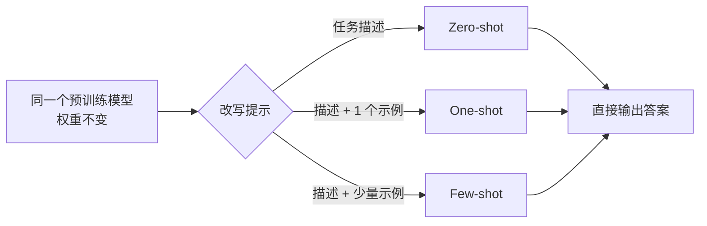

> 这是一篇经典回顾，解读 Brown et al.（OpenAI）2020 年的论文 *Language Models are Few-Shot Learners*（arXiv:2005.14165，<https://arxiv.org/abs/2005.14165>）。文章标题本身就是结论：语言模型是少样本学习者。下文围绕 GPT-3 与「上下文学习」这一核心现象展开，梳理其方法、影响与边界。

## TL;DR

- GPT-3 是一个 1750 亿参数的自回归语言模型，论文标题点题「语言模型是少样本学习者」。
- 核心现象是「上下文学习」（in-context learning）：不更新任何权重，只在提示里给出少量示例（few-shot）甚至零示例（zero-shot），模型就能完成新任务。
- 规模是关键变量：随着模型增大，这种「看提示就学会」的能力显著增强。
- 它让「提示工程」成为一种新的人机交互方式，是后续指令微调、ChatGPT 乃至整个提示范式的前奏。

## 一、背景：从「预训练 + 微调」到「不再微调」

在 GPT-3 之前，主流范式是「预训练 + 下游微调」：先在大规模无标注语料上训练一个通用语言模型，再针对每个具体任务收集带标注的数据集，更新模型权重以适配。这套方法很有效，但代价明显——每个新任务都要重新准备标注数据并训练一份模型副本，泛化能力也常受限于该任务的数据分布。

人类学习新任务往往不需要成千上万个样本，看一两个例子、读一句说明就能上手。GPT-3 论文正是顺着这个直觉提出问题：如果把语言模型做得足够大，它能否在「不更新权重」的前提下，仅凭提示中的少量演示就完成新任务？

## 二、核心思想：上下文学习

GPT-3 的核心贡献不是某个新结构，而是把「上下文学习」这一现象推到了清晰可用的程度。其要点在于：任务的描述与示例不再写进训练流程，而是直接放进推理时的输入提示（prompt）里。模型在前向计算中「读」这些示例，并据此给出对新输入的回答，全程没有任何梯度更新。

论文区分了几种典型设定，差异只在于提示里给多少演示：

| 设定 | 提示中包含的内容 | 是否更新权重 |
| --- | --- | --- |
| Zero-shot（零样本） | 仅任务的自然语言描述 | 否 |
| One-shot（单样本） | 任务描述 + 一个示例 | 否 |
| Few-shot（少样本） | 任务描述 + 少量示例 | 否 |
| 传统微调 | 大量带标注样本 | 是 |

关键区别在最后一列：前三种设定下，模型权重始终不变，所有「适配」都发生在提示这一层。这意味着同一个模型副本可以仅靠改写提示就在翻译、问答、补全、算术等众多任务间切换。

## 三、规模为何重要

GPT-3 之所以能把上下文学习展示得如此鲜明，离不开「规模」这一变量。论文以 1750 亿参数的体量，将语言模型的规模推到了当时少见的量级。一个被反复强调的观察是：随着模型参数量增大，少样本与零样本设定下的表现显著提升，模型「看几个例子就会」的能力越来越强。

也就是说，上下文学习并非一个孤立技巧，而更像是规模增长后浮现出来的一种特性——小模型即便给同样的提示，也难以稳定地从中「领会」任务，而大模型则能更好地利用提示里的演示。这一定性规律，为后续围绕「扩大规模」的研究路线提供了重要的经验支撑。

## 四、影响：提示工程成为新的交互方式

GPT-3 带来的范式转变，在于把「如何向模型描述任务、给出怎样的示例、用什么措辞」变成了一件值得认真设计的事——这就是后来广为人知的「提示工程」（prompt engineering）。当适配任务的成本从「收集数据并训练」降到「写一段好提示」，人与模型的交互方式随之改变：使用者不再必须是能跑训练的工程师，写清楚需求与示例本身就成了一种能力。

沿着这条线索，后续工作进一步发展：通过指令微调让模型更好地理解并遵循自然语言指令，再到面向对话与人类反馈对齐的系统，最终汇入了以 ChatGPT 为代表的对话式产品形态。可以说，GPT-3 所揭示的上下文学习现象，是这一整套「用提示驱动模型」范式的前奏。

## 意义与局限

GPT-3 的意义在于，它用一个足够大的模型清晰地展示了上下文学习：不动权重、仅凭提示即可完成多种任务，并指出规模是这种能力的重要来源。它把研究与应用的注意力，从「为每个任务造一个模型」引向了「造一个通用模型、再用提示去调用」，深刻影响了此后大语言模型的发展方向。

局限同样需要平和看待。上下文学习受提示内容、示例选择与措辞影响较大，表现可能不够稳定；模型基于预训练语料的统计规律生成内容，仍可能产生事实性错误或受训练数据偏见影响；提示能容纳的示例数量也受输入长度限制。这些问题，正是后续指令微调、对齐与检索增强等方向试图缓解的对象。理解 GPT-3，既要看到它打开的可能性，也要记住这些边界。

> 延伸阅读：Brown et al., *Language Models are Few-Shot Learners*, arXiv:2005.14165，<https://arxiv.org/abs/2005.14165>
