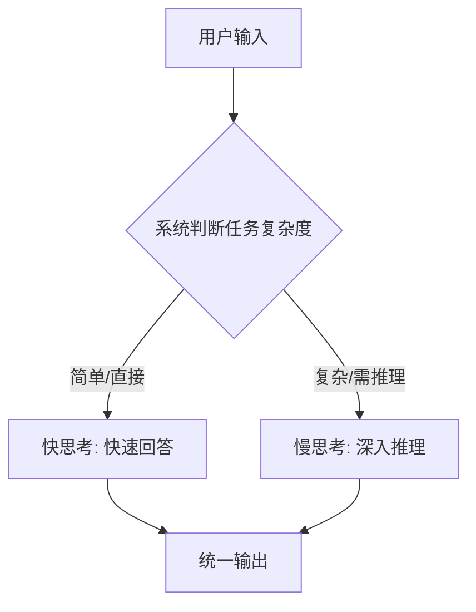

> 这是一篇前沿观察与解读，对象是 OpenAI 于 2025 年 8 月 7 日发布的 GPT-5。需要特别说明的是：与许多研究型工作不同，GPT-5 并未随发布公开完整的技术报告，本文只依据官方公开披露与广为人知的信息展开，不涉及未公开的训练细节。出处：OpenAI, 2025, "Introducing GPT-5"（2025 年 8 月 7 日官方发布，[openai.com](https://openai.com)）。

## TL;DR

- **是什么**：GPT-5 是 OpenAI 于 2025 年 8 月 7 日发布的新一代旗舰模型，面向全体 ChatGPT 用户开放，并同时在 API 上线。
- **核心思想**：被描述为一个「统一（unified）」模型，把「快速回答」与「更深入的推理」整合在一起，由系统按需在「快思考 / 慢思考」之间路由，而非让用户手动切换不同型号。
- **关键结论**：官方强调其在写作、编程、推理等综合能力上的提升，以及更低的幻觉率；但具体的参数量、训练数据与基准分数等细节并未公开。
- **意义**：它代表了「让用户不再为选模型而烦恼」的产品化方向，把模型选择的复杂度收敛到系统内部。

## 一、背景与动机

在 GPT-5 之前，OpenAI 的产品矩阵中并存着多种定位不同的模型：有偏向快速、低延迟对话的通用模型，也有强调链式推理、需要更多「思考时间」的推理型模型。对普通用户而言，这带来一个长期存在的体验问题——**需要自己判断当前任务该用哪一个模型**。一个简单的问候和一道复杂的数学证明，理想的处理方式截然不同，但把这种判断交给用户，既增加了认知负担，也容易导致「用错工具」。

GPT-5 的发布，正是针对这一痛点。官方将其描述为一个「统一」的模型：它不再要求用户在「快」与「慢」之间手动选择，而是把这种调度能力内置到系统中。

## 二、「统一」模型的核心思想

理解 GPT-5 的关键，在于「统一」二字。它的核心思想可以拆解为以下几点：

- **整合快慢两种模式**：把过去分散在不同模型里的「快速回答」与「更深入推理」能力，整合进同一个对外呈现的模型。
- **按需路由**：由系统根据问题的性质，自行决定调用更轻量的快速响应，还是投入更多推理资源进行「慢思考」。
- **降低用户选择成本**：用户面对的是一个入口，而不是一份需要逐一权衡的模型清单。

下面用一个简化的示意来表达这种「按需路由」的思路：

需要强调的是，上图仅为对「统一」理念的概念性表达，具体的路由机制、实现方式等内部细节官方并未公开。

## 三、官方强调的能力与产品定位

根据官方公开的描述，GPT-5 的提升集中在几个方向。下表对其公开披露要点做一个梳理：

| 维度 | 公开披露的要点 |
| --- | --- |
| 发布时间 | 2025 年 8 月 7 日 |
| 覆盖范围 | 面向全体 ChatGPT 用户，并同时上线 API |
| 模型形态 | 「统一」模型，整合快速回答与深入推理 |
| 调度方式 | 由系统按需在「快 / 慢思考」间路由，无需用户手动切换 |
| 能力侧重 | 写作、编程、推理等综合能力提升 |
| 可靠性 | 强调更低的幻觉率 |

从产品角度看，这一系列定位都指向同一个目标：**让能力的提升以「更省心」的方式触达用户**。无论是把多个模型收敛为一个入口，还是强调更低的幻觉，落点都在「降低使用门槛、提升可信度」。

## 四、关于「公开程度」的提醒

对于研究与工程读者，GPT-5 有一点必须明确：它**没有公开完整的技术报告**。这意味着以下信息目前都缺乏官方权威披露，不应臆测或引用未经证实的数字：

- 模型的参数规模；
- 训练数据的构成与规模；
- 具体的训练方法与算力投入；
- 在各类基准上的精确分数。

因此，任何对 GPT-5「跑了多少分」「有多少参数」的具体断言，都需要审慎对待。本文所依据的，仅是官方公开的定性描述与产品层面的信息。

## 意义与局限

从意义上看，GPT-5 把「统一模型 + 系统内路由」推到了面向大众的产品形态：它试图让「快思考」与「慢思考」的切换对用户透明，把模型选择这件长期困扰用户的事收敛到系统内部，同时在写作、编程、推理与可靠性上给出综合性的改进方向。这是一种把研究能力转化为产品体验的清晰路径。

从局限上看，最大的约束恰恰来自信息本身：缺乏完整技术报告，使得外部难以从原理层面理解其「路由」如何工作、能力提升来自何处，也难以做严谨、可复现的横向比较。在这种情况下，对它的讨论更适合停留在「官方公开了什么」这一可证实的范围内，而非基于推测的细节展开。

> 延伸阅读：OpenAI, "Introducing GPT-5"（openai.com，2025 年 8 月）。
