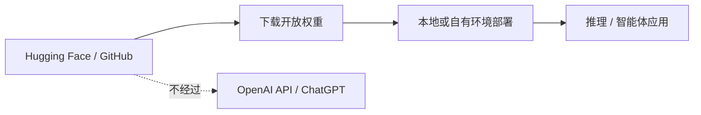

> 本文是对 OpenAI 官方公告 [Introducing gpt-oss](https://openai.com/index/introducing-gpt-oss/)（2025 年 8 月 5 日）的解读与经典回顾。配套的模型卡与代码仓库可见 GitHub 上的 [openai/gpt-oss](https://github.com/openai/gpt-oss)。文中仅依据官方公开信息整理，不涉及未经证实的架构细节或评测分数。

## TL;DR

- **是什么**：OpenAI 于 2025 年 8 月 5 日发布两款开放权重模型 gpt-oss-120b 与 gpt-oss-20b，这是其自 2019 年 GPT-2 以来首次再度公开 LLM 的开放权重。
- **核心思想**：面向强推理与智能体（agent）场景，把可下载、可本地部署的权重直接交到开发者手中。
- **关键结论**：模型以 Apache 2.0 许可（附带使用政策）发布，通过 Hugging Face 与 GitHub 分发，但不通过 OpenAI API 提供，也不出现在 ChatGPT 中。
- **意义**：作为一家以闭源 API 为主的厂商，此举被视为闭源阵营重新拥抱开放权重的标志性事件。

## 一、背景与动机

自 2019 年公开 GPT-2 的权重之后，OpenAI 在随后的多年里转向以 API 服务和 ChatGPT 产品为核心的闭源路线，GPT-3 之后的旗舰模型均未再公开权重。与此同时，开放权重生态在外部快速壮大，一批可下载、可本地微调与部署的模型成为研究者和企业自建系统的重要选择。

在这样的背景下，OpenAI 在 2025 年 8 月 5 日发布 gpt-oss 系列，重新提供可下载的模型权重。这一动作之所以受到关注，正是因为它来自一家长期以闭源 API 为主的厂商：它意味着即使在以服务化为主导的商业模式下，开放权重仍被纳入产品矩阵，与闭源 API 形成互补。

## 二、发布了什么

此次发布包含两个规模档位的模型，命名直接体现其参数量级的差异。从官方定位看，两者都面向需要较强推理能力与智能体编排能力的使用场景，开发者可以将权重下载到自有环境中运行。

| 维度 | 说明 |
| --- | --- |
| 模型 | gpt-oss-120b 与 gpt-oss-20b 两个档位 |
| 许可 | Apache 2.0（附带使用政策） |
| 定位 | 面向强推理与智能体（agent）场景 |
| 分发渠道 | 通过 Hugging Face、GitHub 分发 |
| 不提供的方式 | 不通过 OpenAI API 提供，也不在 ChatGPT 中 |

需要特别留意最后一行：gpt-oss 与 OpenAI 的在线产品是两条相互独立的供给路径。它不是某个 API 模型的「开源镜像」，而是单独发布、单独获取的权重产物。

## 三、为什么选择 Apache 2.0

许可证是开放权重发布中决定使用边界的关键。gpt-oss 采用 Apache 2.0 许可，并附带一份使用政策。Apache 2.0 属于宽松型许可，通常允许在商业与研究场景中较为自由地使用、修改与再分发，对企业自建系统较为友好；而附带的使用政策则在此之上对使用方式作出约束。

下面用一张简化流程图说明开发者获取与使用 gpt-oss 的大致路径。

## 四、与闭源 API 的关系

理解 gpt-oss 的位置，关键在于把它和 OpenAI 既有的闭源服务区分开来。两者面向不同的获取方式与控制粒度，下面做一个定性对比。

| 对比项 | gpt-oss 开放权重 | OpenAI 闭源 API / ChatGPT |
| --- | --- | --- |
| 获取方式 | 下载权重，自行部署 | 通过云端服务调用 |
| 运行环境 | 用户自有环境 | OpenAI 托管 |
| 分发渠道 | Hugging Face、GitHub | 官方 API 与产品 |
| 许可 | Apache 2.0（附带使用政策） | 服务条款约束 |

可以看到，开放权重把部署与运行的控制权交给使用者，适合对数据驻留、离线运行或深度定制有要求的场景；而闭源 API 则在便捷性与托管运维上具有优势。二者并非替代关系，而是覆盖不同需求的两种供给形态。

## 五、对生态的影响

对开发者而言，多一个来自主流厂商的开放权重选项，意味着在自建推理与智能体系统时有了新的备选。对整个行业而言，一家以闭源 API 著称的厂商重新发布开放权重，本身就是一个值得记录的信号：它表明开放权重并未被主流商业路线边缘化，反而可能成为厂商生态布局中长期保留的一环。

## 意义与局限

gpt-oss 的意义在于其象征性与实用性的叠加：象征上，它是 OpenAI 时隔六年再次公开 LLM 权重，呼应了闭源阵营对开放权重的重新接纳；实用上，它为强推理与智能体场景提供了可下载、可自部署的模型。

局限同样需要客观看待。其一，开放权重并不等同于完全无约束，Apache 2.0 之外附带的使用政策仍对使用方式构成限制。其二，它不通过 OpenAI API 提供、也不在 ChatGPT 中，意味着使用者需要自行承担部署与运维成本，无法直接复用既有的在线服务体验。在缺乏官方进一步公开的架构与评测细节时，对其具体能力边界应保持定性、审慎的判断。

> 延伸阅读：OpenAI, [Introducing gpt-oss](https://openai.com/index/introducing-gpt-oss/)（2025）；代码与模型卡见 [openai/gpt-oss](https://github.com/openai/gpt-oss)。
