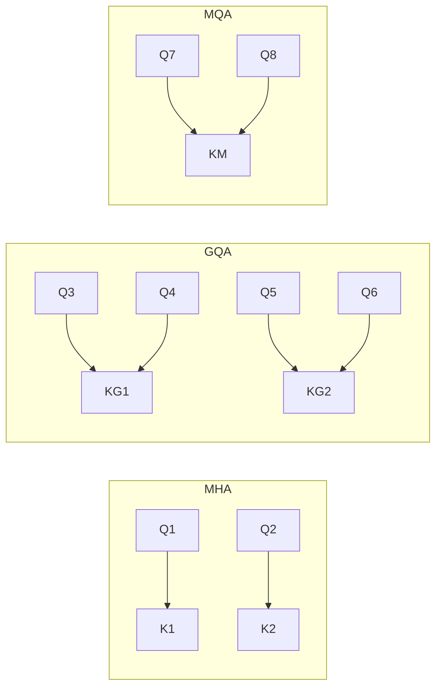

> 本文是对 Ainslie 等人（Google，2023）论文《GQA: Training Generalized Multi-Query Transformer Models》（arXiv:2305.13245，https://arxiv.org/abs/2305.13245）的阅读笔记。文中只对该工作公认的核心思想与定性结论做整理，便于回顾其设计动机与取舍逻辑。

## TL;DR

- 多头注意力（MHA）每个头都维护独立的键值（KV），推理时 KV Cache 体积大、内存带宽压力高。
- 多查询注意力（MQA）让所有头共享同一组 KV，显著省显存，但可能带来质量下降。
- GQA 把注意力头分成若干组，组内共享一组 KV，是介于 MHA 与 MQA 之间的折中方案。
- 它在大幅降低 KV Cache 与带宽压力的同时，质量损失很小，已被 Llama 2 70B 等模型采用。

## 一、背景：KV Cache 为何成为瓶颈

自回归生成的特点是逐 token 解码：每生成一个新 token，都要让它对此前所有 token 的键（Key）和值（Value）做注意力计算。为了避免重复计算，实现上会把历史 token 的 KV 缓存下来，这就是 KV Cache。

在标准的多头注意力（MHA）中，每个注意力头都拥有自己独立的一组 K 与 V。随着序列变长、批量变大、头数增多，KV Cache 占用的显存会线性增长。更关键的是，解码阶段往往受限于内存带宽而非算力：每一步都要把庞大的 KV Cache 从显存搬运到计算单元，搬运量越大，单步延迟越高。因此，KV Cache 的体积既影响能装下多长的上下文、多大的并发批量，也直接影响生成速度。

## 二、两种极端：MHA 与 MQA

围绕"每个 Query 头是否要配一组独立 KV"，存在两种极端做法。

多头注意力（MHA）是经典做法：有多少个 Query 头，就有多少组对应的 K、V 头，表达能力强，但 KV Cache 最大。

多查询注意力（MQA）走向另一端：保留多个 Query 头，但让它们共享同一组 K、V。这样 KV Cache 被压缩到极小，搬运成本大幅下降，解码明显加速。代价是所有 Query 头被迫共用同一份键值表征，在一些任务上可能带来质量下降，并可能引入训练稳定性方面的挑战。

下表概括了两者的取舍：

| 方案 | KV 头数量 | KV Cache / 带宽压力 | 质量表现 |
| --- | --- | --- | --- |
| MHA | 与 Query 头一一对应 | 最大 | 强 |
| MQA | 全部 Query 头共享一组 | 最小 | 可能下降 |

可以看出，MHA 与 MQA 像是同一根坐标轴上的两端：一端偏向质量，一端偏向效率。中间是否存在更平衡的点，正是 GQA 要回答的问题。

## 三、GQA 的核心思想：分组共享

GQA（Grouped-Query Attention，分组查询注意力）的思路非常直接：不让每个头各自独立，也不让所有头挤在一起，而是把 Query 头分成若干个组，每个组内部的若干 Query 头共享同一组 K、V。

这相当于在 MHA 与 MQA 之间引入了一个可调的"组数"参数：

- 当组数等于 Query 头数时，每组只有一个头，退化为 MHA；
- 当组数等于 1 时，所有头共享一组 KV，退化为 MQA；
- 取中间的组数，就得到一族介于两者之间的折中方案。

通过调整分组数量，可以在 KV Cache 体积与模型质量之间灵活权衡：组数越少，越接近 MQA，越省显存；组数越多，越接近 MHA，越保表达力。

## 四、从已有模型出发的训练方式

GQA 的另一处实用性在于，它并不要求从零训练。论文提出，可以从已有的 MHA 检查点出发，对原本独立的多组 KV 头做合并（例如对组内的 KV 投影做聚合），得到分组后的初始化，然后再用相对少量的继续训练来恢复性能。这种"改造已有模型"的路径，让 GQA 可以较低成本地嫁接到现成的预训练模型上，而不必为了节省推理显存重新训练整套权重。

这一点在工程上很有价值：它把"是否采用更省显存的注意力结构"从一次性的预训练决策，变成了一个可以后期介入、按需调整的选项。

## 五、收益与适用场景

GQA 带来的主要收益集中在推理侧：分组共享显著减少了 KV 头数量，从而降低 KV Cache 体积与每步解码需要搬运的数据量，缓解了内存带宽瓶颈。在合理的分组下，质量损失通常很小，相对 MQA 也更稳健。

正因为这种"省得多、掉得少"的性价比，GQA 被多个大模型采用，其中较为知名的是 Llama 2 70B。下表对三种方案的定位做一个收束：

| 方案 | 与 GQA 的关系 | 定位 |
| --- | --- | --- |
| MHA | 组数取最大时的特例 | 质量优先 |
| GQA | 介于两者之间，组数可调 | 平衡 |
| MQA | 组数取 1 时的特例 | 效率优先 |

## 意义与局限

GQA 的意义在于，它用一个简单且可调的"分组"机制，把注意力结构在质量与推理效率之间的取舍从二选一变成了连续可调，并提供了从已有 MHA 模型低成本改造的路径。这使得它易于被现有训练与推理体系吸收，也解释了它在大模型中被广泛采用的原因。

其局限同样需要客观看待：分组共享仍然减少了键值表征的多样性，在部分场景下可能不及完整的 MHA；分组数等关键超参数需要结合具体模型与任务来权衡，并非存在一个普适最优值。总体而言，GQA 更接近一种"工程上很划算的折中"，而非彻底重构注意力机制的方案。

> 延伸阅读：GQA: Training Generalized Multi-Query Transformer Models（arXiv:2305.13245，https://arxiv.org/abs/2305.13245）
