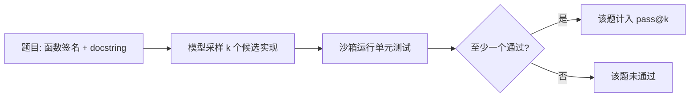

> 本文是对 OpenAI 论文《Evaluating Large Language Models Trained on Code》的阅读笔记与解读。原文：Chen et al. (OpenAI), 2021, arXiv:2107.03374（https://arxiv.org/abs/2107.03374）。该论文同时介绍了 Codex 模型与 HumanEval 评测基准。

## TL;DR

- 论文介绍了 Codex——GitHub Copilot 背后的代码生成模型，并提出配套的 HumanEval 评测基准。
- HumanEval 是一套手写编程题集合，不看代码"长得像不像"，而是看生成代码能否通过单元测试，即"功能正确性"。
- 论文提出 pass@k 指标：对同一题目采样 k 个候选解，只要至少一个通过测试即算成功。
- 这种"以执行结果为准"的评测范式，深刻影响了后续代码模型的评估方式。

## 一、背景与动机

在 Codex 之前，衡量文本生成质量的常用思路是基于参考答案的匹配度，例如 BLEU 这类指标。这套方法在自然语言任务上尚可用，但搬到代码上会遇到根本性的尴尬：两段写法完全不同的代码可能实现同样的功能，而仅有一个字符之差的代码却可能彻底跑不通。换言之，代码的价值在于"能否正确执行"，而非"文本上是否相似"。

代码这种"对就是对、错就是错"的离散特性，恰恰为评测提供了一个比自然语言更硬、更客观的标准——直接运行它，看结果。Codex 论文正是抓住了这一点，把评测重心从"文本相似度"转向"功能正确性"。

## 二、Codex：在代码上微调的语言模型

Codex 是在大量公开代码上训练 / 微调得到的语言模型，能够根据自然语言描述（如函数签名与文档字符串 docstring）生成对应的程序实现。它是 GitHub Copilot 这一代码补全产品背后的核心模型。论文的关注点不只是"模型能写出代码"，更在于"如何严肃、可复现地衡量它写得对不对"，这就引出了 HumanEval。

## 三、HumanEval：以功能正确性为准的基准

HumanEval 由一批手写的编程题构成，共 164 道。之所以强调"手写"，是为了尽量避免题目与训练数据重叠——如果题目本身就出现在训练语料里，模型可能是在"背答案"而非"解题"，评测就失去了意义。

每道题通常包含一个函数签名、一段说明功能的文档字符串，以及一组单元测试。模型需要补全函数体；随后系统在沙箱中运行该实现，用预先写好的单元测试检验它是否满足要求。只有通过全部测试，才算这一题做对。

这种设计把评测从"看文本"彻底拉到了"看行为"：

| 维度 | 传统文本匹配（如 BLEU） | HumanEval 功能正确性 |
| --- | --- | --- |
| 判定依据 | 与参考答案的字面相似度 | 是否通过单元测试 |
| 对写法差异 | 敏感，等价实现可能被判低分 | 不敏感，只看是否跑通 |
| 客观性 | 受参考答案写法影响 | 由测试结果决定，二值清晰 |
| 适用对象 | 自然语言较合适 | 代码生成更贴切 |

## 四、pass@k：把"采样多次"纳入评测

实践中，开发者往往不是只看模型给出的第一个答案，而是会让它生成若干候选，再从中挑一个可用的。为贴合这种使用方式，论文提出了 pass@k 指标：对同一题目采样 k 个解，只要其中至少有一个通过测试，就算该题成功；在整个题集上取平均，得到 pass@k 分数。

直观地说，pass@1 衡量"一次就对"的能力，而 k 取较大值时，衡量的是"多试几次能否解出"。论文还讨论了如何对该指标进行无偏估计，以避免采样带来的统计偏差。下面用一张流程图概括 HumanEval 的评测闭环：

## 五、范式的影响

HumanEval 与 pass@k 的组合，确立了一种"以执行结果为准"的评测范式。它的吸引力在于客观与可复现：判定不依赖人工打分，也不依赖某个参考答案的具体写法，而是交给单元测试这一确定性的裁判。这一思路被后续大量代码模型评测所沿用与拓展，成为衡量代码生成能力时被广泛参考的基准与方法之一。

## 意义与局限

意义在于，HumanEval 把代码评测从模糊的文本相似度，转向了清晰的功能正确性，并用 pass@k 把"采样多次取其一"的真实使用场景纳入度量，使评测更贴近开发者的实际工作方式，也更易于横向比较不同模型。

局限同样需要正视。其一，题集规模有限，且以相对独立、可被单元测试覆盖的函数级问题为主，难以代表大型项目中跨文件、跨模块的工程复杂度。其二，"通过测试"只能证明在给定测试用例下行为正确，无法保证代码的可读性、安全性或在边界情况下的稳健性。其三，随着模型能力提升和基准的广泛使用，数据污染与过拟合特定基准的风险也随之上升。因此，HumanEval 更适合作为代码生成能力的一个重要切面，而非全部。

> 延伸阅读：Chen et al., Evaluating Large Language Models Trained on Code, arXiv:2107.03374（https://arxiv.org/abs/2107.03374）
