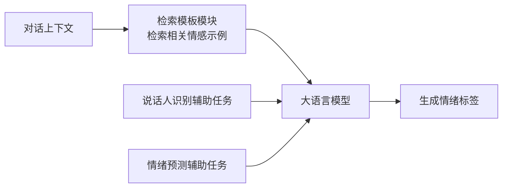

> 本文是对 Lei et al., 2023 的论文《InstructERC: Reforming Emotion Recognition in Conversation with Multi-task Retrieval-Augmented LLMs》(arXiv:2309.11911, https://arxiv.org/abs/2309.11911 )的阅读笔记与解读，内容仅为个人整理，具体细节请以原文为准。

## TL;DR

- InstructERC 把对话情绪识别(ERC)从传统的判别式分类任务，改造为基于大语言模型的生成式任务。
- 核心由三部分构成：检索模板模块(检索增强)、说话人识别辅助任务、情绪预测辅助任务。
- 借助「情感轮」(feeling wheel)统一不同数据集的情绪标签，为跨基准评测提供一致口径。
- 结果表明，LLM 路线在 ERC 任务上相较传统判别式方法展现出优势。

## 一、背景与动机

对话情绪识别(Emotion Recognition in Conversation, ERC)的目标，是判断多轮对话中每一句话所承载的情绪。它与孤立文本的情感分类不同，情绪高度依赖上下文：同一句话在不同的对话历史、不同说话人关系下，可能表达完全不同的情绪状态。

传统 ERC 方法多采用判别式建模，即把问题看作在固定情绪标签集合上的分类，通常借助循环网络、图网络或专门的上下文编码器来捕捉对话依赖与说话人交互。这类方法在特定基准上表现稳定，但往往需要为每个数据集设计专门的标签体系与建模结构，跨数据集迁移与统一评测都比较困难。

随着大语言模型展现出的强上下文理解与指令跟随能力，一个自然的问题是：能否不再把 ERC 当作封闭的分类问题，而是让模型「生成」情绪判断？InstructERC 正是沿这条思路，将 ERC 重构为生成式框架。

## 二、核心思想：从判别式到生成式

InstructERC 的基本转变，是用统一的指令模板把对话上下文组织成自然语言输入，让 LLM 直接生成情绪标签，而非在 softmax 头上做分类。这样做的好处在于：能够复用 LLM 在预训练阶段习得的语言与常识知识，也便于以统一形式融合多种辅助信息。

在此基础上，论文围绕三个关键设计展开。

## 三、三个关键设计

**① 检索模板模块(检索增强)。** 模型在处理当前对话片段时，会检索与之相关的情感示例，并将其纳入上下文提示。检索增强的作用，是为模型提供与当前语境相近的参考样本，帮助其在生成情绪判断时对齐已有的情感表达模式，从而缓解仅靠上下文难以判断的歧义情形。

**② 说话人识别辅助任务。** ERC 中「谁在说」是重要线索：说话人身份的切换、说话人之间的关系，都会影响情绪的走向。该辅助任务引导模型跟踪对话中的说话人信息，让模型在生成情绪标签时更好地感知对话结构。

**③ 情绪预测辅助任务。** 该辅助任务用于增强情感层面的对齐，让模型对情绪本身的表征与判断更加稳健，与主任务形成互补。

三个模块共同构成一个多任务、检索增强的生成式框架，主任务负责输出情绪标签，辅助任务从说话人与情感两个维度提供额外的监督信号。

## 四、用情感轮统一标签口径

不同 ERC 数据集往往使用各自的情绪标签集合，粒度与命名都不一致，这给跨基准比较带来障碍。InstructERC 借助「情感轮」(feeling wheel)作为统一的情绪组织框架，把不同数据集的标签映射到一致的口径上，使得跨数据集的评测与分析更具可比性。

下表概括论文中几个组成部分的角色定位：

| 组成部分 | 类型 | 作用定位 |
| --- | --- | --- |
| 生成式主框架 | 主任务 | 由 LLM 直接生成情绪标签，替代判别式分类 |
| 检索模板模块 | 检索增强 | 引入相关情感示例增强上下文 |
| 说话人识别 | 辅助任务 | 跟踪「谁在说」，感知对话结构 |
| 情绪预测 | 辅助任务 | 增强情感对齐，稳固情绪表征 |
| 情感轮 | 标签统一 | 统一不同数据集的情绪标签口径 |

## 五、方法路线对比

为便于理解 InstructERC 与传统思路的差异，可将两条路线的关键特征概括如下：

| 维度 | 传统判别式方法 | InstructERC(生成式) |
| --- | --- | --- |
| 建模方式 | 固定标签集合上的分类 | LLM 生成情绪标签 |
| 上下文利用 | 依赖专门的上下文/图编码器 | 指令模板组织上下文，辅以检索增强 |
| 说话人信息 | 常通过专门结构建模 | 以辅助任务形式引入 |
| 跨数据集评测 | 标签体系各异，比较困难 | 借情感轮统一口径 |

## 意义与局限

InstructERC 的价值，在于提供了一条把 ERC 纳入大语言模型范式的清晰路径：通过生成式框架、检索增强与多任务辅助设计，它展示了 LLM 在对话情绪识别上相较传统判别式方法的优势，也为「用统一标签口径做跨基准评测」提供了可借鉴的思路。

同时也应看到，生成式与检索增强路线通常伴随更高的推理与工程成本，检索质量、示例选择与提示设计都可能影响最终表现；情感轮虽然缓解了标签不一致的问题，但情绪本身的主观性与标注差异仍是该领域的长期挑战。这些都是后续工作可以继续探讨的方向。

> 延伸阅读：Lei et al., 2023, InstructERC, arXiv:2309.11911 (https://arxiv.org/abs/2309.11911 )
