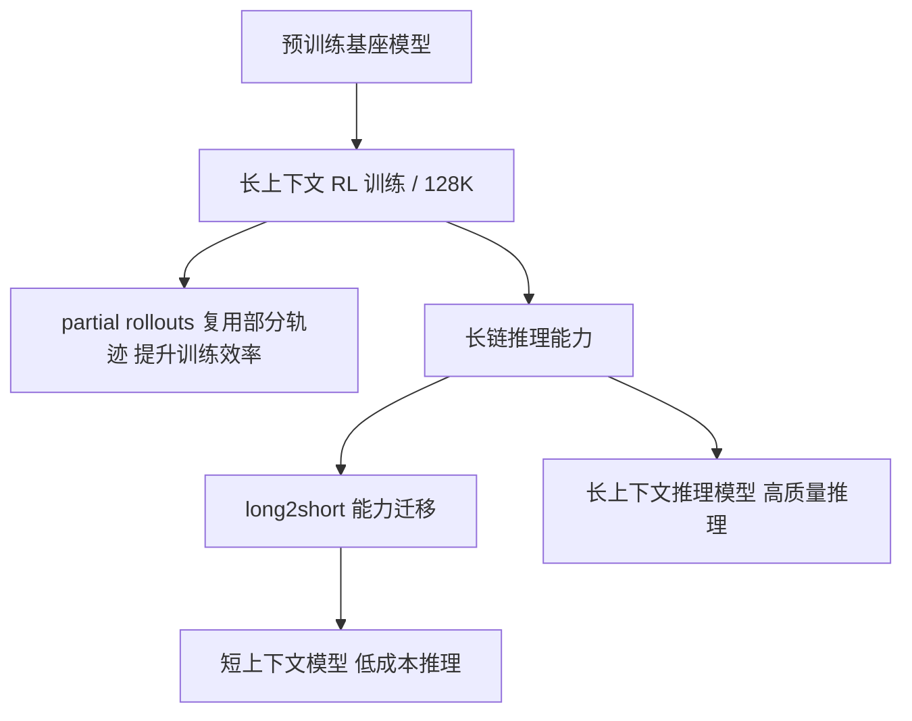

> 本文是对月之暗面（Moonshot AI）Kimi 团队技术报告的阅读笔记与解读。原文：Kimi Team (Moonshot AI), 2025, *Kimi k1.5: Scaling Reinforcement Learning with LLMs*, arXiv:2501.12599（https://arxiv.org/abs/2501.12599）。下文仅就报告中已公开披露的内容进行梳理，未公开的精确指标不在讨论之列。

## TL;DR

- **是什么**：Kimi k1.5 是月之暗面发布的多模态推理模型，与 DeepSeek-R1 同期，同样走"用强化学习（RL）训练推理能力"的技术路线。
- **核心思想**：把 RL 的上下文窗口扩展到 128K，让模型在训练与推理时都能展开更长的思维链；同时用 partial rollouts（部分轨迹复用）提升训练效率。
- **关键技术**：提出 long2short，把长上下文推理学到的能力迁移到短上下文模型，在效果与成本之间取得平衡。
- **意义**：报告称其在多个推理基准上达到 o1 级别表现，表明"扩展 RL"是继预训练扩展之后提升推理能力的又一条可行路径。

## 一、背景与动机

近年来大语言模型能力的提升，很大程度上依赖于预训练阶段对算力、数据和参数规模的扩展。但这条路径正逐渐面临高质量数据有限、边际收益递减的约束。如何在预训练之外找到新的"扩展轴"，成为推动模型推理能力进一步上升的关键问题。

OpenAI 的 o1 系列展示了一个方向：通过让模型在回答前进行更长的"思考"（即更长的推理链），并以强化学习塑造这种思考过程，可以在数学、代码、复杂推理等任务上获得显著提升。但 o1 的训练细节并未公开。Kimi k1.5 与同期的 DeepSeek-R1 一道，正是对"如何用 RL 把推理能力规模化"这一问题的公开探索。

Kimi k1.5 的出发点可以概括为一句话：**把强化学习本身当作一个可扩展的训练范式**。与依赖复杂的蒙特卡洛树搜索、价值函数或过程奖励模型的做法不同，报告强调用相对简洁的框架，通过扩大 RL 的上下文长度来释放模型的长程推理潜力。

## 二、核心思想拆解

报告中的方法可以拆解为几个相互配合的要点。

**1. 长上下文 RL：把窗口扩到 128K**

模型推理链越长，就越能进行多步推演、回溯与自我修正。Kimi k1.5 将 RL 训练的上下文窗口扩展到 128K，使模型可以在一次推理中容纳很长的思考过程。报告观察到，随着可用上下文长度增加，模型在推理任务上的表现也随之提升，这把"上下文长度"确立为一个可扩展的能力维度。

**2. partial rollouts：复用部分轨迹**

长上下文 RL 的一大代价是生成成本高昂——每条推理轨迹都很长，重新从头采样非常耗时。Kimi k1.5 提出 partial rollouts，即复用已经生成的部分轨迹、在其基础上继续，从而显著提高训练吞吐与算力利用率。这是支撑长上下文 RL 能够规模化运行的工程关键之一。

**3. long2short：从长链迁移到短链**

更长的推理链虽然效果好，但推理时的 token 消耗与延迟也更高。long2short 技术的目标是把长上下文模型学到的推理能力，迁移到生成更短输出的模型上，使其在更低的推理成本下尽量保留推理质量。这回应了"推理模型好用但太贵"的现实顾虑。

**4. 多模态与简洁框架**

Kimi k1.5 是多模态推理模型，能够联合处理文本与视觉信息进行推理。整体训练框架强调简洁，不依赖额外的复杂搜索或独立的价值/过程奖励模块，主张以可扩展的 RL 为主线。

下图概括了几个要点之间的关系。

## 三、要点对比

下面把报告中的几项关键设计列在一起，便于理解各自解决的问题。

| 技术点 | 解决的问题 | 直观作用 |
| --- | --- | --- |
| 长上下文 RL（128K） | 推理链长度受限 | 让模型展开更长的多步推理与自我修正 |
| partial rollouts | 长轨迹采样成本高 | 复用已生成部分，提高训练效率 |
| long2short | 长链推理推理成本高 | 把能力迁移到短输出模型，兼顾效果与成本 |
| 多模态 + 简洁框架 | 任务形式多样、流程复杂 | 统一处理文本与视觉，减少额外模块依赖 |

与同期工作相比，Kimi k1.5 与 DeepSeek-R1 共享"用 RL 训练推理"的大方向，但在工程实现与具体侧重上各有取舍。Kimi k1.5 较为突出的特征，是把上下文长度作为扩展维度，并配套了 partial rollouts 与 long2short 来分别应对训练效率与推理成本两个现实约束。

## 四、定位与公开结论

报告将 Kimi k1.5 定位为达到 o1 级别表现的推理模型，覆盖数学、代码以及多模态等多类推理任务。需要强调的是，这里只复述报告中"达到 o1 级别"这一定性结论；具体到各基准上的精确分数、对比配置等细节，应以原始技术报告为准，本文不做推断或补充。

从方法论角度看，Kimi k1.5 提供了一份相对完整、可公开参考的"用 RL 扩展推理"的实践记录，包括训练目标、长上下文设计、采样效率优化以及推理成本控制等环节，对理解这一代推理模型的构建思路具有参考价值。

## 意义与局限

意义方面，Kimi k1.5 与同期工作共同验证了一个判断：在预训练扩展之外，**扩展强化学习**是提升模型推理能力的又一条可行路径。把上下文长度作为可扩展维度、用 partial rollouts 控制训练成本、用 long2short 控制推理成本，这套组合拳针对的都是把方法真正落地时绕不开的工程问题，而非单纯的算法新颖性。

局限方面，长上下文 RL 对算力与工程基础设施的要求较高，复现门槛不低；long2short 在迁移过程中如何权衡"短输出"与"推理质量"之间的损失，仍是值得持续观察的问题。此外，推理模型的能力评估高度依赖基准设计，单一榜单结论需结合更广泛的任务来审视。总体而言，这份报告更大的价值在于把"如何规模化地用 RL 训练推理"的工程路径公开化，为后续研究提供了可对照的参照系。

> 延伸阅读：Kimi Team (Moonshot AI), *Kimi k1.5: Scaling Reinforcement Learning with LLMs*, arXiv:2501.12599（https://arxiv.org/abs/2501.12599）。
