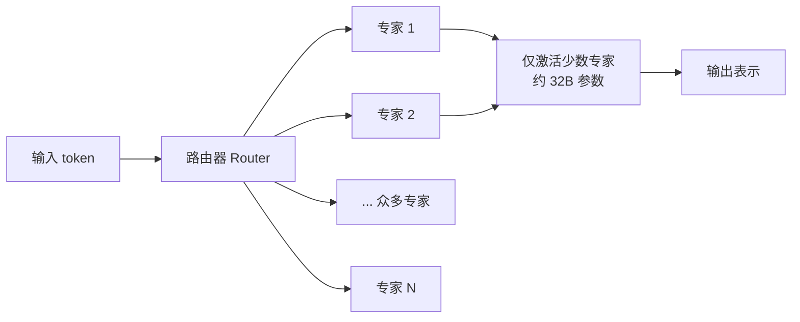

> 本文是对月之暗面（Moonshot AI）技术报告《Kimi K2: Open Agentic Intelligence》的阅读笔记与解读。原文出处：Moonshot AI, 2025, *Kimi K2: Open Agentic Intelligence*, arXiv:2507.20534（https://arxiv.org/abs/2507.20534）。文中观点与事实以原报告为准，本文仅做梳理与延展。

## TL;DR

- **是什么**：Kimi K2 是月之暗面 2025 年 7 月发布的开源 MoE（Mixture-of-Experts，混合专家）大模型，总参数达到约 1.04 万亿（1T 量级），但每个 token 仅激活约 32B 参数。
- **核心思想**：以「开放智能体智能（Open Agentic Intelligence）」为定位，强调长上下文、代码、推理与智能体式工具使用能力，而非单纯堆叠通用语言能力。
- **关键做法**：在约 15.5T tokens 的语料上完成预训练，并采用 MuonClip 优化器，报告中重点强调了大规模训练下的稳定性。
- **意义**：作为 2025 年开源大模型阵营中规模与能力都较为突出的代表之一，它把「万亿参数 + 稀疏激活 + 面向智能体」这一组合推向了开源社区。

## 一、背景与动机

近年来，大模型的能力边界正在从「会聊天、会写作」向「能自主完成任务」迁移。所谓智能体（Agent）能力，指的是模型能够理解目标、调用外部工具、在多步交互中维持状态并逐步逼近结果。这类能力对底层模型提出了更高要求：更长的上下文承载、更稳健的推理链条、更可靠的代码生成与工具调用格式遵循。

与此同时，参数规模的扩张遇到了算力与推理成本的现实约束。稠密（Dense）模型每次前向都要激活全部参数，规模越大、单次推理越昂贵。MoE 架构提供了另一条路径：把参数拆分成大量「专家」，每个 token 只路由到其中少数专家，从而在总参数极大的同时把单次激活量控制在可接受范围。

Kimi K2 正是在这一背景下提出。它的命名与定位——「开放智能体智能」——同时表达了两层意图：一是开源开放，二是把智能体能力作为第一性目标来设计。

## 二、核心设计逐点拆解

报告中可被明确锚定的几项关键设计如下。

**稀疏激活的万亿规模。** Kimi K2 总参数约 1.04 万亿，属于 1T 量级；但得益于 MoE 的路由机制，每个 token 实际只激活约 32B 参数。这意味着它在「容量」上对标超大模型，而在「单 token 计算量」上更接近中等规模模型的开销。

**大规模预训练语料。** 模型在约 15.5T tokens 的数据上完成预训练。充足的 token 预算是稀疏大模型把海量参数「喂饱」的前提，否则庞大的专家容量难以被充分学习利用。

**MuonClip 优化器与训练稳定性。** 训练超大规模 MoE 时，损失尖峰、梯度爆炸、专家路由塌缩等不稳定现象是常见的工程难题。报告中特别提及采用 MuonClip 优化器，并将训练稳定性作为一个被重点说明的方面。

**面向智能体的能力取向。** 与许多以通用对话为中心的模型不同，Kimi K2 把长上下文、代码、推理与工具使用放在能力设计的核心位置，目标是支撑多步、可调用工具的智能体式任务。

## 三、关键特性一览

下表对报告中可确认的几个锚点特性做归纳整理：

| 维度 | Kimi K2 的特征 |
| --- | --- |
| 架构 | Mixture-of-Experts（稀疏专家混合） |
| 总参数规模 | 约 1.04 万亿（1T 量级） |
| 单 token 激活参数 | 约 32B |
| 预训练语料 | 约 15.5T tokens |
| 优化器 | MuonClip（报告强调训练稳定性） |
| 能力定位 | 开放智能体智能：长上下文 / 代码 / 推理 / 工具使用 |
| 开放性 | 开源发布 |

为了更直观地理解「稀疏激活」如何在保持巨大容量的同时控制单次推理开销，可用下图示意 MoE 的路由过程：

## 四、为什么「万亿 MoE + 智能体」值得关注

把规模与定位放在一起看，Kimi K2 的取向有其内在逻辑。智能体任务往往涉及长链条的工具调用与中间推理，模型需要在长上下文中保持一致性，并稳定地输出可被解析、可被执行的结构化结果。更大的模型容量通常有助于承载这类复杂行为，而 MoE 的稀疏激活则让「拥有巨大容量」与「单次推理可负担」之间的矛盾得到一定缓解。

对开源社区而言，一个规模处于 1T 量级、又明确面向智能体场景的开放模型，提供了一个可供研究、复现与二次开发的参照系。它把此前主要在闭源体系中被讨论的「超大稀疏模型 + 智能体能力」组合，带到了更开放的语境下。

## 意义与局限

意义层面，Kimi K2 体现了 2025 年开源大模型的一种代表性方向：以稀疏激活换取规模上限，以智能体能力作为设计目标，并在工程上重视超大规模训练的稳定性。它为长上下文、代码与工具使用类应用提供了一个开放的、规模可观的基座选择。

局限与边界同样需要客观看待。MoE 模型在部署时面临专家分布带来的显存与调度复杂度，对推理基础设施有一定要求；万亿参数的服务成本即便在稀疏激活下也不容低估。此外，「智能体智能」是一个仍在快速演进的目标，模型在真实多步任务中的可靠性、工具调用的鲁棒性，仍需在具体场景中长期检验。关于各项基准的精确表现，应以原报告与后续公开评测为准，本文不就未公开的精确数值做引申。

> 延伸阅读：Moonshot AI, *Kimi K2: Open Agentic Intelligence*, arXiv:2507.20534（https://arxiv.org/abs/2507.20534）。
