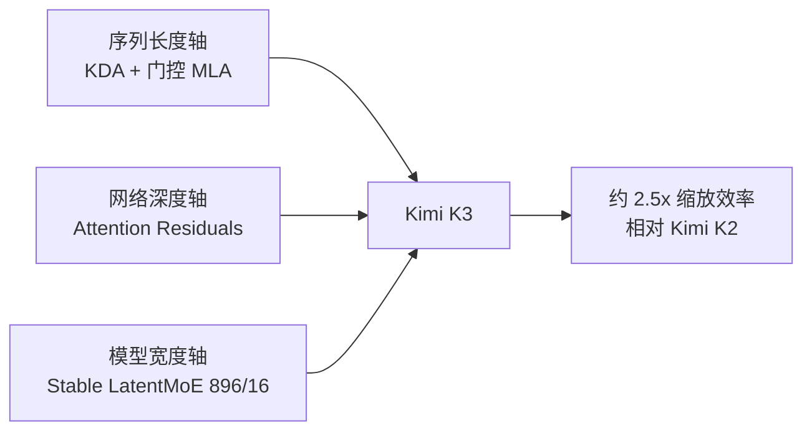

> 本文是对月之暗面（Moonshot AI）技术报告《Kimi K3: Open Frontier Intelligence》的解读笔记，原文见 arXiv:2607.24653（https://arxiv.org/abs/2607.24653）。模型于 2026 年 7 月 16 日发布，权重按报道计划于 7 月 27 日开放。文中数字均引自官方报告或官方模型卡，第三方评测另行标注；具体结论请以原始材料为准。

## TL;DR

- Kimi K3 是一个 2.8T 总参数、104B 激活参数的原生多模态 MoE 模型，上下文窗口达到 1,048,576 个 token。
- 架构上的三块主要改动分别针对序列长度、网络深度与模型宽度：Kimi Delta Attention（KDA）、Attention Residuals（AttnRes）与 Stable LatentMoE。
- 官方称这些改动配合数据与训练配方的调整，带来相对 Kimi K2 约 2.5 倍的整体缩放效率提升。
- 后训练强调通用、智能体与编码三个方向的强化学习，以及多档「推理努力」（reasoning effort）设置。

## 一、发布概览与定位

Kimi K3 于 2026 年 7 月 16 日发布，是月之暗面在 Kimi K2 之后的新一代旗舰。K2 在 2025 年 7 月以「万亿参数 MoE 的开放智能体」形象出场（本站曾有笔记），K3 则把总参数推到 2.8T，并把上下文从 K2 的量级进一步拉到百万 token。

按官方模型卡，K3 的基本规格如下：

| 项目 | 规格 |
| --- | --- |
| 总参数 / 激活参数 | 2.8T / 104B |
| 架构 | MoE，896 个路由专家，每 token 激活 16 个，另有 2 个共享专家 |
| 注意力层构成 | 69 层 KDA + 24 层门控 MLA |
| 视觉编码器 | MoonViT-V2，401M 参数 |
| 上下文长度 | 1,048,576 token |
| 词表 | 160K |

值得注意的是「原生多模态」这一表述：视觉能力不是后期贴上去的适配层，而是在预训练阶段就参与进来的。这也解释了为什么官方评测里多模态项目（MMMU-Pro、MathVision、MMVU 等）与文本、代码项目并列呈现。

## 二、架构：沿三个轴扩展信息流动

报告把三项架构改动组织成一个统一叙事——分别扩展沿序列长度、网络深度与模型宽度的信息流动。这个框架比逐项罗列更容易理解它们的分工。

**1）Kimi Delta Attention（KDA）：序列长度轴。** KDA 是一种混合线性注意力机制，源自 Kimi Linear 的工作（arXiv:2510.26692）。它的基本思路是把线性注意力层与全注意力层交错排布——公开材料中提到的比例是 3:1，即三层线性注意力负责廉价地处理局部序列结构，一层全注意力负责保住全局信息通路。K3 的具体配置是 69 层 KDA 配 24 层门控 MLA（多头潜在注意力），后者周期性插入以保留全局交互。

这一设计的动机非常实际：在 1M token 上跑完整的二次复杂度注意力，经济上难以承受。按 Kimi Linear 论文在同等规模下的报告，该方案可将 KV 缓存内存降低最多约 75%，并在百万 token 上下文下带来数倍的解码吞吐提升。换句话说，KDA 是这个百万窗口能被真正服务出来的前提。

**2）Attention Residuals（AttnRes）：网络深度轴。** 这一机制允许每一层选择性地关注此前所有层的表示，而不只是相邻的前一层输出。它针对的是深层网络中信息随深度衰减的问题。

**3）Stable LatentMoE：模型宽度轴。** 路由专家空间被扩展到 896 个，每 token 只激活 16 个——稀疏度相当极端。极端稀疏容易带来训练不稳定，报告提到用归一化、SiTU-GLU 激活与 Quantile Balancing（分位数均衡）来稳定优化过程。这里的思路与业界近年在 MoE 上的共同关注一致：专家数越多、激活越稀疏，路由的均衡与训练的稳定就越成为瓶颈。

报告将这三项与数据、训练配方的改进合并计入，给出「相对 K2 约 2.5 倍整体缩放效率提升」的说法。需要留意的是，这是一个综合口径的数字，无法据此把收益拆分到某一项具体改动上。

## 三、后训练与基础设施

后训练部分，报告强调在通用、智能体、编码三个域上做强化学习，并支持多个档位的推理努力级别，目标是获得组合泛化能力与长程任务上的稳定执行。「多档推理努力」意味着同一权重可以按任务难度调节思考预算，这与近一两年主流模型把「快慢思考」收进单一模型的取向是一致的（可对比 DeepSeek-V3.1 的做法）。

在 2.8T 这个尺度上，基础设施本身就是贡献的一部分。报告列出的几个方向包括：面向 KDA 的算法—系统协同设计、专家并行的完全均衡训练与内存管理、支持百万 token 的智能体 RL（需要持久化的 rollout 与沙箱状态）、以及部署侧的一系列工程改动。最后一项尤其关键——一个 2.8T 的 MoE 若无法以可接受的成本服务，其开放权重的意义会大打折扣。

## 四、评测表现与需要留意的地方

官方模型卡给出的部分结果：推理与知识方面 GPQA Diamond 93.5、AA-LCR 74.7；编码方面 Terminal-Bench 2.1 达 88.3、FrontierSWE 81.2、DeepSWE 67.5、ProgramBench 77.8；多模态方面 MMMU-Pro 在无工具/有工具下分别为 81.6 / 83.4，MathVision 为 94.3 / 97.8。

这些数字看起来很强，但解读时有几点值得克制：

- **harness 不一致**：官方表格中不同编码基准用了不同的智能体框架（Kimi Code、Claude Code、Codex 或官方 harness），跨模型比较并非同一条件。第三方注意到在唯一可做同 harness 对照的 DeepSWE 上，K3 与对手几乎持平。
- **长上下文缺少独立验证**：1M 是官方规格，但公开材料中缺少 500K 或 1M 长度下的针尖检索类评测，极端长度上的可用性仍待确认。
- **厂商评测的固有偏向**：官方发布通常会选取有利角度，这不是 K3 独有的问题，但看待「登顶」类表述时应保持距离——第三方综合排位与官方叙事并不总是一致。

## 意义与局限

意义层面，Kimi K3 值得关注的地方不只是参数量。它把混合线性注意力从论文推到了旗舰模型的主架构上，这是个不小的工程承诺——在 2.8T 规模上采用尚未被大规模验证的注意力方案，需要对训练稳定性与推理栈都有相当把握。如果这条路走通，「长上下文昂贵」这个长期约束会被实质性放松，而不只是靠外推技巧勉强撑住窗口。此外，以 2.8T 的规模开放权重，也为社区提供了在极端稀疏 MoE 上做研究的稀缺材料。

局限层面同样明显。首先是可及性：2.8T 的 MoE 即便以 MXFP4 原生量化的检查点发布，自部署仍需多节点级别的加速卡与成熟的 MoE 服务栈，多数团队短期内只能走 API，「开放权重」的实际受益者相对有限。其次如上一节所述，架构改动的收益以合并口径给出，单项贡献不易剥离，2.5 倍缩放效率也依赖官方自身的度量方式。最后，百万上下文的真实可用长度与始终开启思考带来的 token 成本，都需要在具体负载上实测，而非依据规格表下判断。

> 延伸阅读：Moonshot AI，《Kimi K3: Open Frontier Intelligence》，arXiv:2607.24653（https://arxiv.org/abs/2607.24653）；KDA 的来源工作见 Kimi Linear，arXiv:2510.26692（https://arxiv.org/abs/2510.26692）。
