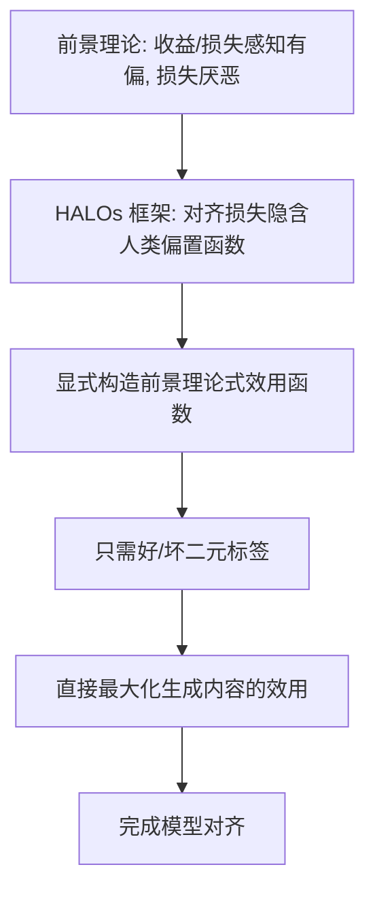

> 本文是对 Ethayarajh et al., 2024 (ICML 2024) 论文《KTO: Model Alignment as Prospect Theoretic Optimization》的解读与经典回顾。原文见 arXiv:2402.01306（<https://arxiv.org/abs/2402.01306>）。文中只展开论文及业界公认的事实，不补充无法核实的具体数字。

## TL;DR

- **是什么**：KTO（Kahneman-Tversky Optimization）是一种大模型对齐方法，把卡尼曼与特沃斯基的「前景理论」引入对齐目标的设计。
- **核心思想**：直接最大化模型生成内容的「效用」，只需要每条输出「好/坏（desirable/undesirable）」的二元标签，而不需要成对偏好数据。
- **关键结论**：论文显示，在约 1B 到 30B 的多种规模上，KTO 能够匹配甚至超过基于成对偏好的方法。
- **意义**：二元反馈在现实中更容易、更便宜地大规模获取，KTO 因此拓宽了「用什么信号做对齐」的选择空间。

## 一、背景：对齐为什么离不开「人类反馈」

大语言模型在预训练后往往需要经过对齐，使其输出更符合人类期望。主流路线是基于人类反馈的强化学习（RLHF）以及后来兴起的直接偏好优化（DPO）等方法。这一类方法的共同前提是：需要人类对模型输出表达偏好。

最典型的偏好信号是「成对比较」——给定同一个提示，标注者在两条候选回答中选出更好的一条，从而得到「优于/劣于」的成对数据。这种成对偏好数据信息量大，但采集成本不低：标注者要同时阅读、比较两条完整回答，并做出一致、可靠的取舍。在真实生产环境中，这往往成为扩大对齐数据规模的瓶颈。

KTO 的出发点正是：能否换一种更易获得的反馈信号，同样把模型对齐好？

## 二、理论基础：前景理论与「人类感知损失」

KTO 的理论根基来自行为经济学中的前景理论（Prospect Theory）。前景理论指出，人对收益与损失的感知是有偏的——人们并非以「客观期望值」来评估结果，而是相对于某个参照点来感知收益或损失，并且对损失的敏感程度通常高于对等量收益的敏感程度，即「损失厌恶」。

论文据此提出了「人类感知损失」（HALOs，Human-Aware Losses）这一框架，用来统一审视对齐方法的目标函数。一个重要观察是：以 DPO 为代表的现有方法，其损失函数其实隐含了某种关于人类如何感知收益与损失的偏置假设。换句话说，这些方法在数学形式背后，已经隐含地嵌入了一套「人类偏置函数」，只是此前没有被明确地命名和讨论。

把这一隐含假设显式化之后，研究者获得了一个新的设计自由度：既然对齐目标里本就藏着一个「人类感知函数」，那么不妨直接按前景理论来刻画它，并以此构造新的对齐目标。

## 三、核心创新：直接最大化「效用」，只用二元标签

基于 HALOs 框架，KTO 的核心做法是直接最大化模型生成内容的「效用」，其中「效用」的形状由前景理论式的感知函数来描述（区分收益侧与损失侧、并体现损失厌恶的不对称性）。

与 DPO 最显著的差别在于数据需求：

- DPO 等成对偏好方法需要「同一提示下两条回答谁更好」的配对数据；
- KTO 只需要为每条输出打上「好/坏（desirable/undesirable）」的二元标签，无需配对。

这意味着标注者不必再做两两比较，只需对单条输出给出一个是非判断。下面的对比可以更直观地看出两者的差异：

| 维度 | DPO（成对偏好） | KTO（二元反馈） |
| --- | --- | --- |
| 反馈形式 | 同一提示下两条回答的优劣排序 | 单条输出标注为「好/坏」 |
| 标注负担 | 需比较、权衡两条完整回答 | 对单条输出做是非判断 |
| 数据获取 | 相对昂贵、规模受限 | 现实中更易、更便宜地大量获取 |
| 理论刻画 | 隐含某种人类偏置函数 | 显式采用前景理论式的感知函数 |

下面用一张流程图概括 KTO 的基本思路：

## 四、价值：更易获取的信号，匹配甚至超过成对方法

KTO 的实践价值集中体现在「信号成本」上。二元的「好/坏」反馈在现实场景中天然更容易获得：用户的点赞/点踩、是否被采纳、是否触发投诉等，往往本身就是单条样本上的是非信号，而非成对比较。这类信号既可以来自显式标注，也可能来自系统中已有的交互记录，因而更容易低成本地积累出大规模数据。

在效果层面，论文报告称：在约 1B 到 30B 的多个模型规模上，KTO 能够匹配甚至超过基于成对偏好的方法。这一结果的意义在于，放宽到更廉价的反馈形式后，对齐效果并未因此明显牺牲。

从方法谱系上看，KTO 属于偏好优化家族（与 DPO、SimPO、ORPO 等并列）中独特的一支。这一家族大多围绕成对偏好做文章，而 KTO 的独特之处在于改变了所依赖的信号类型本身，从而把「用什么信号做对齐」这一问题重新打开。

## 意义与局限

KTO 的意义在于，它通过前景理论与 HALOs 框架，把对齐目标中长期隐含的「人类感知假设」显式化，并由此论证：对齐并不必然依赖昂贵的成对偏好数据，单条输出的二元标签同样可以支撑高质量的对齐。这既降低了数据获取的门槛，也为对齐方法的设计提供了一个新的理论视角。

局限方面需要保持审慎。二元标签虽然便宜，但相比成对比较所承载的信息更为粗粒度，「好/坏」的判定标准在不同标注来源之间可能并不一致；前景理论式效用函数也引入了关于人类感知形状的特定假设，这些假设在不同任务、不同人群上的适用程度仍有待具体衡量。此外，论文给出的结论是在其所考察的模型规模与设置下得到的，迁移到其他规模或场景时仍应结合实际验证。总体而言，KTO 拓宽了对齐信号的选择空间，是偏好优化方法演进中的一个重要参照点。

> 延伸阅读：Ethayarajh et al., 2024, "KTO: Model Alignment as Prospect Theoretic Optimization", arXiv:2402.01306（<https://arxiv.org/abs/2402.01306>）。
