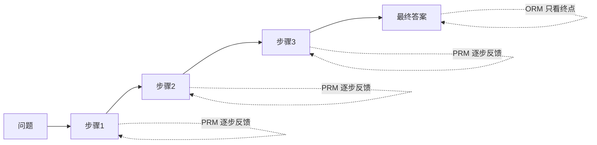

> 本文是对 OpenAI 论文《Let’s Verify Step by Step》（2023，arXiv:2305.20050，https://arxiv.org/abs/2305.20050）的阅读笔记。原文围绕一个核心问题展开：当我们训练奖励模型去监督大模型的推理时，究竟应该奖励"最终答案对不对"，还是奖励"每一步推得对不对"。

## TL;DR

- 奖励信号有两种粒度：结果监督（ORM）只看最终答案的对错，过程监督（PRM）则对思维链的每一步分别给出反馈。
- 在 MATH 数据集上，过程监督训练出的奖励模型显著优于结果监督，并刷新了数学解题的当时最优水平（SOTA）。
- 论文公开了 PRM800K 数据集，包含约 80 万条步级（step-level）人工标注。
- 这一工作成为后续"奖励正确推理过程"的推理模型的重要基础。

## 一、背景：奖励应该看结果，还是看过程

大语言模型在求解数学题这类多步推理任务时，通常采用思维链（chain-of-thought）的方式，把推理拆成一连串中间步骤再得出最终答案。要进一步提升这类能力，一种常见做法是训练奖励模型（reward model），用它对模型生成的多个候选解进行打分与筛选，或作为后续强化学习的奖励来源。

问题在于：奖励模型应该奖励什么？最直接的方案是只看最终答案是否正确，这就是结果监督。它的标注成本低——只需判断答案对错——但隐藏着一个结构性缺陷：一个推理过程中间步骤错误、却"歪打正着"得到正确答案的解，会被同等地视为"好解"。这意味着奖励信号无法区分"真正会做"和"碰巧蒙对"。

## 二、两种监督方式的对比

论文系统性地对比了两种监督范式。其差异不仅是标注粒度的不同，更直接影响奖励模型学到的是什么。

| 维度 | 结果监督（ORM） | 过程监督（PRM） |
| --- | --- | --- |
| 反馈对象 | 仅最终答案 | 思维链的每一步 |
| 信号粒度 | 整条解一个标签 | 逐步标签 |
| 标注成本 | 较低 | 较高 |
| 对错误中间步的敏感度 | 低，可能奖励"蒙对" | 高，能定位错误步骤 |

过程监督的核心思想，是把对"一整条解"的一个笼统判断，细化为对"每一个推理步骤"的逐点判断。这样得到的奖励模型不再只关心终点，而是关心整条推理路径是否步步成立。

## 三、方法与核心发现

论文的做法是：用人工对思维链中的每一步进行标注，训练一个过程监督奖励模型；再以同等条件训练一个结果监督奖励模型作为对照。评测时，两者都被用于对大量候选解进行重排序（即从模型采样的多个解中，选出奖励模型打分最高的一个）。

核心发现可以归纳为几点：

- 在 MATH 数据集上，过程监督训练的奖励模型在筛选正确解上的表现显著优于结果监督。
- 这种优势随着候选解数量的增加而持续保持，说明过程监督提供的奖励信号更可靠、更具区分度。
- 借助过程监督的奖励模型，论文刷新了当时数学解题任务的最优水平。

直观地解释，过程监督之所以更强，是因为它向模型提供了更密集、更精确的监督信号：它能指出"错在第几步"，而不仅仅是"这条解最终错了"。密集的、定位到步骤的反馈，比稀疏的、只在终点出现的反馈更利于训练出可靠的判别能力，也更不容易被"中间出错却蒙对"的解所误导。

## 四、PRM800K：把步级标注开放出来

为支撑过程监督的研究，论文还公开了名为 PRM800K 的数据集，其中包含约 80 万条步级人工标注。标注的粒度落在推理的"每一步"上，使研究者能够训练和评估真正意义上的过程监督奖励模型。开放这样一份大规模、细粒度的人工标注数据，本身就是这项工作的重要贡献之一——它为后续研究提供了可复用的基础设施，而不只是一个结论。

## 意义与局限

这项工作的意义在于，它清晰地论证了奖励信号的"粒度"对推理能力的影响：奖励正确的推理过程，比仅奖励正确的最终答案更有效。这一思路成为后续"奖励正确推理过程"一类推理模型的重要基础，过程监督奖励模型（PRM）也由此成为推理对齐方向中被广泛讨论的范式之一。

局限同样值得正视。过程监督依赖步级人工标注，其成本明显高于只标注最终答案的结果监督，规模化时面临标注负担。论文的结论主要建立在数学解题这类有相对清晰"步骤对错"判定的任务上，能否同等迁移到步骤边界模糊、正确性难以逐步判定的开放任务，仍需更多探索。此外，如何降低步级监督的获取成本，也是后续研究持续关注的方向。

> 延伸阅读：OpenAI《Let’s Verify Step by Step》，arXiv:2305.20050（https://arxiv.org/abs/2305.20050）
