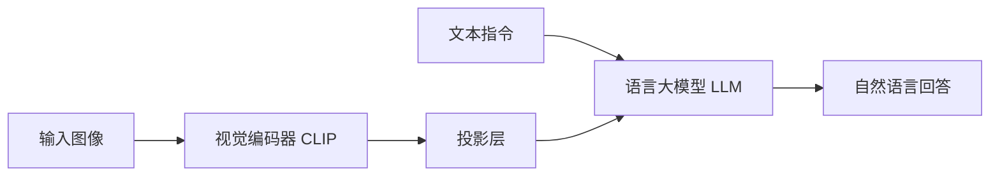

> 本文是对经典工作的阅读笔记，原文为 Liu et al., 2023, 《Visual Instruction Tuning》（arXiv:2304.08485，链接：https://arxiv.org/abs/2304.08485）。LLaVA 把视觉编码器与语言大模型连接起来，并通过「视觉指令微调」让模型具备看图对话的能力，是开源多模态大模型的代表性早期工作。

## TL;DR

- LLaVA 用一个投影层把视觉编码器（如 CLIP）与语言大模型连接，让 LLM 能够「看图说话」。
- 核心方法是「视觉指令数据」：借助 GPT-4 等生成图文指令—回答样本，再对模型做指令微调。
- 训练得到的是一个开源的多模态对话助手，可用于视觉问答、看图描述等任务。
- 它是开源多模态大模型方向上具有代表性的早期工作。

## 一、背景与动机

在 LLaVA 出现之前，纯语言大模型已经通过指令微调展现出很强的对话与遵循指令能力，但它们「看不见」图像；与此同时，视觉表征模型（如 CLIP）虽然能很好地理解图像内容，却缺乏与人类自然对话、遵循复杂指令的能力。如何把这两类已有能力拼接起来，让一个模型既能理解图像、又能像语言助手那样对话，是当时多模态研究的关键问题。

LLaVA 的思路并不是从零训练一个庞大的多模态模型，而是尽量复用已有的强大组件：一个成熟的视觉编码器负责「看」，一个成熟的语言大模型负责「说」和「推理」，中间只需要一座轻量的「桥」把视觉信息送进语言模型的输入空间。这种以连接和微调为主的设计，使得在有限资源下构建多模态对话助手成为可能。

## 二、核心思想：用一个投影层连接两个世界

LLaVA 架构可以拆成三个部分逐点理解：

- 视觉编码器：使用 CLIP 这类预训练视觉模型，把输入图像编码成视觉特征。
- 投影层：一个相对轻量的映射模块，把视觉特征转换到语言模型可以接受的表示空间，相当于把图像「翻译」成 LLM 能读的「词」。
- 语言大模型：接收投影后的视觉表示与文本指令，统一在语言模型中进行理解与生成，输出自然语言回答。

这种设计的巧妙之处在于：视觉与语言两侧都可以沿用预训练好的强模型，真正需要重点学习的是中间的连接与对齐。图像经过编码与投影后，被当作一段「视觉上下文」与文本指令一起喂给语言模型，模型据此完成回答。

## 三、关键：视觉指令数据与指令微调

让模型「能看图」只是第一步，要让它「能按人类指令围绕图像对话」，关键在于训练数据。LLaVA 的核心贡献之一，是提出用 GPT-4 等模型来生成视觉指令数据：基于图像相关的信息，构造出多样化的指令—回答样本，例如围绕一张图像提出问题并给出回答、要求详细描述图像、围绕图像内容进行多轮交流等。

有了这样的图文指令数据，就可以对连接好的模型做「视觉指令微调」，使其学会理解图像、遵循指令并以对话形式作答。下面对几个核心概念做一个对照梳理：

| 概念 | 含义 | 在 LLaVA 中的作用 |
| --- | --- | --- |
| 视觉编码器 | 预训练的图像表征模型（如 CLIP） | 提取图像的视觉特征 |
| 投影层 | 轻量映射模块 | 把视觉特征对齐到语言模型的表示空间 |
| 语言大模型 | 预训练的对话/指令模型 | 结合视觉与文本进行理解与生成 |
| 视觉指令数据 | 借助 GPT-4 等生成的图文指令—回答样本 | 作为指令微调的训练信号 |

通过这种「连接 + 视觉指令微调」的组合，模型不仅能识别图像内容，还能围绕图像遵循多样化的指令进行交流，从而成为一个真正可用的多模态对话助手。

## 四、能力与应用

经过视觉指令微调后，LLaVA 表现为一个开源的多模态对话助手。它可以在给定图像的前提下进行视觉问答、对图像进行描述，以及围绕图像内容展开自然语言交流等。这意味着用户可以直接用自然语言向模型提出与图像相关的问题，模型据此作答，交互方式与纯文本的语言助手保持一致，只是输入中多了图像这一模态。

这种统一在语言模型内的交互形式，使多模态能力更易于使用和扩展：图像被纳入语言模型的上下文，模型用同一套生成机制回应文本与图像相关的请求。

## 意义与局限

从意义上看，LLaVA 提供了一条以「复用强组件 + 视觉指令微调」构建多模态对话助手的清晰路径，并以开源形式呈现，是开源多模态大模型方向上具有代表性的早期工作。它展示了用一个轻量连接层把视觉编码器接入语言大模型、再借助由强模型生成的视觉指令数据进行微调的可行性，为后续大量多模态对话模型的研究与实现提供了参考范式。

从局限上看，这类方法的能力上限在相当程度上取决于所连接的视觉编码器与语言大模型本身，以及视觉指令数据的质量与覆盖范围；当图像内容超出训练分布、或需要精细视觉理解与严谨推理时，模型的表现仍可能受到限制。这些方面也成为后续工作持续改进的方向。

> 延伸阅读：Liu et al., 《Visual Instruction Tuning》，arXiv:2304.08485（https://arxiv.org/abs/2304.08485）。
