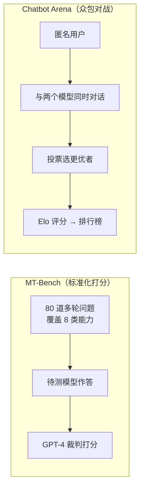

> 本文为论文深度阅读笔记。原文：*Judging LLM-as-a-Judge with MT-Bench and Chatbot Arena*（Zheng et al., NeurIPS 2023 Datasets and Benchmarks Track，arXiv:2306.05685，https://arxiv.org/abs/2306.05685 ）。文中数据引自原论文，转载请注明出处。

## TL;DR

- **问题**：MMLU、HellaSwag 这类封闭题基准只能测"答得对不对"，测不了对话助手"好不好用、合不合人类口味"。人工标偏好又太贵、太慢。
- **方法**：系统验证**用强 LLM（如 GPT-4）当裁判**来近似人类偏好，并提出两套被后续反复引用的评测体系——**MT-Bench**（多轮问答打分）与 **Chatbot Arena**（众包对战 + Elo 排名）。
- **结论**：GPT-4 裁判与人类的一致性约 **80%**，与"人与人之间的一致性"相当；但存在**位置、冗长、自我偏好**等系统性偏差，需要专门缓解。
- **影响**：直接奠定了 `LLM-as-a-Judge` 评测范式，催生了 AlpacaEval、Arena-Hard 等一系列后续工作。

---

## 一、背景：传统基准为什么不够用

早期 LLM 评测高度依赖 MMLU、HellaSwag、ARC 这类**多选/封闭题**基准。它们的优点是客观、可自动判分，但有两个根本短板：

1. **测不到"对话体验"**：一个模型 MMLU 很高，不代表它在开放式对话里回答得有条理、有帮助、符合指令。
2. **与真实使用场景脱节**：用户真正在意的是写作润色、代码调试、角色扮演这类**开放式生成**任务的质量，而这正是封闭题测不出来的维度。

测开放式生成质量，最可靠的是**人类偏好标注**，但它成本高、周期长、难以规模化复现。于是一个自然的问题浮现：**能不能让已经很强的 LLM 来代替人类打分？**

## 二、两套评测体系

### MT-Bench

精心设计的 **80 道多轮对话题**，覆盖 8 个类别，重点考察**多轮指令遵循**能力：

| 类别 | 考察点 |
| --- | --- |
| Writing | 写作与表达 |
| Roleplay | 角色扮演与人设保持 |
| Reasoning | 逻辑推理 |
| Math | 数学计算 |
| Coding | 代码生成 |
| Extraction | 信息抽取 |
| STEM | 理工知识 |
| Humanities | 人文社科 |

每题包含两轮追问，专门暴露模型"第一轮答得不错、第二轮就跟丢上下文"的问题。

### Chatbot Arena

一个**众包对战平台**：用户匿名同时与两个模型对话，投票选出更优的一方，再用 **Elo 评分**（源自国际象棋的对弈评分系统）对模型排名。这种"用户用脚投票"的方式，后来成了业界事实上的大模型排行榜。它的好处是题目**完全开放、贴近真实需求**，且随用户增长持续累积数据。

## 三、LLM 当裁判的三种用法

论文系统比较了几种裁判模式：

| 模式 | 做法 | 特点 |
| --- | --- | --- |
| Pairwise comparison | 给裁判两个回答，让它选更优 | 与 Arena 一致，稳定但需两两比较 |
| Single-answer grading | 让裁判直接给单个回答打分（如 1–10） | 可扩展，但分数尺度易漂移 |
| Reference-guided | 提供参考答案，再让裁判评判 | 显著改善数学/推理题的判分准确率 |

## 四、关键发现：一致性与偏差

### 4.1 一致性有多高

GPT-4 裁判与人类偏好的一致性可达 **~80%**。作为参照，**人类标注者彼此之间的一致性也大致是这个量级**——也就是说，强 LLM 裁判已经接近"再找一个人来标"的水平。这是全文最重要的结论：它让自动化评测开放式生成第一次有了可信的量化依据。

### 4.2 系统性偏差（重点）

论文最有价值的部分，是诚实地揭示并量化了 LLM 裁判的几类偏差：

| 偏差类型 | 表现 | 缓解手段 |
| --- | --- | --- |
| **位置偏差** Position bias | 倾向于偏好排在前面的回答 | 交换两个回答位置各评一次，取一致结果 |
| **冗长偏差** Verbosity bias | 倾向于更长的回答，哪怕没更好 | 控制长度、提示裁判关注实质 |
| **自我偏好** Self-enhancement | 偏好与自己风格相近的回答 | 多裁判投票、引入参考答案 |
| **推理/数学能力有限** | 数学题自身可能判错 | Reference-guided 模式 |

其中**位置偏差**最隐蔽也最致命：同样两个回答，仅仅交换顺序，裁判的结论就可能反转。论文给出的"交换位置、取一致结果"是后续工作几乎默认采用的标准操作。

## 五、意义与局限

- **意义**：这篇工作的贡献不在于方法多复杂，而在于**把"LLM 当裁判"这件事做扎实、量化了它的可信度边界**，让自动化评测开放式生成成为可能。它是后续 AlpacaEval 2.0、Arena-Hard-Auto、MT-Bench 衍生评测的直接源头。
- **局限**：裁判偏差无法被完全消除，强裁判对"长而流畅但空洞"的回答仍有偏爱；对需要精确计算的题目，裁判本身的能力就是天花板。
- **实践启示**：做情感对话、共情回复生成这类**开放式生成**评测时，可以用强 LLM 裁判提效，但务必**交换位置、控制长度、辅以人工抽检**。

> 延伸阅读：MMLU-Pro、Arena-Hard-Auto、AlpacaEval 2.0，都是在这个范式上的演进，后续单独整理。
