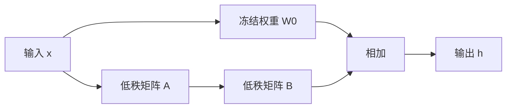

> 本文是对 Hu et al. (Microsoft) 在 2021 年提出的经典论文《LoRA: Low-Rank Adaptation of Large Language Models》(arXiv:2106.09685，[原文链接](https://arxiv.org/abs/2106.09685)) 的解读与经典回顾。LoRA 已经成为参数高效微调领域绕不开的基础工作，本文尝试梳理它的动机、做法与影响。

## TL;DR

- **是什么**：LoRA 是一种参数高效微调（PEFT）方法，通过在模型权重旁注入一对可训练的低秩矩阵来适配下游任务。
- **核心思想**：冻结预训练权重，只学习一个低秩的权重增量 ΔW，用两个小矩阵 A、B 的乘积来近似它。
- **关键结论**：可训练参数量与优化器显存大幅下降，且推理时可将增量合并回原权重，不引入额外延迟。
- **意义**：LoRA 是 PEFT 的代表性工作，催生了 QLoRA 等后续研究，已成为当下微调大模型的默认选择之一。

## 一、背景与动机

随着预训练语言模型的规模不断增长，"先大规模预训练、再针对下游任务微调"成为主流范式。但全参数微调（full fine-tuning）的代价随模型规模急剧上升：每一次微调都要更新模型的全部参数，并为这些参数维护对应的梯度与优化器状态。对于基于 Adam 这类带动量的优化器而言，优化器状态本身往往是参数量的数倍，显存开销极其可观。

更现实的问题在于"任务多、模型大"。当一个组织需要为许多不同任务分别维护一份微调后的完整模型副本时，存储与部署成本会成倍叠加。此外，全参数微调得到的是一份与原模型同等大小的新权重，难以灵活切换。LoRA 正是针对"微调成本高、可训练参数多、占用优化器显存大"这一痛点提出的解决方案。

## 二、核心思想：用低秩增量近似权重更新

LoRA 的出发点是一个关于"更新量结构"的假设：在适配下游任务时，权重的更新量 ΔW 往往具有较低的内在秩（low intrinsic rank），即它可以被一个低秩矩阵很好地近似，而不必让 ΔW 拥有与原权重同样的自由度。

基于这一假设，LoRA 不直接学习庞大的 ΔW，而是把它分解为两个较小矩阵的乘积：

```
W = W₀ + ΔW = W₀ + B·A
```

其中 W₀ 是冻结不动的预训练权重，A、B 是新引入的两个低秩矩阵，其乘积 BA 近似权重更新量 ΔW。秩 r 取得很小时，A 与 B 的参数总量远小于原权重，因此真正参与训练的参数被压缩到一个很小的子集。训练过程中只对 A、B 求梯度、做更新，W₀ 全程保持冻结。

下面用一张流程图概括前向计算路径：



输入同时经过冻结的主干权重和"A→B"这条低秩旁路，两者相加得到最终输出。训练时只有旁路是可学习的。

## 三、关键优点

LoRA 的优势可以从训练与推理两个阶段来看，下表做了归纳对比：

| 维度 | 全参数微调 | LoRA |
| --- | --- | --- |
| 可训练参数量 | 与模型同等规模 | 仅低秩矩阵，大幅减少 |
| 优化器显存占用 | 高（需为全部参数维护状态） | 显著降低 |
| 推理延迟 | 无额外开销 | 合并后无额外开销 |
| 多任务部署 | 每任务一份完整模型 | 共享主干 + 切换适配器 |

具体来说：

- **可训练参数与显存大幅下降**：由于只训练低秩矩阵，需要计算梯度和保存优化器状态的参数量被大幅压缩，使得在更有限的硬件上微调大模型成为可能。
- **推理零额外延迟**：A、B 是线性结构，部署时可以把 BA 直接合并回 W₀，得到一份与原模型结构完全一致的权重，因此推理阶段不会引入额外的计算分支或延迟。
- **适配器可插拔**：主干权重保持不变，不同任务只需训练并保存各自的一份小适配器。部署时按需挂载对应的 LoRA，即可在同一份主干上服务多个任务。

## 四、它在 PEFT 谱系中的位置

LoRA 属于"参数高效微调"（Parameter-Efficient Fine-Tuning, PEFT）这一更大的研究方向。PEFT 的共同目标是：在尽量不动或少动原模型参数的前提下，以很小的额外参数完成下游适配。与在层间插入额外模块的适配器类方法、以及只调整输入提示的提示微调类方法相比，LoRA 的特点在于直接对权重更新量本身做低秩建模，并且能在推理时无损合并回原权重。

正因为兼顾了训练效率与推理友好，LoRA 被后续大量工作沿用与扩展，其中较有代表性的是将量化与低秩适配结合的 QLoRA，它进一步压低了微调大模型所需的显存门槛。如今在开源社区，"加载预训练模型 + 套一层 LoRA 进行微调"已经成为相当普遍的实践路径。

## 意义与局限

LoRA 的意义在于，它用一个简洁的低秩假设，把大模型微调从"重型工程"变成了多数研究者和开发者都能负担的日常操作，并以可插拔适配器的形式改善了多任务部署的灵活性。它对参数高效微调方向的推动是结构性的，相关思路被广泛吸收进后续工作与工具链中。

局限方面也应客观看待：LoRA 建立在"权重更新量具有较低内在秩"这一假设之上，对某些任务而言，过低的秩可能不足以充分表达所需的适配能力，需要在秩的大小、插入位置等超参上做权衡；它改变的是权重增量的表达方式，而非引入新的知识来源，因此在需要大幅改变模型能力的场景中，仍需结合其他手段。总体而言，LoRA 在效率与效果之间取得了被业界广泛认可的平衡点。

> 延伸阅读：Hu et al., LoRA: Low-Rank Adaptation of Large Language Models, arXiv:2106.09685（<https://arxiv.org/abs/2106.09685>）
