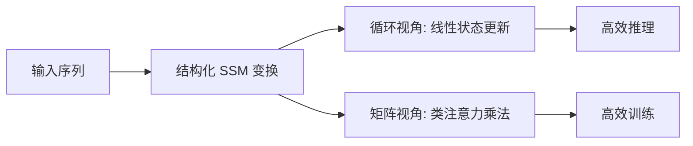

> 本文是对 Dao & Gu, 2024（ICML 2024）论文《Transformers are SSMs: Generalized Models and Efficient Algorithms Through Structured State Space Duality》的阅读笔记，原文见 arXiv:2405.21060（https://arxiv.org/abs/2405.21060）。文中观点与结论均以原论文为准，笔记仅作梳理与解读。

## TL;DR

- 论文提出「状态空间对偶」（Structured State Space Duality, SSD）理论框架，揭示了 Transformer 的注意力机制与状态空间模型（SSM）之间的深层等价关系。
- 基于 SSD，作者设计了 Mamba-2，重新组织了原 Mamba 中的选择性 SSM 核心层，使训练更高效。
- 据论文报告，Mamba-2 相比原 Mamba 有约 2-8× 的速度提升，并在语言建模上与同规模 Transformer 保持竞争力。
- 它是「非注意力 / 高效序列建模」路线的一次重要推进，同时在理论层面把注意力与 SSM 两大模型族统一了起来。

## 一、背景：两条看似分岔的路线

近年来的序列建模大致沿两条路线演化。一条是以 Transformer 为代表的注意力路线，表达力强、可并行训练，但自注意力的计算与显存开销随序列长度呈二次增长；另一条是以状态空间模型（SSM）为代表的循环路线，代表工作是 Mamba，它通过「选择性」机制让状态转移依赖于输入，从而在长序列上获得接近线性的复杂度和高效的推理。

这两条路线长期被视为不同的技术谱系：注意力靠成对相似度做全局交互，SSM 靠一个随时间演化的隐藏状态压缩历史信息。原始 Mamba 虽然效果出色，但其核心的选择性扫描以定制 CUDA 算子实现，难以充分利用现代硬件上高度优化的矩阵乘法单元。这构成了本文的直接动机：能否找到一个理论桥梁，既解释两者的联系，又指导出更硬件友好的实现。

## 二、核心思想：状态空间对偶（SSD）

论文的核心贡献是提出状态空间对偶框架。其基本洞察是：一类结构化的 SSM，其从输入序列到输出序列的整体映射，可以写成一个带有特定结构的矩阵变换；而这个矩阵形式，恰好与一种带掩码的注意力在数学上对应。换言之，同一个序列变换存在两种「对偶」的计算视角。

- 一种是循环 / 线性视角：沿时间维度逐步更新隐藏状态，计算量随序列长度线性增长，适合推理和长序列。
- 另一种是二次 / 矩阵视角：把整个序列变换展开成一个结构化矩阵乘法，形式上类似注意力，便于在训练时利用大规模并行的矩阵运算。

两种视角描述的是同一个模型，可以按场景选择更划算的一侧来算。这正是「对偶」一词的含义：不是近似，而是等价的两种展开方式。

下表概括了两种视角的取舍：

| 视角 | 计算形式 | 复杂度特征 | 适用场景 |
| --- | --- | --- | --- |
| 循环 / 线性 | 逐步状态更新 | 随序列长度线性 | 推理、超长序列 |
| 二次 / 矩阵 | 结构化矩阵乘法 | 类注意力，可高度并行 | 训练阶段 |

## 三、从 SSD 到 Mamba-2

有了 SSD 这一桥梁，Mamba-2 的设计思路就顺理成章：在保留 Mamba「选择性」核心能力的前提下，重新组织其 SSM 层，使关键计算能够落到矩阵乘法这一侧。这样做的直接好处是，训练时可以复用硬件上高度优化的稠密矩阵运算通路，而不必完全依赖专门的扫描算子。

相比原始 Mamba，Mamba-2 对核心层的结构做了简化与规整，让状态维度可以取得更大，同时保持训练的高效与稳定。根据论文报告，Mamba-2 的核心层相较原 Mamba 实现了约 2-8× 的速度提升，并且在语言建模任务上与同等规模的 Transformer 保持竞争力。需要强调的是，这里的加速主要来自实现层面对硬件的贴合，而非牺牲建模能力换取的折中。

## 四、为什么这件事重要

SSD 的意义不止于「又一个更快的架构」。它提供了一个统一的分析语言：注意力和 SSM 不再是彼此孤立的发明，而是同一族结构化序列变换在不同参数化与不同计算路径下的表现。这种统一视角带来两方面价值。

- 理论上，它把两大主流模型族纳入同一框架，便于借鉴彼此的成熟技术，例如注意力一侧成熟的并行化与系统优化经验，可以迁移到 SSM 的训练中。
- 工程上，它给出了「用矩阵乘法做 SSM」的可行路径，降低了高效序列模型落地的门槛。

## 意义与局限

从意义看，Mamba-2 与 SSD 一起，进一步夯实了非注意力路线在大规模序列建模中的可行性，并在理论上搭起了连接 SSM 与注意力的桥梁，为后续架构探索提供了统一的坐标系。

从局限看，论文所报告的效率与效果结论，是在特定的模型规模、任务与实现条件下得到的，能否在更大规模、更多样任务与更长上下文上稳定复现，仍需更广泛的实践检验。此外，SSD 所刻画的对偶关系建立在结构化假设之上，注意力与 SSM 在极端长程依赖、检索类任务等场景下是否表现完全一致，也是值得继续观察的问题。总体而言，这项工作的价值更多体现在提供统一框架与高效实现路径，而非宣告某一路线的终局。

> 延伸阅读：Dao & Gu, 2024, arXiv:2405.21060（https://arxiv.org/abs/2405.21060）
