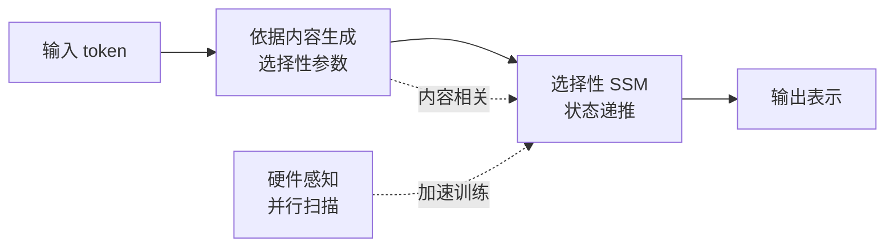

> 本文是对 Gu & Dao 经典论文《Mamba: Linear-Time Sequence Modeling with Selective State Spaces》（arXiv:2312.00752，https://arxiv.org/abs/2312.00752）的阅读笔记与解读。Mamba 提出了带「选择性」机制的状态空间模型，是近年「非注意力」高效序列建模方向上的代表性工作。

## TL;DR

- Transformer 的自注意力随序列长度呈二次复杂度，长序列代价高昂；状态空间模型（SSM）可做到近线性，但此前在语言任务上效果不及注意力。
- Mamba 的核心是「选择性（selective）」：让 SSM 的参数随输入内容动态变化，从而具备按需「记住/遗忘」的能力，弥补传统 SSM 内容无关的缺陷。
- 配合硬件感知的并行扫描算法，Mamba 在保持近线性复杂度的同时实现了高效训练与推理。
- 在语言等多种模态上，Mamba 达到与同规模 Transformer 相当甚至更好的表现，并激发了大量后续 SSM 与混合架构研究。

## 一、背景与动机：注意力的代价与 SSM 的潜力

主流大模型普遍以 Transformer 为骨架，其核心是自注意力机制。注意力允许序列中任意两个位置直接交互，表达能力强，但代价是计算与显存随序列长度呈二次增长。当上下文从几千扩展到数万乃至更长时，这种二次复杂度成为训练和推理的瓶颈。

状态空间模型（State Space Model, SSM）提供了另一条思路。它源自经典的连续系统建模，通过一个隐藏状态在时间维度上递推地汇总历史信息。SSM 在序列长度上可以做到近线性的复杂度，并且推理时无需保存随长度增长的键值缓存。然而，在 Mamba 之前，SSM 类模型在语言建模等离散、信息密集的任务上，整体效果仍不及注意力。论文正是从这一矛盾出发：能否在保留 SSM 高效性的同时，补上它在语言任务上的短板。

## 二、传统 SSM 的局限：内容无关

要理解 Mamba 的创新，需先看清传统 SSM 的弱点。经典 SSM 的状态转移与输出由一组固定参数决定，这些参数在整个序列上是「内容无关」的——无论当前输入是什么 token，状态如何被更新、信息如何被传递，规则都一样。

这种设计带来了高效性（参数固定使得递推可以被改写为卷积，便于并行），但也限制了模型的表达力。语言序列里，不同位置的重要性差异很大：有的 token 需要长久记住（如关键实体），有的则可以很快遗忘（如填充词）。一个内容无关的系统难以做出这种「按需」的选择。直观地说，它缺少根据上下文动态决定「关注什么、忽略什么」的能力，而这恰恰是注意力机制天然具备的优势。

## 三、核心思想：让 SSM 变得「选择性」

Mamba 的关键贡献，是引入「选择性」机制：让 SSM 的若干参数不再是固定常数，而是随当前输入内容动态生成。换言之，状态如何更新、输入如何被纳入状态、状态又如何影响输出，都可以依据当前 token 的内容而变化。

这一改动赋予模型「内容感知」的门控能力：当遇到重要信息时，模型可以让其更强地写入并长久保留在状态中；当遇到无关信息时，则可以选择性地忽略或快速遗忘。这正是对传统 SSM「内容无关」缺陷的直接弥补，使其在语言这类信息密度高、依赖结构复杂的序列上更具竞争力。

代价在于：一旦参数随输入变化，原先把递推改写为卷积、从而高效并行的技巧便不再适用。为解决这一工程难题，作者设计了硬件感知（hardware-aware）的并行扫描算法，针对 GPU 的存储层次进行优化，使得选择性 SSM 仍能高效地并行训练，而非退化为缓慢的逐步递推。可以说，「选择性」是建模上的创新，「并行扫描」则是让这一创新落地的工程支撑。

下面用一张简图概括从输入到输出的核心数据流：

## 四、与注意力的对比

为便于把握 Mamba 与 Transformer 的定位差异，下表做定性归纳（不涉及具体数值）：

| 维度 | 自注意力（Transformer） | 选择性 SSM（Mamba） |
| --- | --- | --- |
| 序列长度复杂度 | 二次 | 近线性 |
| 长序列推理 | 需维护随长度增长的缓存 | 以固定大小状态递推，开销更稳定 |
| 信息交互方式 | 任意位置直接两两交互 | 通过隐藏状态逐步汇总历史 |
| 内容感知 | 天然具备 | 由「选择性」机制引入 |
| 工程实现 | 高度成熟、生态完善 | 依赖硬件感知的并行扫描 |

需要强调的是，上表是定性对照，意在呈现两类架构的思路差异，而非给出某种绝对优劣的结论。

## 五、效果与影响

论文报告，Mamba 在语言等多种模态上，能够达到与同规模 Transformer 相当甚至更好的表现，同时在长序列场景下的推理更为高效。这一结果的意义在于：它表明「非注意力」路线在语言建模这一长期由注意力主导的领域，已经具备了正面竞争的实力，而不仅是某些特定任务上的替代方案。

Mamba 的出现，重新点燃了学术界与工业界对 SSM 及其变体的兴趣，也推动了大量后续工作，包括对选择性机制的改进、状态空间与注意力相结合的混合架构，以及把这一思路推广到视觉、音频等更多模态的尝试。它成为「高效序列建模」这一研究脉络中的重要节点。

## 意义与局限

意义层面，Mamba 给出了一个清晰的范式：通过让状态空间模型具备内容感知的选择能力，并辅以硬件友好的并行实现，可以在保持近线性复杂度的前提下，逼近甚至局部超越注意力的建模质量。它证明了高效架构与强表达力并非不可兼得，为长上下文建模提供了一条值得认真对待的技术路线。

局限层面也应客观看待。注意力机制经过多年发展，拥有极为成熟的生态、工具链与工程经验，而 SSM 类方法在系统支持、可解释性和大规模长期验证上仍处于持续完善的阶段；不同任务、不同规模下两类架构的取舍，也需要更多实践来厘清。更可能的趋势，是注意力与状态空间思想在混合架构中各取所长，而非简单的彼此取代。

> 延伸阅读：Gu & Dao, 《Mamba: Linear-Time Sequence Modeling with Selective State Spaces》，arXiv:2312.00752，https://arxiv.org/abs/2312.00752
